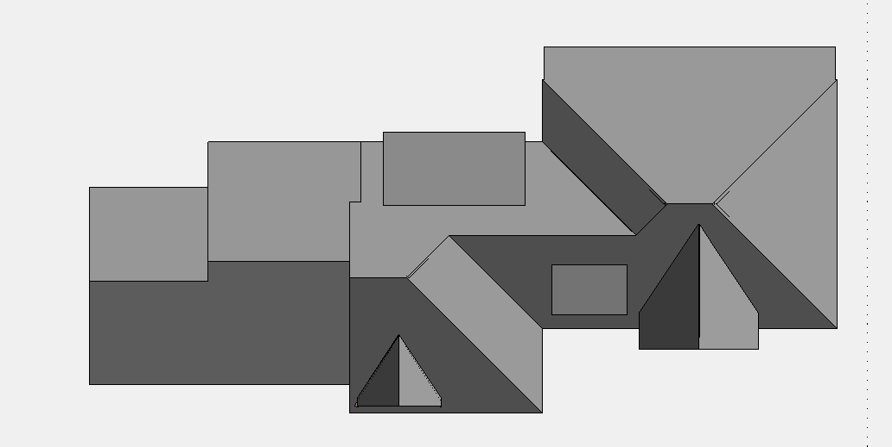
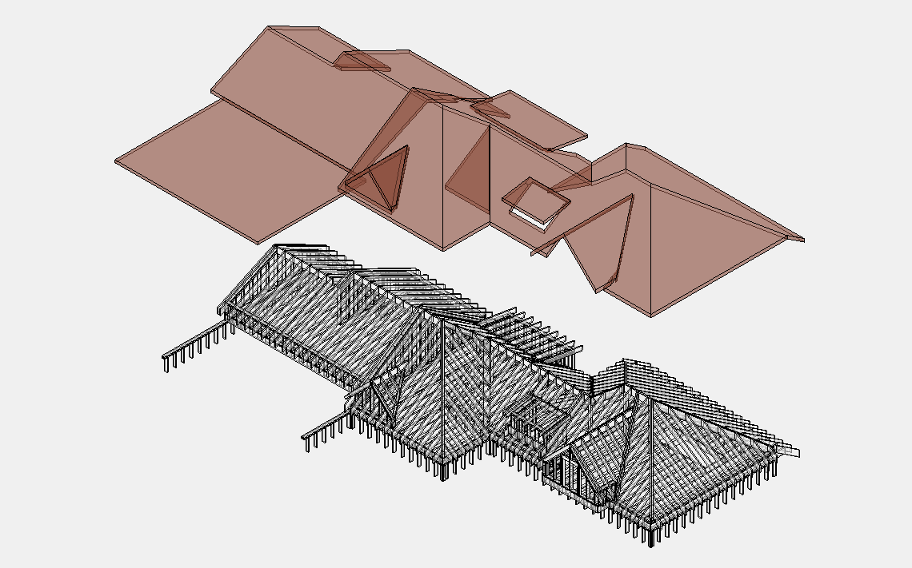

# Roof Sheathing

## Что считать

- Roof OSB/Plywood.
- Flat roof cover board, Densedeck/glass mat, rigid insulation, and XPS layers.
- Soffit plywood under roof trusses where shown.

## Проверить

- Flat roof trusses often need Densedeck over the same area as rigid insulation.
- Extra rigid XPS layer is a recurring miss.
- Piggy truss sleepers can be hidden in roof details.
- 1x3 strapping under roof trusses может требоваться.
- For roofs framed with `AJS Rafters`, count rafters manually instead of `Rake`
  когда condition ведёт себя как exposed floor overhang.
- Some details call for every other rafter to be doubled; do not average this
  into a generic rafter run.

<!-- confluence-gallery:start -->
## Визуальная проверка

Эти картинки уже привязаны к правилам страницы. Используй их как быстрые
checkpoint-ы перед output: сначала прочитай правило выше, потом открой нужную
карточку и проверь похожий condition на плане/schedule.

??? info "Источник картинок"
    - Roof Sheathing (обшивка): [2 карт. Confluence](https://redacted.atlassian.net/wiki/spaces/work/pages/66125845/Roof+Sheathing)

  <a class="kb-rule-card" href="../../../../assets/images/confluence/confluence-149.png" title="image-20250608-054015.png">
    
    

      
Roof Sheathing - визуальная проверка 01

      
Сверь roof planes, openings, overhangs и sheathing material/thickness.

      
Не считай roof sheathing как простую footprint area, если planes/details дают другое.

    

  </a>
  <a class="kb-rule-card" href="../../../../assets/images/confluence/confluence-150.png" title="image-20250608-053831.png">
    
    

      
Roof Sheathing - визуальная проверка 02

      
Сверь roof planes, openings, overhangs и sheathing material/thickness.

      
Не считай roof sheathing как простую footprint area, если planes/details дают другое.

    

  </a>

<!-- confluence-gallery:end -->
