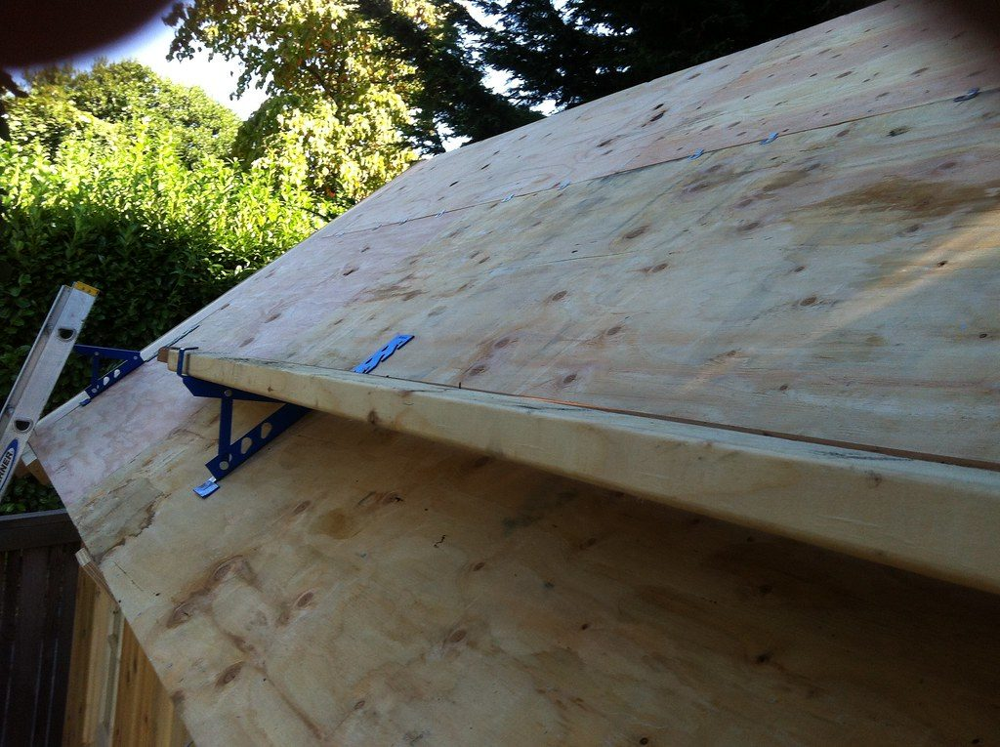
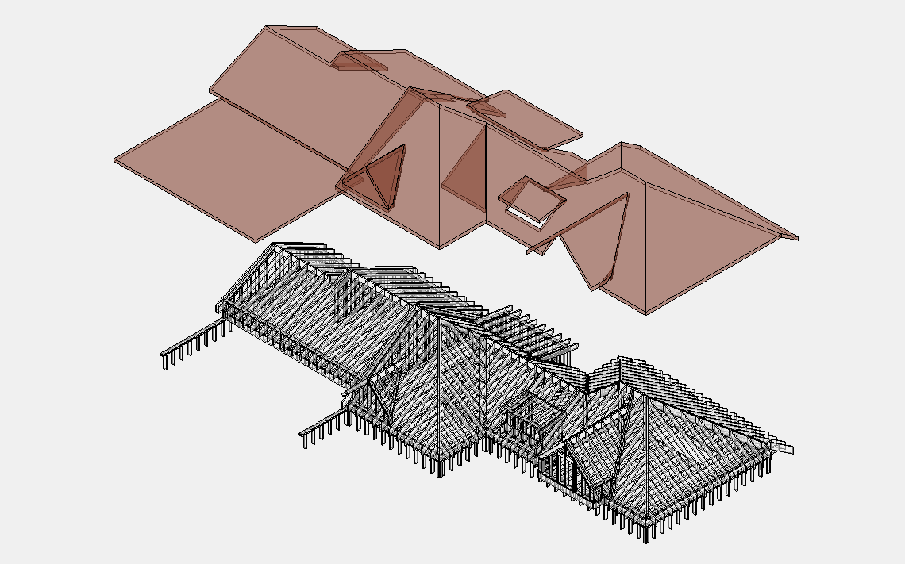

# Roof Sheathing (обшивка кровли)

<figure markdown>
  
  <figcaption markdown="span">Листы plywood по скату: площадь = плановая проекция x коэффициент уклона, листы = площадь / 32 x 1.1. Стыки между опорами - место H-clips при square edge. Фото: Marshmallow, CC BY 2.0, <a href="https://www.flickr.com/photos/69487319@N00/10585957386">источник</a>.</figcaption>
</figure>

## Что это

Roof sheathing - настил по фермам или rafters: OSB или plywood на скатах,
`3/4"` на плоских участках, ply под металл, второй слой у canopy. У каждого
типа кровли свой продукт и своя площадь ([Roof Types](../../sheathing-and-misc/rooftype.md)).
Soffit снизу - не настил. Вместе с настилом в DFL идёт карнизный каркас:
sub fascia, blocking at eves, truss bracing, ties.

## Где искать на чертежах

| Лист | Что взять |
| --- | --- |
| Structural roof framing plan, notes (`s2xx rf`) | Продукт и толщина (таблица кровли WRS-1 отдельно от стен WS-1), span rating, крепление |
| Arch roof plan (`a105 rf`) | Контуры скатов, уклоны `6:12`, overframe, flat зоны |
| Roof sections, details (`sec`, `d`) | Кромка T&G или square edge, clips, blocking, sub fascia, heel, слои flat roof |
| Truss package / layout | Шаг ферм (`24" o.c.`), piggyback и sleepers, bracing |
| Roof assemblies (`ft`) | Flat: cover board (Densdeck, glass mat), rigid, tapered, XPS, EPDM |

## Как мерить в OurPlanCore

1. Площадь берётся из ветки `sqfts`: Area плановой проекции по каждому
   уклону и материалу: `rf 6`, `rf mtl 4`, `overframe 4`, `flat`, `ply flat`,
   `flat grge` ([Roof SQFT](../../sqfts/roof.md)). Гараж, porch, storage -
   свои контуры и свои уклоны.
2. Уклон берём с листа этого дома. Коэффициент `sqrt(1+(rise/12)^2)`
   применяется один раз в формуле Excel; имя `rf 6` геометрию не меняет.
3. Спека в ячейках шаблона R3 main, R4 overframes, R5 metal, R6 flat,
   R7 shingles; в S голая ссылка на лист (`S203`, `2/S500`).
4. Конфликт арх и структуры: главная Note с обоими источниками и принятым
   значением, например `Note: Roof sheathing differ, 19/32" per S612,
   15/32" per A4-03; counted 19/32"; verify`.
5. H-clips считаются отдельно по типу кромки, толщине и шагу опор:
   [H-clips](h-clips.md). При T&G клипс нет.

## Как назвать в дереве и строка DFL

| Имя в дереве | Строка DFL | Материал | Unit | Формула |
| --- | --- | --- | --- | --- |
| `sqfts/rf 6` | `Roof Sheathing` | `19/32" Ply or OSB (40/20)` | `4x8` | `=ОКРВВЕРХ(G*1.118/32*1.1;1)` |
| `sqfts/rf mtl 4` | `Roof Sheathing (metal)` | `1/2" Ply` под металл | `4x8` | то же с 1.054 |
| `sqfts/ply flat` | `Roof Sheathing at Flat Roofs` | `3/4" Ply` | `4x8` | без уклона |
| `sqfts/flat` | `Rigid Insulation`, `Densdeck` / cover board | по assembly | `SQ FT` | та же площадь |
| `sqfts/rf 6` | `Clips` | `PSCL 19/32` | `pcs` | по [H-clips](h-clips.md) |

Карнизный каркас в той же секции, по деталям этого дома:

| Строка | Типично | Unit |
| --- | --- | --- |
| `Sub Fascia` | `2x6` / `2x8` | `LFT` по eave и rake |
| `Blocking at Eves` | `2x6` | `LFT` |
| `Bracing for Trusses` | по truss detail (встречается `2x4`, `2x6`); на всю площадь под крышей, включая гараж | `LFT` |
| `Simpson Ties at Eves` | `H2.5A` без Zmax (под обшивкой), шаг = шаг ферм, по всем линиям опирания | `pcs` |
| `Frame for Soffits` / `Frame for Rakes` | `2x4 24" o.c.` | `LFT` |

## Частые ошибки

- Уклон не с листа или применён дважды (6:12 вместо 4:12 дало +3 листа и +12 clips на гараже).
- Clips при T&G или при настиле толще порога; "4 на лист" вместо шага опор.
- `24" OWJ` прочитано как шаг, а это глубина фермы.
- На flat roof пропущены Densdeck / cover board и второй слой XPS.
- Piggyback sleepers и 1x3 strapping под фермами пропущены.
- Ties не по всем линиям опирания; шаг ties не равен шагу ферм.
- Soffit снизу посчитан как площадь настила.

Все ошибки по кровле: [common-mistakes](../../../start/common-mistakes.md#roof).

## Пример

```text
Roof Frame list
Note: Roof uses 19/32" exterior-rated plywood per S203; PSCL size matches.
Roof Sheathing      19/32" Ply or OSB (40/20)   206   4x8    2/S500
Clips               PSCL 19/32                  1240  pcs
Sub Fascia          2x8                          310  LFT
Blocking at Eves    2x6                          236  LFT
Simpson Ties at Eves H2.5A                       236  pcs    S203
```

<figure markdown>
  
  <figcaption markdown="span">Площадь настила = плоскости скатов (сверху); каркас ферм под ними by others. Каждый скат и уклон - своя Area. Архивный рендер.</figcaption>
</figure>

## См. также

- [H-clips](h-clips.md), [Roof SQFT](../../sqfts/roof.md), [Roof Types](../../sheathing-and-misc/rooftype.md)
- [Eve / Eave](../../sheathing-and-misc/eve.md), [Truss Heel](../../vertical/sheathing/truss-heel.md), [Overframes](overframes.md)
- [Советы и важные вещи, Sheathing](../../../reference/boss-feedback-rules.md#sheathing)
