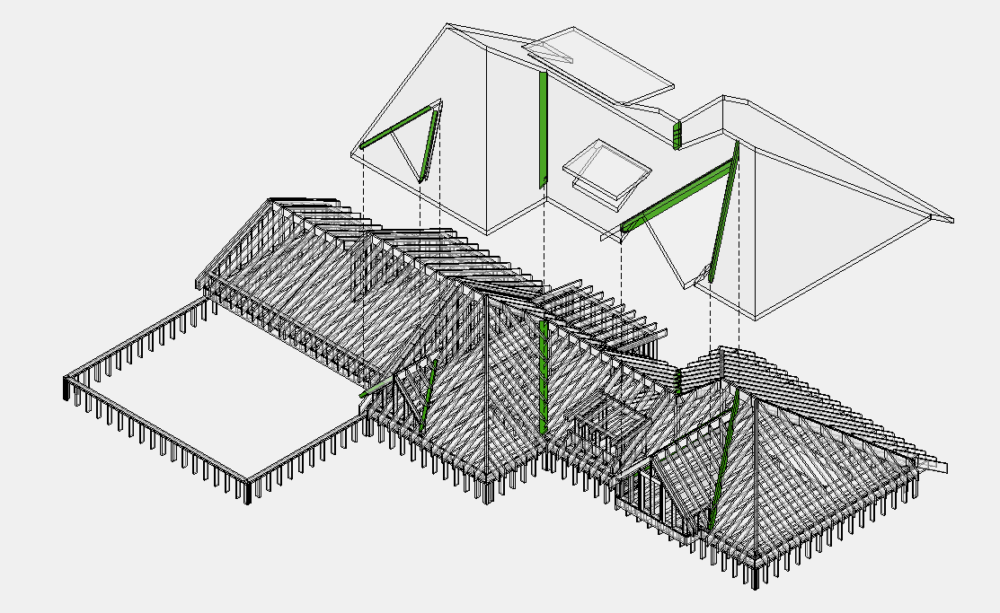

# Valley

## Что считать

- Valley rafters/beams, valley framing, and connectors where shown.

## Проверить

- Valley framing can be part of overframe or truss package by others.
- Если stick-framed, проверь sheathing, blocking и roof finish interfaces.

<!-- confluence-gallery:start -->
## Визуальная проверка

Эти картинки уже привязаны к правилам страницы. Используй их как быстрые
checkpoint-ы перед output: сначала прочитай правило выше, потом открой нужную
карточку и проверь похожий condition на плане/schedule.

??? info "Источник картинок"
    - Valley (балка примыкания крыши внутрь): [1 карт. Confluence](https://redacted.atlassian.net/wiki/spaces/work/pages/66093097/Valley)

  
Скрыть 1 правил с иллюстрациями

  <figure class="kb-figure-row">
    <figcaption class="kb-figure-row__text">
      
Valley - визуальная проверка

      
Проверь inside roof intersection, length и material callout.

      
Valley не смешивай с Hip: это внутреннее примыкание roof planes.

    </figcaption>
    
  </figure>

<!-- confluence-gallery:end -->
