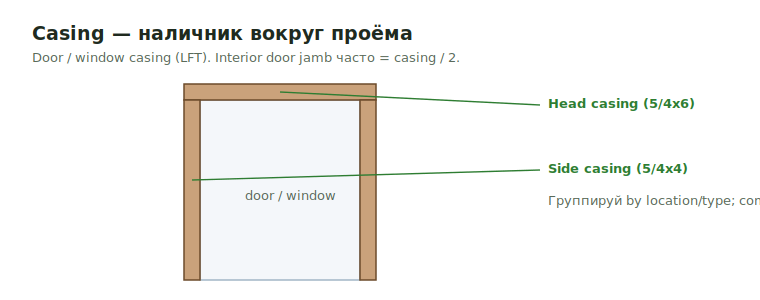

# Casing

<figure markdown>
  
  <figcaption>Casing — наличник вокруг проёма (LFT). Interior door jamb часто = casing / 2.</figcaption>
</figure>

## Что считать

- Door casing.
- Window casing.
- Interior jamb trim там, где estimating method использует casing.

## Локальное правило

Для interior door jambs local feedback говорит: можно использовать casing / 2:

```text
Interior door jamb trim = casing / 2
```

Используй это только там, где совпадает current template/scope.

## Проверить

- Door schedule может дать size/material/fire rating, но не trim type.
- Interior casing отделяй от exterior trims и flashing.
- Hardware numbers не считай как trim.

## Вывод

Casing держи grouped by location/type, если common areas отличаются от units.

## See also

- [Door & Window Trim](door-window-trim.md) · [Base](base.md) · [Room Schedule](room-schedule.md) · [Interior Trims overview](overview.md)
