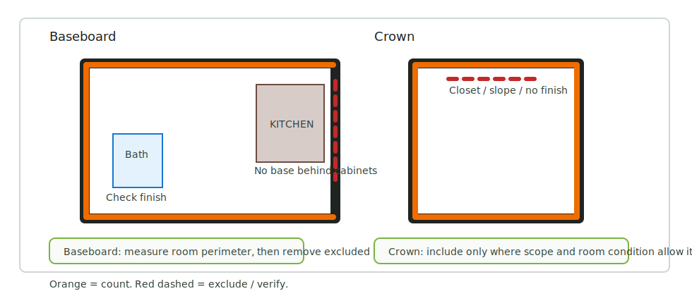
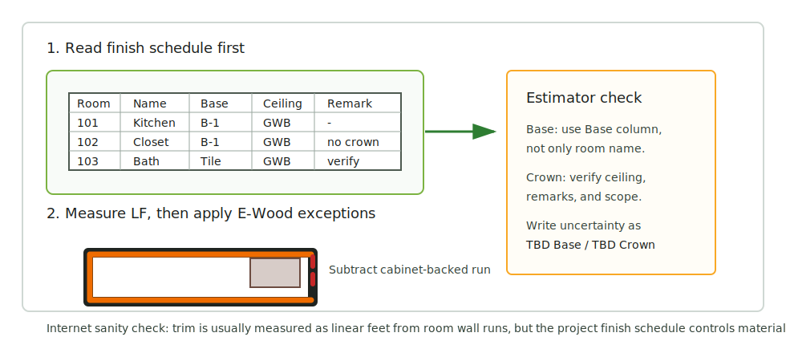

# Crown

<figure markdown>
  
  <figcaption>Crown — count only where scope and room condition allow it.</figcaption>
</figure>

## Rule

Crowns should be included when interior trim scope is active.

## Count

- Crown molding by room/area where shown or required by the trim scope.
- Separate common areas from units when the finish schedule differs.

## Check

- Crown may appear in finish notes instead of plan view.
- Garage: no `Crowns`.
- Do not confuse crown with exterior cornice, fascia, frieze, or rake trim.
- If trim scope exists but crown is unclear, add a visible note.
- Typical no-crown spaces: garage, mechanical/equipment rooms, crawl space, and
  other rooms without finish.

## Trello Rules

| Rule | What to check | Source |
| --- | --- | --- |
| No `Crowns` in closets. | Exclude `Closet` / `CLO.` spaces unless scope says otherwise. | [Trello](https://trello.com/c/Iz1T4E1L) |
| No `Crowns` in rooms with sloped ceilings. | Watch rooms marked `slope ceiling` / sloped roof conditions. | [Trello](https://trello.com/c/a2x8EuZA) |
| No `Crowns` in garage. | Do not carry crown perimeter through garage walls. | E-Wood rule |
| No `Crowns` in rooms without finish. | Exclude unfinished areas. | [Trello](https://trello.com/c/L54HVTxD) |
| `Crowns` are counted in bathrooms when trim scope requires it. | Do not automatically exclude bathrooms. | [Trello](https://trello.com/c/nV0U6Z32) |
| On the second level, count crowns only in `Hall`, foyer, and large guest rooms where required. | Separate second-floor crown logic from first-floor living areas. | [Trello](https://trello.com/c/EImvQgbn) |
| In Excel, write all measured values into the formula. | Keep the formula reviewable. | [Trello](https://trello.com/c/x4SZ0PZN) |
| Check material such as `TBD Crowns`. | Leave a visible note if material is not specified. | [Trello](https://trello.com/c/KvJvp48a) |

## Takeoff Method

- Measure crowns by the same room perimeter logic as baseboard.
- Garage perimeter is not counted for `Crowns`.
- Write each measured segment into the Excel formula, not only the final total.
- If the crown material is `TBD`, keep the material note visible.

## External Cross-Check

<figure markdown>
  
  <figcaption>Crown check: use scope / ceiling / remarks before carrying the room perimeter.</figcaption>
</figure>

- Crown is also a linear room-run item, but it should not be inferred from base
  alone.
- Check finish schedule, ceiling notes, RCP/finish plans, and remarks before
  counting the perimeter.
- E-Wood exclusions remain the working rule: closets, sloped-ceiling rooms, and
  no-finish rooms are not counted unless scope clearly says otherwise.

## Picture Guide

Use these images as the visual proof for each rule:

| Image | Rule | How to write/check it |
| --- | --- | --- |
| [17](../../assets/images/trims/int-trims-17.png) | No `Crowns` in closets. | Exclude `Closet` / `CLO.` unless trim scope explicitly includes it. |
| [18](../../assets/images/trims/int-trims-18.png) / [19](../../assets/images/trims/int-trims-19.png) | No crowns in sloped-ceiling rooms. | Check ceiling/roof condition before carrying a room perimeter. |
| [20](../../assets/images/trims/int-trims-20.png) | No crowns in no-finish rooms. | Exclude garage, mechanical/equipment rooms, crawl space, unfinished storage. |
| [21](../../assets/images/trims/int-trims-21.png) | Bathrooms can have crowns. | Do not auto-exclude bathrooms; follow finish/trim scope. |
| [22](../../assets/images/trims/int-trims-22.png) | Second level crown rule. | Count only `Hall`, foyer, and large guest rooms when that rule applies. |
| [23](../../assets/images/trims/int-trims-23.png) | Crown Excel formula values. | Write each measured segment into the formula. |
| [24](../../assets/images/trims/int-trims-24.png) | `TBD Crowns` / unspecified material. | Keep material note visible instead of guessing. |
| [25](../../assets/images/trims/int-trims-25.png) | Crown Excel output. | Confirm output line matches formula/material. |

## Visual Examples

  <a class="kb-gallery__item" href="../../../assets/images/trims/int-trims-17.png">
    
    
No crowns in closets

  </a>
  <a class="kb-gallery__item" href="../../../assets/images/trims/int-trims-18.png">
    
    
No slope-ceiling crowns

  </a>
  <a class="kb-gallery__item" href="../../../assets/images/trims/int-trims-19.png">
    
    
Slope ceiling example

  </a>
  <a class="kb-gallery__item" href="../../../assets/images/trims/int-trims-20.png">
    
    
No finish rooms

  </a>
  <a class="kb-gallery__item" href="../../../assets/images/trims/int-trims-21.png">
    
    
Bathrooms can have crowns

  </a>
  <a class="kb-gallery__item" href="../../../assets/images/trims/int-trims-22.png">
    
    
Second level: Hall / foyer / guest

  </a>
  <a class="kb-gallery__item" href="../../../assets/images/trims/int-trims-23.png">
    
    
Excel formula values

  </a>
  <a class="kb-gallery__item" href="../../../assets/images/trims/int-trims-24.png">
    
    
Check `TBD Crowns`

  </a>
  <a class="kb-gallery__item" href="../../../assets/images/trims/int-trims-25.png">
    
    
Excel output

  </a>

