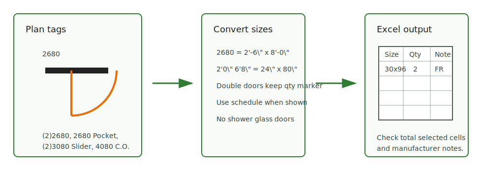

# Door and Window Trim

<figure markdown>
  
  <figcaption>Interior doors and cased openings — read plan tags, convert sizes, then fill Excel.</figcaption>
</figure>

## Door Trim

- Unit entry doors may be fire-rated and should be labeled clearly in door
  takeoff, but hardware numbers are not needed for trim.
- Interior door jamb trim can use casing divided by 2 where the local method
  applies.
- Separate common-area doors from unit doors if trim type differs.

## Window Trim

- Count casing/stool/apron only if the finish schedule or details include them.
- Do not reuse exterior window trim logic for interior trims without checking
  scope.

## Check

- Door/window trim can be hidden in finish schedules, interior elevations, or
  details rather than framing sheets.
- Keep trim notes separate from blocking/jamb framing notes.
- If the schedule names a manufacturer or special product, keep it in the note
  instead of flattening the opening to a generic size.

## Trello Rules

| Rule | What to check | Source |
| --- | --- | --- |
| Measure interior doors by the open door symbol. | Count the actual door swing/opening, not nearby wall notes. | [Trello](https://trello.com/c/IZ2sNLWl) |
| Door size `2680` means width `2'-6"` and height `8'-0"`. | Keep size notation consistent before Excel conversion. | [Trello](https://trello.com/c/hCU71d7H) |
| Double doors are written like `(2)2680`. | Keep the pair marker visible. | [Trello](https://trello.com/c/eQgpc2fU) |
| Pocket doors are written like `2680 Pocket`. | Preserve the `Pocket` note. | [Trello](https://trello.com/c/YhlqMraY) |
| Slider doors are written like `(2)3080 Slider`. | Preserve both quantity and type. | [Trello](https://trello.com/c/sgMGFbJN) |
| Garage/mechanical metal doors can be `F.R S.C.`. | Note fire-rated and self-close conditions. | [Trello](https://trello.com/c/aFiv0hIM) |
| Do not enter glass shower doors as interior doors. | Exclude shower glass doors from interior door count. | [Trello](https://trello.com/c/43ZyybeD) |
| Large guest rooms may use `French doors`. | Keep glass/French door note visible. | [Trello](https://trello.com/c/cb8EWYy1) |
| `Cased Openings` are openings without doors. | Write cased openings separately from doors. | [Trello](https://trello.com/c/GIxtgKCI) |
| `4080 C.O.` is a cased-opening notation. | Convert and enter it in the cased-opening side, not doors. | [Trello](https://trello.com/c/XYT9cr0q) |
| Enter interior doors and cased openings for each level in Excel. | Separate floors before trim formulas. | [Trello](https://trello.com/c/Zy0M8kcH) |
| If a door schedule exists, fill from the schedule. | Prefer schedule data over manual plan-only entry. | [Trello](https://trello.com/c/C0LHSgXl) |

## Excel Entry

- After all doors/openings are written, copy the opening mark and quantity
  columns into the right-side Excel helper table for casing formulas.
- Rewrite all door and cased-opening sizes into the left table in inches:
  `2'-0" x 6'-8"` becomes `24 x 80`.
- For many repeated doors, use an Excel formula instead of manual repeated
  typing.
- Before output, select the entered door/opening cells and check the status-bar
  sum against the takeoff count.

## Visual Examples

  <a class="kb-gallery__item" href="../../../assets/images/trims/int-trims-26.png">
    
    
Measure by open door

  </a>
  <a class="kb-gallery__item" href="../../../assets/images/trims/int-trims-27.png">
    
    
Size notation: 2680

  </a>
  <a class="kb-gallery__item" href="../../../assets/images/trims/int-trims-28.png">
    
    
Double door: (2)2680

  </a>
  <a class="kb-gallery__item" href="../../../assets/images/trims/int-trims-29.png">
    
    
Pocket door

  </a>
  <a class="kb-gallery__item" href="../../../assets/images/trims/int-trims-30.png">
    
    
Slider door

  </a>
  <a class="kb-gallery__item" href="../../../assets/images/trims/int-trims-34.png">
    
    
Cased opening

  </a>
  <a class="kb-gallery__item" href="../../../assets/images/trims/int-trims-39.png">
    
    
Size conversion to inches

  </a>
  <a class="kb-gallery__item" href="../../../assets/images/trims/int-trims-43.png">
    
    
Use door schedule

  </a>

