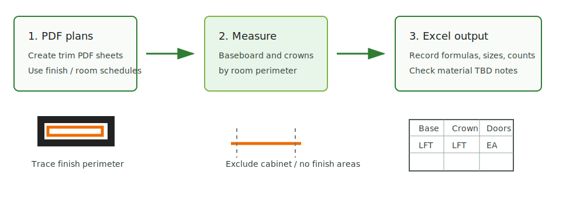
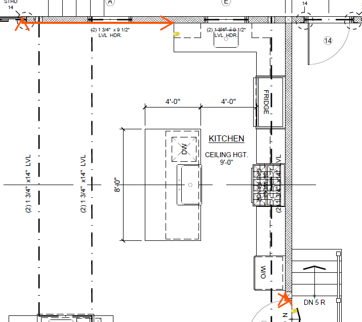
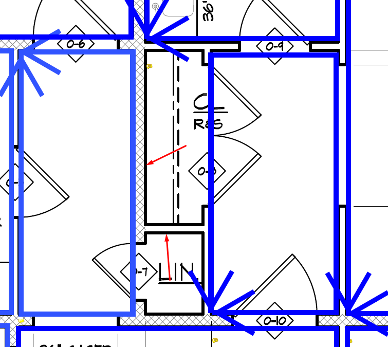
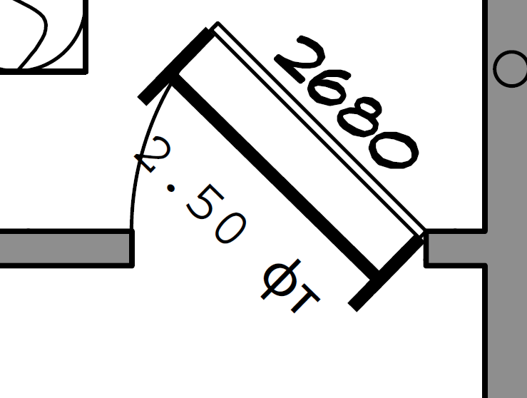

# Interior Trims

<figure markdown>
  
  <figcaption>Interior Trims — PDF sheets, perimeter measurement, and Excel output flow.</figcaption>
</figure>

Interior trims are separate from exterior trims, drywall, and framing. Use this
section when the scope includes finish trim items from room schedules, door/window
schedules, or finish plans.

## Count

- Base / wood base.
- Door casing and jamb trim.
- Window casing, stool, apron, and related trim if shown.
- Crown when trim scope is active.
- Common-area trims separately from unit trims.

## Do Not Mix

- Exterior casing, mullion, sill, head, corner board, watertable, siding trim.
- Gypsum board for walls.
- Framing blocking, unless the trim requires backing and the scope asks for it.

## Core Rules

- If trims are not specified, write `not specified`.
- Room schedules can have tile base; exclude tile base when the takeoff needs
  wood base only.
- Common areas such as corridors and lobbies should be separate because trim type
  can differ.
- Crowns should be included when interior trim scope is active.
- First make the interior-trim PDFs/sheets, then measure baseboard and crowns by
  continuous room perimeter.
- Casing for interior doors is filled after the interior-door list is entered;
  casing for exterior doors/windows is filled after exterior openings are
  entered.

## Visual Sources

Trello `int trims` was imported from the logged-in browser session:
44 cards and 43 images. The full visual archive is here:
[Trello Visual Archive](trello-import-pending.md).

## Picture Map

Use the numbered images as examples, not as a separate hidden archive:

| Images | Topic | Open page |
| --- | --- | --- |
| `01` - `06` | Overall workflow: create PDFs, measure perimeter, casing automation | This page |
| `07` - `16` | Baseboard rules and Excel checks | [Base](base.md) |
| `17` - `25` | Crown rules and Excel checks | [Crown](crown.md) |
| `26` - `43` | Interior doors, `F.R. S.C.`, cased openings, and Excel entry | [Door and Window Trim](door-window-trim.md) |

## Workflow Pictures

| Image | What it explains | What to do |
| --- | --- | --- |
| [01](../../assets/images/trims/int-trims-01.png) | Create PDF files for interior trims. | Prepare separate review PDFs/sheets before measuring. |
| [02](../../assets/images/trims/int-trims-02.png) | Baseboard and crowns are perimeter items. | Trace continuously; do not count disconnected fragments from memory. |
| [03](../../assets/images/trims/int-trims-03.png) / [04](../../assets/images/trims/int-trims-04.png) | Perimeter example and measurement note. | Start from the entry door and keep the path reviewable. |
| [05](../../assets/images/trims/int-trims-05.png) | Interior door casing automation. | Enter all interior doors first, then let casing formulas fill. |
| [06](../../assets/images/trims/int-trims-06.png) | Exterior doors/windows casing automation. | Exterior openings feed the exterior casing/window trim side, not interior doors. |

  <a class="kb-gallery__item" href="../../../assets/images/trims/int-trims-02.png">
    
    
Perimeter: baseboard and crowns

  </a>
  <a class="kb-gallery__item" href="../../../assets/images/trims/int-trims-07.png">
    
    
Baseboard: no behind kitchen cabinets

  </a>
  <a class="kb-gallery__item" href="../../../assets/images/trims/int-trims-17.png">
    
    
Crown: no closets

  </a>
  <a class="kb-gallery__item" href="../../../assets/images/trims/int-trims-26.png">
    
    
Interior doors: count by open door

  </a>

## Source Status

Imported source board:
`https://trello.com/b/TyUKA0Zw/int-trims`.

