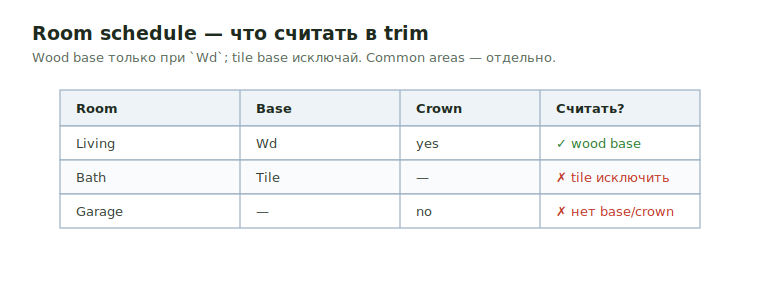

# Room Schedule

<figure markdown>
  
  <figcaption>Wood base только при `Wd`; tile base исключай. Garage — без base/crown.</figcaption>
</figure>

## Что читать

- Room finish schedule.
- Door schedule.
- Finish plans и interior elevations.
- Notes для common areas, corridors, lobby, bathrooms и units.

## Правила

- Wood base включай только когда schedule помечает base как `Wd` или equivalent.
- Tile base исключай из wood-base counts.
- Common areas держи отдельно, потому что trim type может отличаться.
- Если finish line неясна, добавь note вместо guessing.

## Вопросы для проверки

- Bathrooms имеют tile base?
- Corridors/lobbies имеют другой base или casing type?
- Crown нужен везде, только common areas или только specific rooms?
- Door/window trims указаны или omitted?

## See also

- [Base](base.md) · [Casing](casing.md) · [Crown](crown.md) · [Interior Trims overview](overview.md)
