# Trello Visual Archive — Interior Trims

Source board:
`https://trello.com/b/TyUKA0Zw/int-trims`

Импортировано из logged-in browser session: **44 cards** и **43 images**.
Эта страница — полный visual archive. Держи её как source shelf; в topic pages
переноси только clean rules.

## Визуальный индекс

| Диапазон | Тема |
| --- | --- |
| `int-trims-01` - `int-trims-06` | Overall interior-trim workflow, PDFs, casing automation |
| `int-trims-07` - `int-trims-16` | `Baseboard` rules и Excel checks |
| `int-trims-17` - `int-trims-25` | `Crowns` rules и Excel checks |
| `int-trims-26` - `int-trims-43` | Interior doors, cased openings и Excel entry |

## Полная галерея

  <a class="kb-gallery__item" href="../../../assets/images/trims/int-trims-01.png">
    
    
01. Create PDF files for interior trims

  </a>
  <a class="kb-gallery__item" href="../../../assets/images/trims/int-trims-02.png">
    
    
02. Measure baseboard / crowns by perimeter

  </a>
  <a class="kb-gallery__item" href="../../../assets/images/trims/int-trims-03.png">
    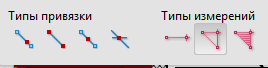
    
03. Perimeter measurement note

  </a>
  <a class="kb-gallery__item" href="../../../assets/images/trims/int-trims-04.png">
    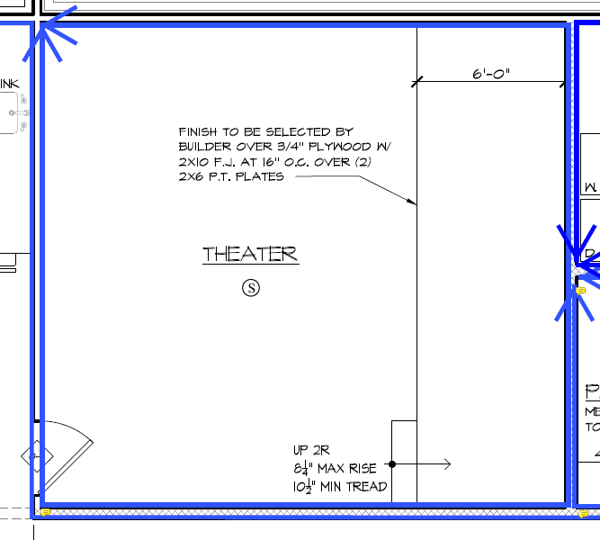
    
04. Interior trim perimeter example

  </a>
  <a class="kb-gallery__item" href="../../../assets/images/trims/int-trims-05.png">
    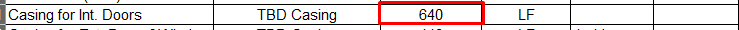
    
05. Casing for interior doors automation

  </a>
  <a class="kb-gallery__item" href="../../../assets/images/trims/int-trims-06.png">
    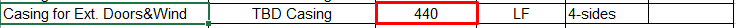
    
06. Casing for exterior doors/windows automation

  </a>
  <a class="kb-gallery__item" href="../../../assets/images/trims/int-trims-07.png">
    
    
07. Baseboard: no behind kitchen cabinets

  </a>
  <a class="kb-gallery__item" href="../../../assets/images/trims/int-trims-08.png">
    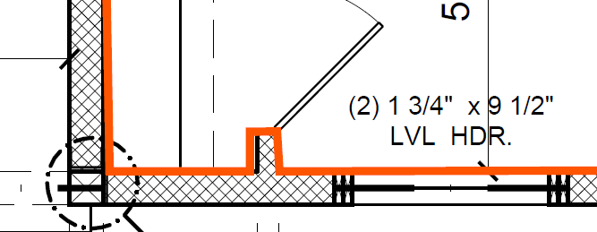
    
08. Baseboard under windows

  </a>
  <a class="kb-gallery__item" href="../../../assets/images/trims/int-trims-09.png">
    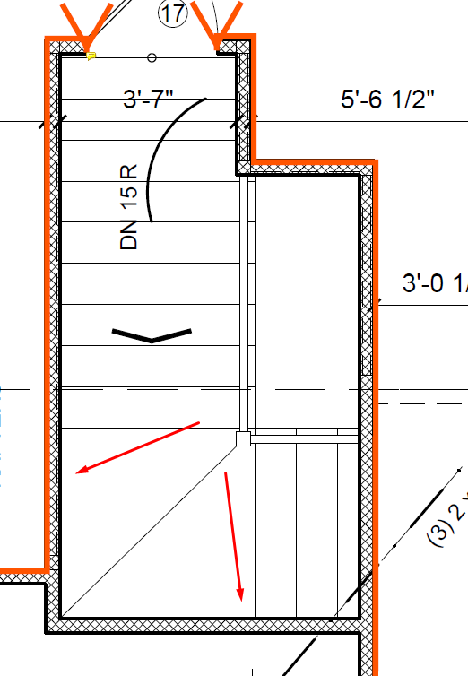
    
09. No base at stair-wall junction

  </a>
  <a class="kb-gallery__item" href="../../../assets/images/trims/int-trims-10.png">
    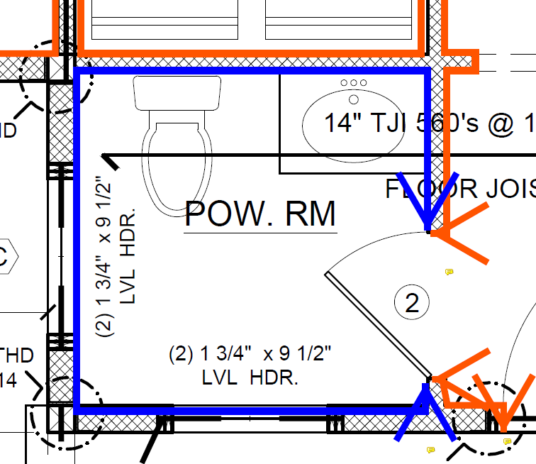
    
10. Baseboard in toilet / shower rooms

  </a>
  <a class="kb-gallery__item" href="../../../assets/images/trims/int-trims-11.png">
    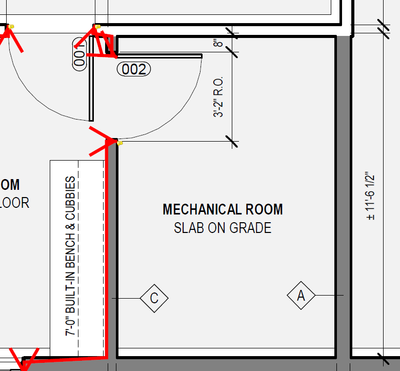
    
11. No base in unfinished rooms

  </a>
  <a class="kb-gallery__item" href="../../../assets/images/trims/int-trims-12.png">
    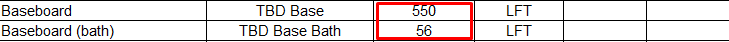
    
12. Base Excel: formula values

  </a>
  <a class="kb-gallery__item" href="../../../assets/images/trims/int-trims-13.png">
    
    
13. Base Excel: formula continuation

  </a>
  <a class="kb-gallery__item" href="../../../assets/images/trims/int-trims-14.png">
    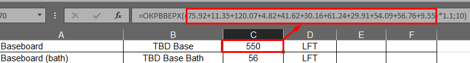
    
14. Base Excel: formula example

  </a>
  <a class="kb-gallery__item" href="../../../assets/images/trims/int-trims-15.png">
    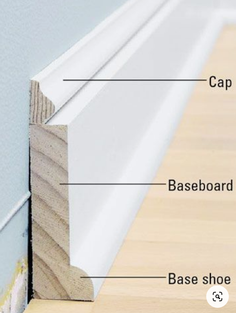
    
15. Проверка `TBD Base` material

  </a>
  <a class="kb-gallery__item" href="../../../assets/images/trims/int-trims-16.png">
    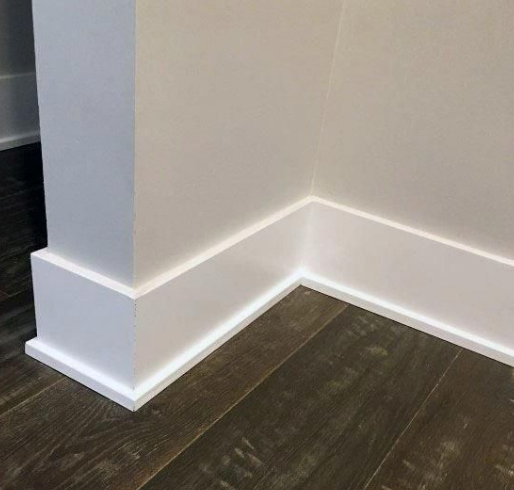
    
16. Baseboard Excel output

  </a>
  <a class="kb-gallery__item" href="../../../assets/images/trims/int-trims-17.png">
    
    
17. Crowns: no closets

  </a>
  <a class="kb-gallery__item" href="../../../assets/images/trims/int-trims-18.png">
    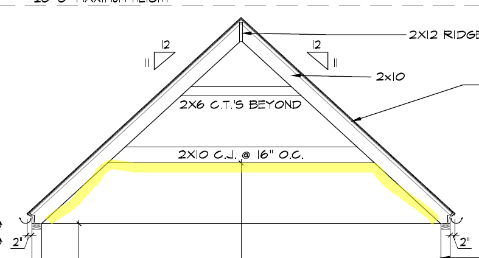
    
18. Crowns: no sloped ceilings

  </a>
  <a class="kb-gallery__item" href="../../../assets/images/trims/int-trims-19.png">
    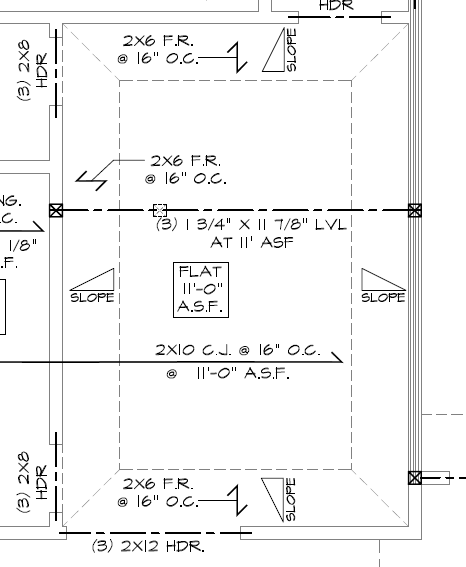
    
19. Slope ceiling example

  </a>
  <a class="kb-gallery__item" href="../../../assets/images/trims/int-trims-20.png">
    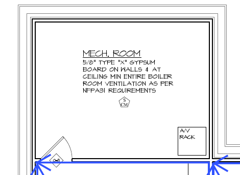
    
20. Crowns: no unfinished rooms

  </a>
  <a class="kb-gallery__item" href="../../../assets/images/trims/int-trims-21.png">
    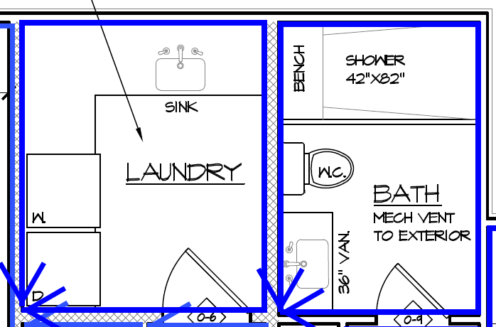
    
21. Crowns in bathrooms

  </a>
  <a class="kb-gallery__item" href="../../../assets/images/trims/int-trims-22.png">
    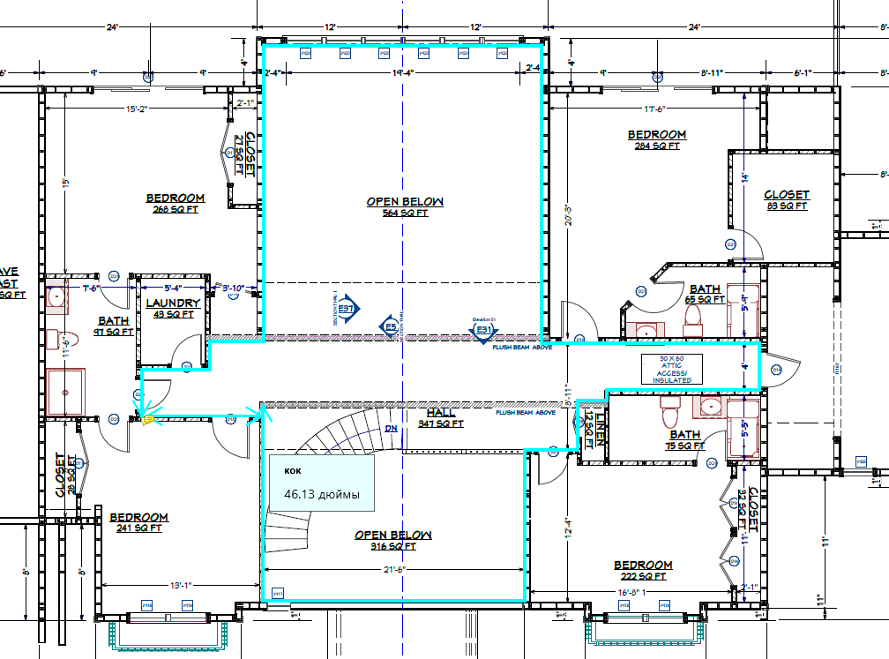
    
22. Second-level crown locations

  </a>
  <a class="kb-gallery__item" href="../../../assets/images/trims/int-trims-23.png">
    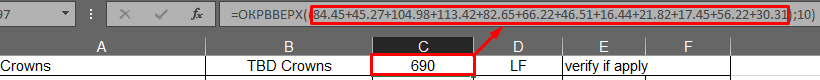
    
23. Crown Excel: formula values

  </a>
  <a class="kb-gallery__item" href="../../../assets/images/trims/int-trims-24.png">
    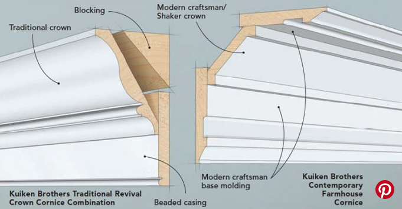
    
24. Проверка `TBD Crowns` material

  </a>
  <a class="kb-gallery__item" href="../../../assets/images/trims/int-trims-25.png">
    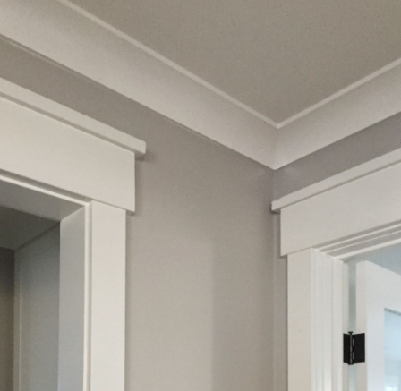
    
25. Crowns Excel output

  </a>
  <a class="kb-gallery__item" href="../../../assets/images/trims/int-trims-26.png">
    
    
26. Interior doors: open door symbol

  </a>
  <a class="kb-gallery__item" href="../../../assets/images/trims/int-trims-27.png">
    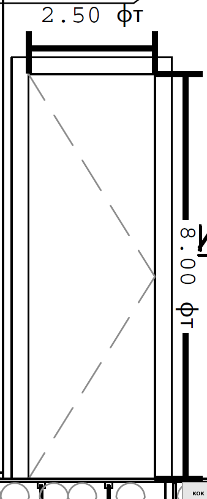
    
27. Door size: `2680`

  </a>
  <a class="kb-gallery__item" href="../../../assets/images/trims/int-trims-28.png">
    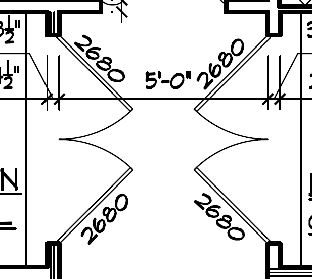
    
28. Double door: `(2)2680`

  </a>
  <a class="kb-gallery__item" href="../../../assets/images/trims/int-trims-29.png">
    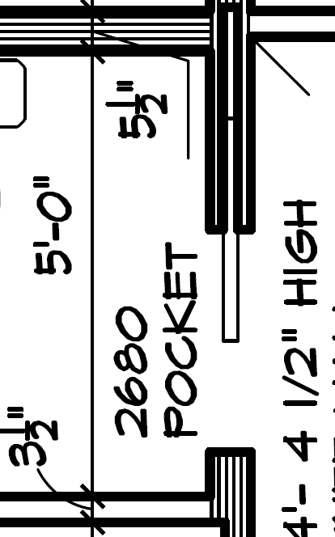
    
29. Pocket door notation

  </a>
  <a class="kb-gallery__item" href="../../../assets/images/trims/int-trims-30.png">
    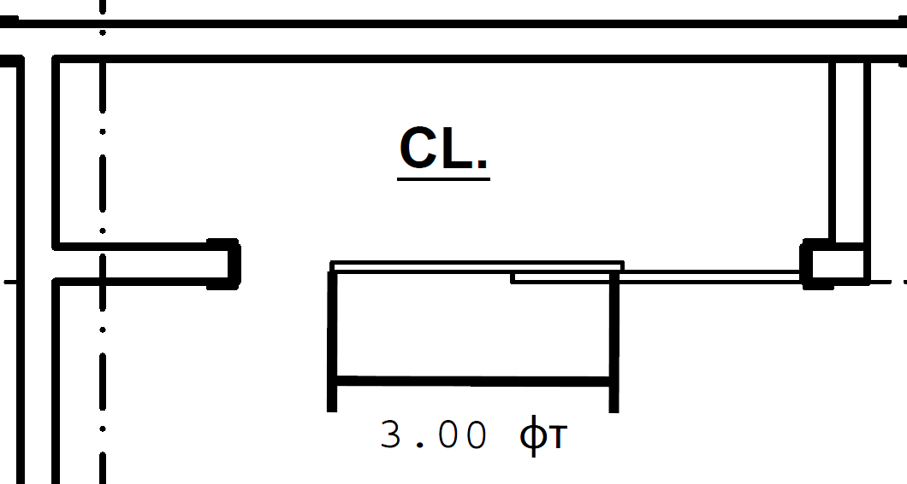
    
30. Slider door notation

  </a>
  <a class="kb-gallery__item" href="../../../assets/images/trims/int-trims-31.png">
    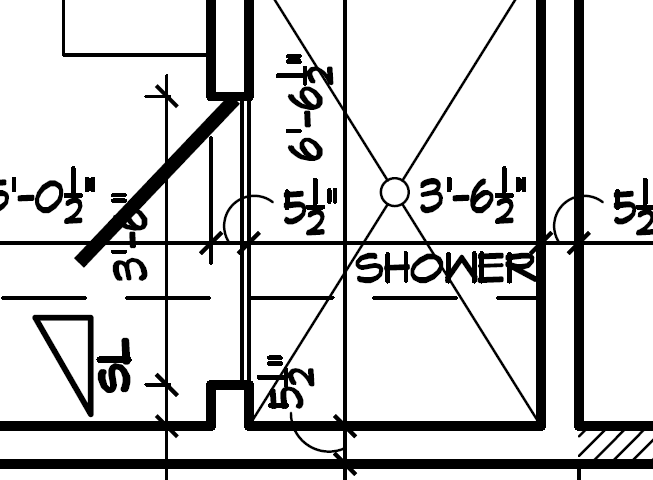
    
31. Shower glass doors не считать как interior doors

  </a>
  <a class="kb-gallery__item" href="../../../assets/images/trims/int-trims-32.png">
    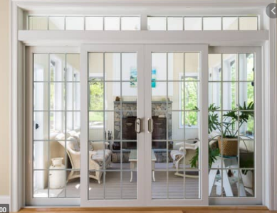
    
32. French doors

  </a>
  <a class="kb-gallery__item" href="../../../assets/images/trims/int-trims-33.png">
    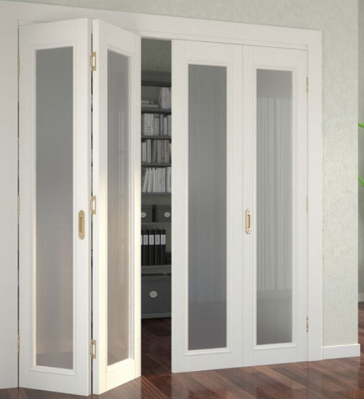
    
33. Bi-Fold

  </a>
  <a class="kb-gallery__item" href="../../../assets/images/trims/int-trims-34.png">
    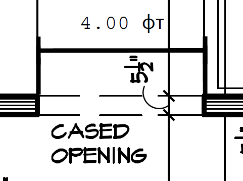
    
34. Cased opening

  </a>
  <a class="kb-gallery__item" href="../../../assets/images/trims/int-trims-35.png">
    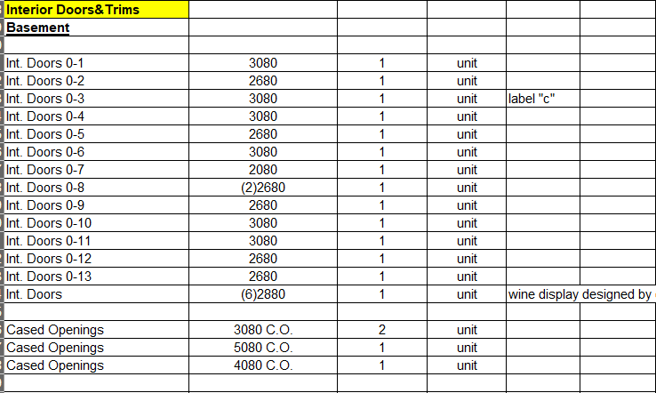
    
35. Excel: enter by level

  </a>
  <a class="kb-gallery__item" href="../../../assets/images/trims/int-trims-36.png">
    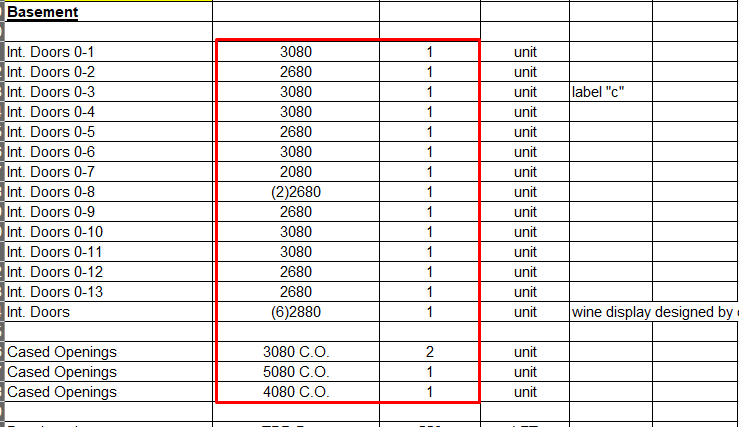
    
36. Excel: copy helpful columns

  </a>
  <a class="kb-gallery__item" href="../../../assets/images/trims/int-trims-37.png">
    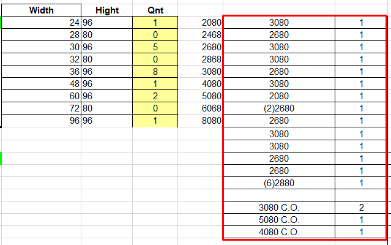
    
37. Excel table

  </a>
  <a class="kb-gallery__item" href="../../../assets/images/trims/int-trims-38.png">
    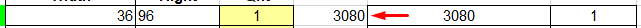
    
38. Rewrite sizes into left table

  </a>
  <a class="kb-gallery__item" href="../../../assets/images/trims/int-trims-39.png">
    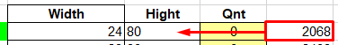
    
39. Convert feet to inches

  </a>
  <a class="kb-gallery__item" href="../../../assets/images/trims/int-trims-40.png">
    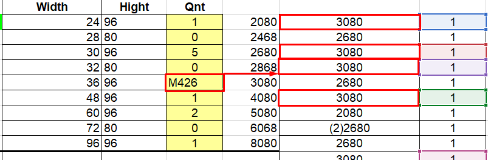
    
40. Formulas для many doors

  </a>
  <a class="kb-gallery__item" href="../../../assets/images/trims/int-trims-41.png">
    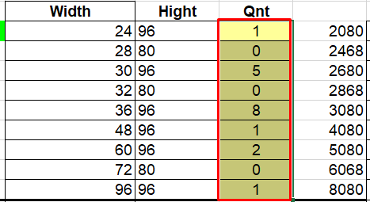
    
41. Проверка selected cell sum

  </a>
  <a class="kb-gallery__item" href="../../../assets/images/trims/int-trims-42.png">
    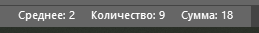
    
42. Excel output

  </a>
  <a class="kb-gallery__item" href="../../../assets/images/trims/int-trims-43.png">
    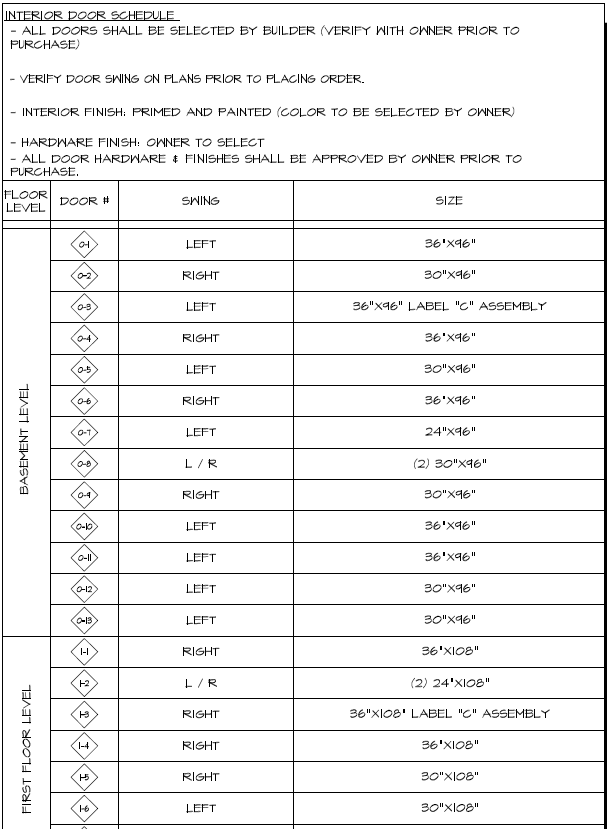
    
43. Заполнять из door schedule

  </a>

## Raw import

Raw markdown copies are stored in:

`imports/live-sources/trello-int-trims/pages/`

