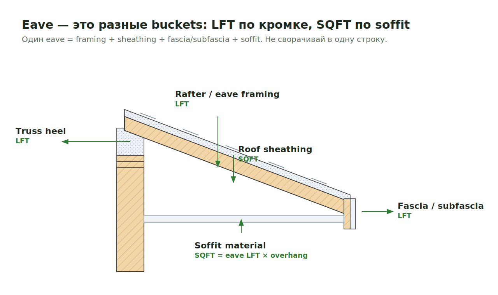
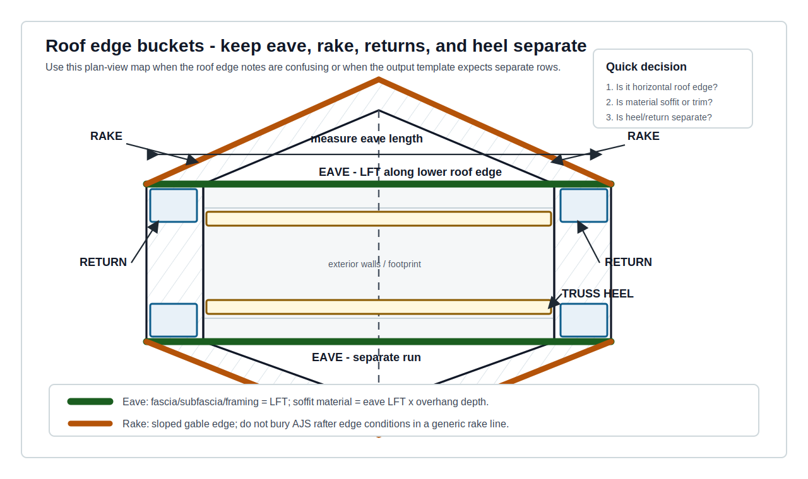
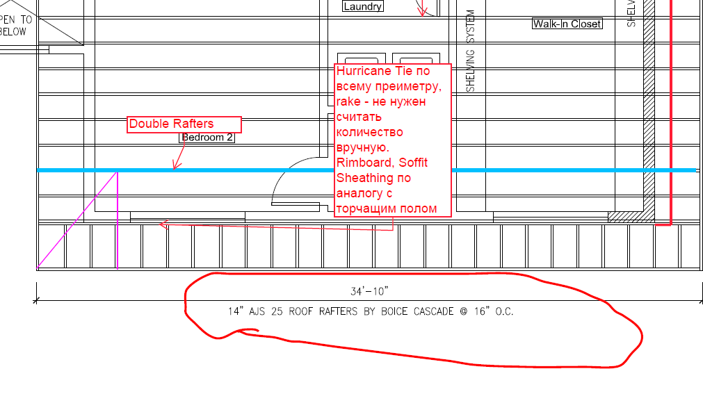

# Eve / Eave

`Eve` / `Eave` — нижний горизонтальный край крыши вдоль стены. В takeoff это не
один item: там могут быть framing, soffit material, fascia/subfascia, trims,
vented/vinyl soffit и отдельные roof-edge details.

<figure markdown>
  
  <figcaption>Eave состоит из разных buckets: LFT для edge/framing, SQFT для soffit material.</figcaption>
</figure>

## Что считать

- `Eve` framing / rafter-tail framing / soffit frame, когда shown.
- `Soffit` material: vinyl, beadboard, plywood, exterior gypsum, Denseglas /
  Densglass, vented soffit panels.
- `Subfascia` и `Fascia` / trim, если это часть scope.
- `Frieze` / wall trim под eave, если drawings/specs показывают отдельную line.
- Blocking, backing, strapping и vents только когда они called out.
- `Soffit plywood` under roof trusses, если detail/RCP/section показывает его.
- Canopy/porch eave material, если это не отдельная page/line в output.

## Что не смешивать

  
Скрыть 3 правил с иллюстрациями

  <figure class="kb-figure-row">
    <figcaption class="kb-figure-row__text">
      
Eave / Rake / Return / Truss Heel

      
Держи buckets отдельно, если output template не просит объединить.

      
Eave = горизонтальный нижний edge; Rake = sloped gable edge; Return = boxed corner; Truss Heel = вертикальная полоска.

    </figcaption>
    
  </figure>
  <figure class="kb-figure-row">
    <figcaption class="kb-figure-row__text">
      
Truss Heel near Eave

      
На eave side heel sheathing часто забывается.

      
Это вертикальная полоска между Top Plate и низом overhang; не прячь её в soffit SQFT.

    </figcaption>
    
  </figure>
  <figure class="kb-figure-row">
    <figcaption class="kb-figure-row__text">
      
AJS Rafters edge condition

      
Если roof framed with AJS Rafters ведёт себя как exposed overhang, считай rafters manually.

      
Не заменяй это простым `Rake`, когда detail требует отдельные rafters.

    </figcaption>
    
  </figure>

| Bucket | Что это | Где считать |
| --- | --- | --- |
| `Eave` | Горизонтальный нижний edge roof overhang | LFT по длине eave |
| `Rake` | Наклонный edge на gable side | Отдельная Rake line |
| `Returns` | Boxed corner, где eave/rake возвращается | Отдельная Returns line |
| `Truss Heel` | Вертикальная strip у края truss | [Truss Heel](../vertical/sheathing/truss-heel.md), не soffit |
| `Canopy / Porch soffit` | Soffit under canopy/porch | Считать в canopy/porch scope, если output так разделён |

## Правила takeoff

- `Eave` line обычно меряется **LFT** по наружному периметру roof edge.
- `Soffit` material обычно считается **SQFT**: `eave length × overhang width`.
- `Fascia`, `subfascia`, frieze trim и edge trims обычно считаются **LFT**.
- `Vinyl Soffits` / `Soffit Eve Vinyl` вводи в **SQFT**, не как framing line.
- Если `30%+` soffit = beadboard, считай весь soffit SQFT как beadboard и
  добавь note, что это local rule.
- Eve soffit frames can be `2x6`, not `2x4`, if drawings show it.
- Canopies и porch soffits могут требовать `5/8" exterior-grade gypsum`,
  Denseglas/Densglass или похожий exterior soffit material.
- Для roofs framed with `AJS Rafters`: если edge behaves like exposed floor
  overhang, считай rafters manually instead of simple `Rake`.
- Если `FRT`/exterior treatment applies to exposed roof edge, проверь fascia,
  subfascia, blocking и trim material.

## Где искать

| Лист / источник | Что взять |
| --- | --- |
| Roof plan | Eave runs, overhang zones, main roof vs porch/canopy |
| Exterior elevations | Fascia/subfascia, frieze, trim profiles, material changes |
| Architectural sections | Overhang depth, soffit thickness, boxed eave construction |
| RCP | Dropped soffits, canopy/porch soffits, hidden soffit frames |
| Structural roof framing | Rafter tails, truss condition, AJS rafters, blocking |
| Truss package/details | Heel height, eave side vertical sheathing, bearing condition |
| Exterior finish schedule/specs | Vinyl, beadboard, vented soffit, Denseglas/Densglass |

## Как мерить

| Item | Unit | Метод |
| --- | --- | --- |
| Eave framing | LFT | По eave run, split by size/material. |
| Soffit material | SQFT | `eave LFT × overhang width`; split by material. |
| Vinyl soffit | SQFT | Вносить как SQFT, даже если на plan подписано `Soffit Eve Vinyl`. |
| Beadboard soffit | SQFT | Если 30%+ beadboard, local rule: full soffit SQFT as beadboard. |
| Fascia / subfascia | LFT | По exposed roof edge; отделяй eave от rake. |
| Soffit frame | LFT / PCS | По detail: 2x4/2x6, spacing или continuous run. |
| Vented soffit | SQFT / LFT | Следуй spec/template; note if counted by SQFT. |

## Проверить

- RCP and architectural sections can show soffits missing from structural plans.
- `Vinyl Soffits` / `Soffit Eve Vinyl` belong in SQFT, not as a framing line.
- Не включай `Rake` в `Eve`, если template ожидает separate roof edge lines.
- Не включай `Returns` в обычный eave run, если return trim/framing differs.
- Не считай `Truss Heel` как soffit; это separate vertical sheathing strip.
- Для porch/canopy проверь, не должен ли soffit идти в
  [Canopy](../horizontal/roof-framing/canopy.md) или [Porch SQFT](../sqfts/porch.md).
- Если eave material меняется по elevation, разбивай line by material.
- Если soffit depth меняется, считай SQFT отдельными участками.
- Если note говорит `vented`, `solid`, `beadboard`, `vinyl`, `fiber cement`,
  `gypsum`, не заменяй generic `soffit`.
- Если drawings молчат по size, не подставляй `2x4` frame автоматически:
  сначала проверь section/detail.

## Пример output

| Description | Size / material | Qty | Unit | Note |
| --- | --- | ---: | --- | --- |
| Eave subfascia | `2x6` | 148 | LFT | Main roof eave only |
| Soffit Eve Vinyl | Vinyl | 296 | SQFT | `148 LFT × 2'-0"` |
| Soffit frame | `2x6` | 148 | LFT | Per A-section |
| Beadboard soffit | Beadboard | 296 | SQFT | Full soffit by 30%+ local rule |
| Truss Heel sheathing | OSB / plywood | 148 | LFT/SQFT | Separate from soffit |

## Источники правил

- Trello: `Vinel Soffits только в SQFT`.
- Trello: `Если Soffit Eve Vinyl то нужно вписать в SQFT`.
- Trello: `Для крыши из AJS Rafters считать вместо Rake вручную Rafters`.
- Related pages: [Rake](rake.md), [Returns](returns.md),
  [Truss Heel](../vertical/sheathing/truss-heel.md),
  [Roof Sheathing](../horizontal/roof-framing/roof-sheathing.md),
  [Canopy](../horizontal/roof-framing/canopy.md).
