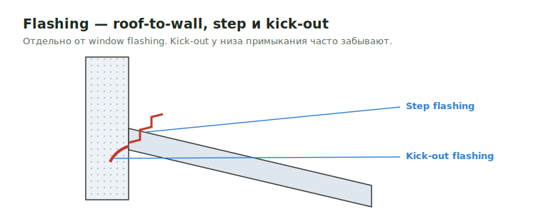

# Flashing (roof / wall / deck)

Эта страница — про flashing **на крыше, стенах и deck/balcony**: rake / eve /
parapet / cap flashing, kick-out, step flashing, deck-to-wall flashing и т.п.

!!! info "Flashing вокруг окон и дверей — на другой странице"
    `Window Flashing` и `Sill Flashing` (включая разделение wood / Mtl /
    CMU/concrete и опциональный wood jamb `1x4` / `2x4` P.T. на бетоне) —
    относятся к Openings, не к крыше. См. **[Window Flashing](../vertical/openings/window-flashing.md)**.

<figure markdown>
  
  <figcaption>Roof-to-wall: step flashing + kick-out у низа примыкания (частый пропуск).</figcaption>
</figure>

## Что считать

- Roof flashing: rake / eve / parapet / cap, step flashing у дымоходов и
  стен, kick-out у крыш, примыкающих к стене.
- Wall flashing (горизонтальные швы, band flashing, water table).
- Deck / balcony flashing — у примыкания к стене, под decking.

## Правила

- Если template разделяет trims и flashing, держи их отдельно.
- Roof / wall / deck flashing считается **независимо** от openings flashing —
  это разные строки в takeoff.

## Проверить

- Rake / eve / parapet trim и flashing могут быть called out на architectural
  sheets, **не на structural** — открой и тот, и другой набор листов.
- На примыканиях roof-to-wall и chimney-to-roof проверь kick-out / step
  flashing — их часто забывают.

## See also

- [Window Flashing](../vertical/openings/window-flashing.md) — flashing
  вокруг окон и дверей.
- [Exterior Wall Materials](../vertical/sheathing/exterior-materials.md)
- [Eve](eve.md), [Rake](rake.md)
