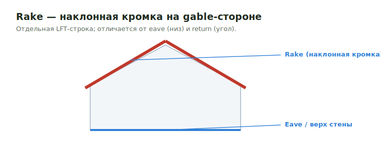

# Rake

**Rake** — наклонный край крыши на gable-стороне (по скату фронтона). Отличается
от **eave** (горизонтальный нижний край) и **return** (угловая коробка).
Меряется отдельной LFT-строкой по наклонной кромке.

<figure markdown>
  
  <figcaption>Rake — наклонная кромка на gable; eave (зелёный) — горизонтальный низ.</figcaption>
</figure>

## Что считать

- Rake trim, rake fascia/subfascia.
- Sheathing edge treatment вдоль наклонной кромки.
- Rake board / barge board, lookouts/outriggers, если показаны в detail.

## Проверить

- Rake держи отдельно от [Eve](eve.md) и [Returns](returns.md), когда output
  template ожидает separate roof-edge lines.
- Confirm FRT/exterior treatment для exposed wood.
- Для крыш из `AJS Rafters` (exposed overhang) считай rafters вручную, а не
  простой `Rake` — см. [Eve / Eave](eve.md).

## See also

- [Eve / Eave](eve.md) · [Returns](returns.md) · [Roof Sheathing](../horizontal/roof-framing/roof-sheathing.md)
