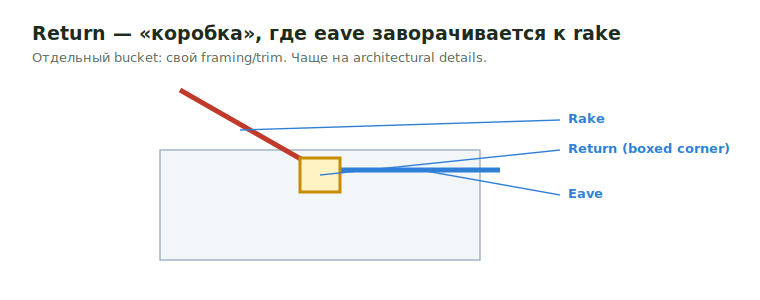

# Returns

**Return** — «коробка» в углу, где eave и rake встречаются и карниз
«заворачивается» обратно к стене (boxed / cornice return). Отдельный bucket от
eave и rake — другой набор framing/trim и часто другой pricing.

<figure markdown>
  
  <figcaption>Return — коробка, где eave заворачивается к rake; отдельный bucket.</figcaption>
</figure>

## Что считать

- Return framing, sheathing и trim (fascia/subfascia, soffit под return).
- Edge treatment там, где eave переходит в rake.

## Проверить

- Returns чаще живут в **architectural details**, а не на structural plans —
  открой elevations/sections.
- Returns отделяй от [Rake](rake.md) и [Eve](eve.md), если pricing lines
  различаются.
- FRT/exterior treatment для exposed wood — проверь по wall material rule.

## See also

- [Eve / Eave](eve.md) · [Rake](rake.md) · [Soffit & Fascia](../exterior-trims/soffit-fascia.md)
