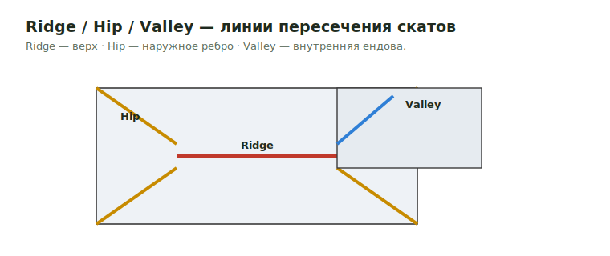

# Ridge / Valley / Hip

Линии пересечения скатов крыши:

- **Ridge** — верхний горизонтальный конёк (стык двух скатов вверху).
- **Hip** — наклонное наружное ребро (скаты сходятся выпуклым углом).
- **Valley** — наклонная внутренняя ендова (скаты сходятся вогнутым углом).

<figure markdown>
  
  <figcaption>Ridge (верх) · Hip (наружное ребро) · Valley (внутренняя ендова).</figcaption>
</figure>

## Что считать

- Ridge / hip / valley framing (ridge board/beam, hip & valley rafters).
- Связанный trim/material и sheathing вдоль этих линий, когда in scope.
- Metal valley flashing — см. [Flashing](flashing.md), если в scope.

## Проверить

- Roof framing members держи **отдельно** от roof-finish trim, если output
  template prices them separately.
- Проверь тип member: dimensional lumber, LVL/PSL/GL или **truss by others**.
- Hip/valley rafters обычно длиннее и крупнее common rafters — проверь size/length.

## See also

- [Ridge](../horizontal/roof-framing/ridge.md) · [Hip](../horizontal/roof-framing/hip.md) · [Valley](../horizontal/roof-framing/valley.md)
