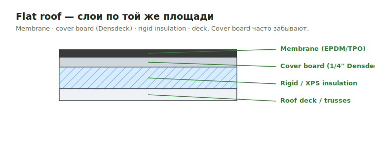

# Roof Types

Тип кровельной системы задаёт, какие площадные материалы попадают в takeoff
(а каркас идёт по roof-framing страницам). Частые системы: **asphalt shingle**,
**standing-seam metal**, **flat / low-slope** (membrane).

<figure markdown>
  
  <figcaption>Flat roof: membrane · cover board · rigid insulation · deck — слои по той же площади.</figcaption>
</figure>

## Что считать

- Asphalt, metal, flat roof и alternate roof systems — только когда in scope.
- Для flat roof: cover boards, rigid insulation, XPS, glass mat, Densedeck.
- Underlayment / ice-&-water, drip edge — если в scope отделки.

## Проверить

- Plans часто дают alternates: asphalt shingles **и** standing seam metal —
  уточни, что считать (или обе как alternate).
- Flat-roof trusses обычно требуют Densedeck / cover board **по той же площади**,
  что и rigid insulation — частый пропуск.
- Piggy trusses требуют проверки sleepers.

## See also

- [Roof SQFT](../sqfts/roof.md) · [Roof Sheathing](../horizontal/roof-framing/roof-sheathing.md) · [Ridge / Valley / Hip](ridgevalleyhip.md)
