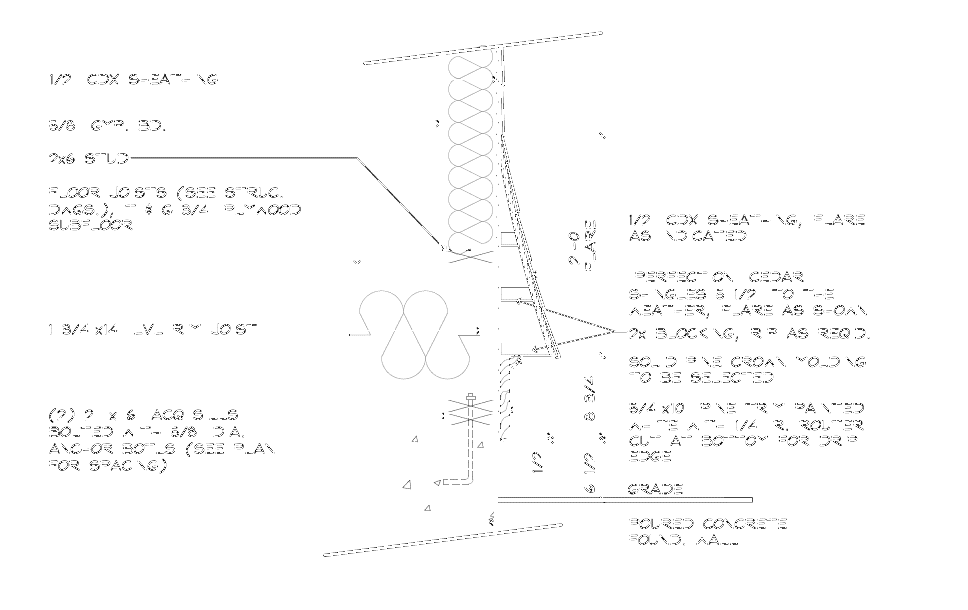

# Siding

Siding — это **наружная обшивка стен**: clapboard / lap, shingle / shake,
panel / board, vinyl, Hardi (fiber cement), cedar, composite. Это **отдельный
scope**, не Exterior Trims.

!!! abstract "Siding vs Exterior Trims"
    - **Siding** — поле стены (площадь, `SQ FT`). Эта секция.
    - **Trim вокруг siding** — casing, corner, band, soffit/fascia — это
      [Exterior Trims](../exterior-trims/overview.md).
    - **EIFS / Stucco / Stone / Brick veneer** — это **тоже cladding**, но
      обычно **by others**. Полностью разобрано здесь:
      [EIFS / Stucco / Veneer](eifs-stucco-veneer.md).

## Что входит в scope { .kb-section-title .kb-st--green }

-   :material-format-list-group:{ .lg .middle } **Типы siding**

    ---

    Clapboard / lap, shingle / shake, panel / board-&-batten / shiplap,
    vinyl, Hardi, cedar, Boral / composite, gable accent.

    [:octicons-arrow-right-24: Типы siding](types.md)

-   :material-layers-outline:{ .lg .middle } **Underlayment / за siding**

    ---

    WRB / housewrap (Tyvek), Zip, furring / rainscreen, Cedar Breather,
    starter / J-channel / corners, flashing.

    [:octicons-arrow-right-24: Underlayment](underlayment.md)

-   :material-cancel:{ .lg .middle .kb-mk--amber } **EIFS / Stucco / Veneer**

    ---

    EIFS, Stucco, Stone & Brick veneer — что это, как распознать, почему
    **by others**, и где идёт `J-Channel` / casing bead.

    [:octicons-arrow-right-24: EIFS / Stucco / Veneer](eifs-stucco-veneer.md)

-   :material-ruler-square:{ .lg .middle } **Измерение / takeoff**

    ---

    `SQ FT` по elevation, gables, dormers, bays, deductions, waste,
    by-others дисциплина.

    [:octicons-arrow-right-24: Измерение](measure.md)

## Считаем / не считаем { .kb-section-title .kb-st--amber }

| Cladding | Считаем? | Почему |
| --- | --- | --- |
| Clapboard / lap / shingle / panel / board | :material-check-bold: ДА | wood / vinyl / fiber-cement / composite — наш scope |
| Cedar / Hardi / Boral / vinyl | :material-check-bold: ДА | поле стены, `SQ FT` |
| **EIFS** / **Stucco** | :material-close-thick: НЕТ* | finish system by others |
| **Stone / Brick veneer** | :material-close-thick: НЕТ* | masonry / veneer by others |
| Siding `by others` / `TBD` | :material-minus-thick: 0 + note | заказчик/другой trade |

\* Но WRB, sheathing, furring и trim вокруг — всё равно проверяем.
Подробно: [EIFS / Stucco / Veneer](eifs-stucco-veneer.md).

## Строка takeoff { .kb-section-title .kb-st--cyan }

| Label | Value | Unit | Заметка |
| --- | --- | --- | --- |
| `Siding` | `Hardi plank 6" exp` | `SQ FT` | exposure в Label |
| `Siding` | `Vinyl clapboard` | `SQ FT` | |
| `Siding Gable front` | `Vinyl Shingles` | `SQ FT` | gable accent отдельно |
| `Siding` | `Per customer TBD` | `SQ FT` | `0` + note |
| `Siding 2 Boral TruExt` | `1x10 Shiplap` | `SQ FT` | продукт в Label |

- Материал и exposure (`6" exp`, `5-1/2" to weather`) всегда в Label.
- Gable / accent / bay siding — **отдельные строки** от field siding.
- `SQ FT` (или `SF`) — единица siding. Не `LFT`.

!!! tip "Note-дисциплина"
    Сразу пиши siding-note: `Note: Siding is Hardi; verify if Trims are
    Hardi or PVC`, `Note: Stone Veneer by others`, `Note: Per customer TBD`.
    Это управляет и trim-scope (см. [Standard notes](../../reference/standard-notes.md)).

## Визуально { .kb-section-title .kb-st--green }

  
Скрыть siding-примеры

  <figure class="kb-figure-row">
    <figcaption class="kb-figure-row__text">
      
Lap / clapboard + corner

      
Vinyl/Hardi/cedar lap заводится в corner / J-channel.

      
Siding = поле (SQ FT); corner — это trim.

    </figcaption>
    
  </figure>
  <figure class="kb-figure-row">
    <figcaption class="kb-figure-row__text">
      
Cedar shingle

      
<code>"Perfection" 5-1/2" to weather</code> — exposure в Label.

      
Shingle waste выше, чем у lap; Cedar Breather на solid основании.

    </figcaption>
    
  </figure>

## See also

- [Типы siding](types.md) · [Underlayment](underlayment.md) · [EIFS / Stucco / Veneer](eifs-stucco-veneer.md) · [Измерение](measure.md)
- [Exterior Trims → Overview](../exterior-trims/overview.md) · [Exclusions и J-Channel](../exterior-trims/exclusions.md)
- [Furring & Window Jambs](../exterior-trims/furring-and-jambs.md)
- [Material catalog](../../reference/material-catalog.md) · [Standard notes](../../reference/standard-notes.md)
