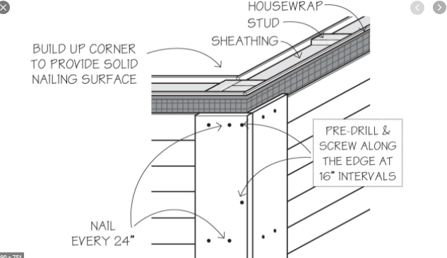

# Underlayment — что за siding

За siding есть слои, которые легко пропустить: WRB / housewrap, sheathing,
furring / rainscreen, Cedar Breather, starter / J-channel / corners,
flashing. Смотри **wall sections**, не только elevation.

## Слои стены снаружи внутрь { .kb-section-title .kb-st--green }

1. **Siding** (поле, `SQ FT`) — см. [Типы siding](types.md).
2. **Rainscreen / furring** — `1x4` / `2x4`, P.T. или нет (опционально).
3. **WRB / housewrap** — Tyvek, или Zip (WRB integral).
4. **Sheathing** — CDX / Zip / OSB (свой scope).
5. Stud wall.

## WRB / Housewrap { .kb-section-title .kb-st--cyan }

| Label | Материал | Unit |
| --- | --- | --- |
| `House wrap` / `WRB` | `Tyvek` | `SQ FT` (стена) или rolls |
| `Vapor Barrier` | `Tyvek` | `SQ FT` |
| Zip system | `7/16` / `1/2` Zip + `Zip Tape` | sheet / rolls |

- При **Zip** отдельный housewrap не нужен (WRB встроен) — не дублируй.
- Tyvek считается по площади стены (часто = siding SQ FT + factor).

## Furring / Rainscreen { .kb-section-title .kb-st--magenta }

Рейка между WRB и siding: вентзазор / ровное основание. **Часто пропускают.**

- `1x4` или `2x4`, **P.T. или не P.T.** — берётся из section.
- Считается `LFT` (по spacing, 16" o.c.) или `SQ FT` стены, если сплошной.
- P.T. внизу / у foundation / влажно; выше — обычно не P.T.

Полное правило и макрос — [Furring & Window Jambs](../exterior-trims/furring-and-jambs.md).

## Cedar Breather { .kb-section-title .kb-st--green }

Вентилируемая сетка-мат под **cedar shingle/shake** на сплошном основании
(чтобы дранка сохла с тыла).

- Появляется в Standarts как `Cedar Breather`.
- Считается `SQ FT` площади shingle-стены.
- Если siding = cedar shingle на solid sheathing — проверь, есть ли он в деталях.

## Vinyl accessories / starter / J-channel / corners { .kb-section-title .kb-st--cyan }

Для vinyl (и иногда fiber-cement) siding нужны accessories — это **не поле**,
а отдельные `LFT`-строки (часто учитываются как trim):

| Accessory | Где | Unit |
| --- | --- | --- |
| `Starter strip` | низ первого ряда | `LFT` |
| `J-Channel` | вокруг окон/дверей, под soffit, у corner, gable/rake | `LFT` |
| `Corner posts` (outside/inside) | углы | `LFT` |
| `Undersill / finish trim` | под окном, у верха стены | `LFT` |

- При vinyl siding `Ext. Casing` нередко **и есть** `Vinyl J-channel` — не
  дублируй с `5/4` wood casing. См.
  [Exterior Trims → Exclusions и J-Channel](../exterior-trims/exclusions.md).

<figure markdown>
  
  <figcaption>Housewrap → sheathing → stud за siding; corner нужен solid nailing base.</figcaption>
</figure>

## Flashing за / в siding { .kb-section-title .kb-st--magenta }

| Flashing | Где | Unit |
| --- | --- | --- |
| Z-flashing | горизонтальные стыки panel siding | `LFT` |
| Head flashing / drip cap | над окнами/дверями, head trim | `LFT` |
| Kickout flashing | где крыша встречает стену (roof-wall) | `pcs` |
| Step flashing | вдоль ската у стены | `LFT` |
| Band / watertable flashing | под горизонтальным trim-поясом | `LFT` |

- Flashing держи **видимой строкой**, не растворяй в siding SQ FT.
- Head/band flashing часто = `drip edge` (см. [Casing, Corner & Band](../exterior-trims/casing-corner-band.md)).

## Чек { .kb-section-title .kb-st--green }

- [ ] WRB определён (Tyvek vs Zip-integral) — без дублей?
- [ ] Открыл sections — есть ли furring/rainscreen (size, P.T.)?
- [ ] Cedar shingle на solid → Cedar Breather учтён?
- [ ] Vinyl: starter / J-channel / corners / undersill посчитаны (LFT)?
- [ ] При vinyl: casing = J-channel, без двойного счёта?
- [ ] Z / head / kickout / step flashing — видимыми строками?

## See also

- [Overview](overview.md) · [Типы siding](types.md) · [Измерение](measure.md)
- [Furring & Window Jambs](../exterior-trims/furring-and-jambs.md)
- [Exterior Trims → Exclusions и J-Channel](../exterior-trims/exclusions.md)
- [Material catalog](../../reference/material-catalog.md)
