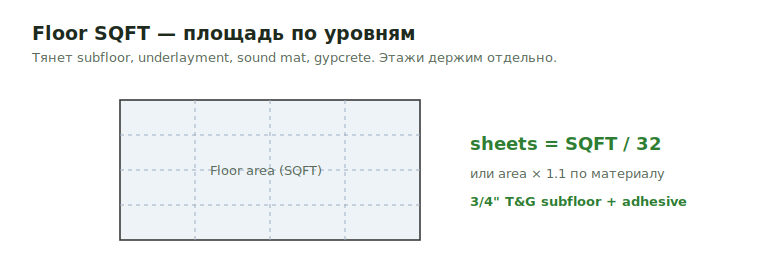

# 1st-5th Floor SQFT

**Floor SQFT** — площадь перекрытия по уровням. Тянет subfloor, underlayment,
sound mat, gypcrete и прочие площадные материалы пола.

<figure markdown>
  
  <figcaption>Площадь этажа → sheets = SQFT / 32 (или area × 1.1). Этажи держим отдельно.</figcaption>
</figure>

## Что считать

- Floor areas по level.
- Assemblies, которые управляют subfloor, underlayment, sound mat, gypcrete или
  other material.

## Правила

- Floors держи отдельно, даже когда identical.
- Добавляй note, когда floor identical to another floor, но materials всё равно
  list separately.
- Проверяй lower bearing wall notes; 1st/2nd floor walls могут требовать double studs.

## See also

- [Subfloor](../horizontal/floor-framing/subfloor.md) · [Joist](../horizontal/floor-framing/joist.md)
- [Формулы → per SQFT](../../reference/formulas.md)

