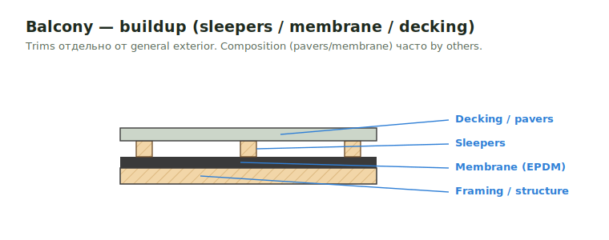

# Balcony SQFT

**Balcony** — приподнятая наружная площадка, консольно вынесенная или на
каркасе, привязанная к зданию. В SQFT — площадь настила + buildup.

<figure markdown>
  
  <figcaption>Buildup: structure → sleepers → membrane → decking/pavers (часто by others).</figcaption>
</figure>

## Что считать

- Decking по площади и balcony buildup (sleepers, slope).
- Framing: joists/cantilever, ledger, rim к зданию.
- Railings/guards, balcony trims, waterproofing/membrane по detail.
- Attachment details (bolts/screws/LVL rim).

## Проверить

- Details могут показывать **decking без sheathing** — не добавляй sheathing,
  если его нет.
- Balcony trims держи **отдельно** от general exterior trims (другой pricing).
- Attachment к зданию может тянуть LVL rim, bolts или Simpson screws.
- Cantilevered balcony — смотри [Cantilevered SQFT](cantilevered.md) (rim/edge,
  blocking, holdowns).

## See also

- [Balcony build-up](../exterior-trims/balcony-buildup.md) · [Balcony trims](../deck/balcony-trims.md)
- [Deck / Porch / Balcony framing](../deck/deck-porch-balcony-frame.md)
