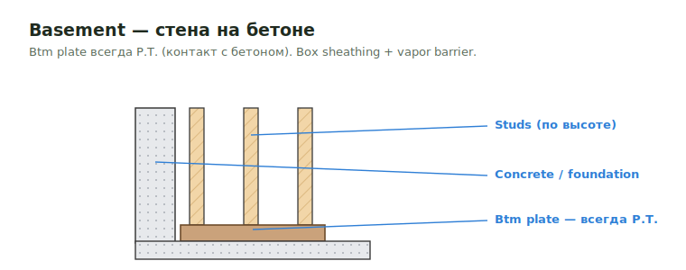

# Basement SQFT

<figure markdown>
  
  <figcaption>Цокольная стена на бетоне: btm plate всегда P.T.; box sheathing + vapor barrier.</figcaption>
</figure>

## Что считать

- Basement floor/wall areas that drive sheathing, sleepers, insulation, or
  finish assemblies.

## Проверить

- Basement SQFT plywood and sleepers are easy to skip.
- Under slab / over slab assemblies всё ещё могут требовать underlayment.
- Existing/podium conditions нельзя считать standard panels без
  checking details.

## Basement как каркасная стена { .kb-section-title .kb-st--green }

Если basement walls in scope — это полноценная stick-стена. Типовой состав:

| Строка | Заметка |
| --- | --- |
| **Plates Interior btm** | **всегда `P.T.`** (садится на бетон) |
| **Studs Interior** | размер авто по высоте (nested-IF) |
| Blocking | `2x` |
| Plates dbl top | |
| Plates / Studs Corridor | `2x6 P.T.` / `LSL P.T.` btm |
| Vapor Barrier | Tyvek |
| Box Sheathing | OSB |
| Window / Sill Flashing | проёмы в bsmt-стене |

→ Ключевое: **btm-plate цокольной стены всегда P.T.** (контакт с бетоном) — как и
у [Sill Plates](../vertical/walls/sill-plates.md). Стальной каркас (Steel/Mtl Walls)
встречается — тогда framing by others, но обшивка/изоляция наши.
