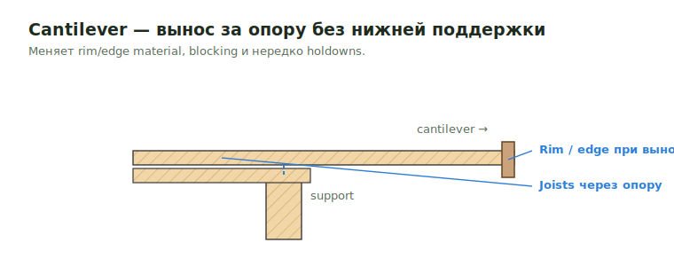

# Cantilevered SQFT

**Cantilever** — часть перекрытия/крыши/деки, вынесенная за опору без нижней
поддержки. Меняет rim/edge, blocking и нередко holdowns.

<figure markdown>
  
  <figcaption>Joists идут через опору наружу; rim/edge и blocking на выносе меняются.</figcaption>
</figure>

## Что считать

- Cantilevered floor/roof/deck areas и их sheathing, blocking, insulation и rim
  conditions.

## Проверить

- Cantilever conditions часто меняют rim/edge material.
- Exterior FRT rules могут применяться.
- Проверь details на extra blocking, bracing или holdowns.
- В output оставляй видимый label `Cantilevered`, чтобы reviewer видел, почему
  SQFT отделён.

## See also

- [Rim Board](../horizontal/floor-framing/details/rim.md) · [Blocking](../horizontal/floor-framing/details/blocking.md)
- [Joist](../horizontal/floor-framing/joist.md)

