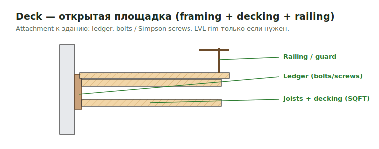

# Deck SQFT

**Deck** — открытая (без крыши) наружная площадка на каркасе. В SQFT-такеоффе
это площадь настила, которая тянет framing, decking, railings и attachment.

<figure markdown>
  
  <figcaption>Deck: ledger + joists + decking + railing; attachment — bolts/screws.</figcaption>
</figure>

## Что считать

- Decking по площади (см. формулу) — composite, PT lumber или по spec.
- Framing: joists, beams, posts, ledger к зданию.
- Sleepers / underlayment — нередко `1/2"` underlayment по detail.
- Railings, guards, stairs, exterior trims.

## Формула площади

`Decking pcs = area SQFT / board coverage` либо `area × 1.1` по материалу.
Waste — `1.1` (см. [Формулы](../../reference/formulas.md)).

## Проверить

- LVL rim — **только** когда явно нужен for strength (deck/corridor frame),
  не по умолчанию.
- Exterior attachment details могут требовать bolts или Simpson screws.
- Guards/railings высотой и шагом по code — отдельной строкой.

## See also

- [Deck / Porch / Balcony framing](../deck/deck-porch-balcony-frame.md)
- [Rails & Decking](../exterior-trims/rails-decking.md) · [Railing](../deck/railing.md)
- [Anchor Bolts](../deck/anchor-bolts.md)
