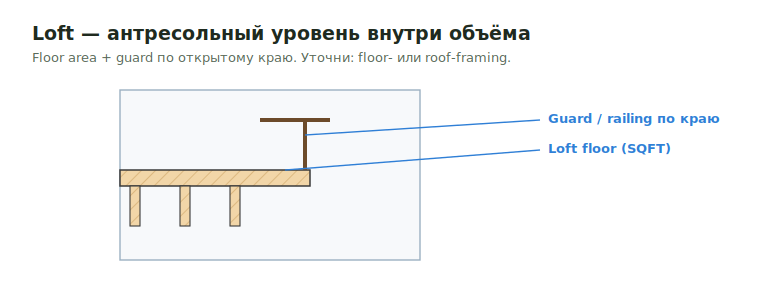

# Loft SQFT

**Loft** — антресольный/мезонинный уровень внутри объёма этажа. В SQFT — площадь
пола лофта; framing может быть floor- или roof-типа.

<figure markdown>
  
  <figcaption>Loft floor (SQFT) + guard по открытому краю. Уточни тип framing.</figcaption>
</figure>

## Что считать

- Loft floor area → subfloor, joists/framing, blocking.
- Guards/railings по периметру открытой части.
- Stairs/openings к лофту и roof-interface materials, когда показаны.

## Проверить

- Loft часто прячется на architectural sheets, а framing — на structural.
- Уточни: loft framing — это **floor framing, roof framing или by others**.
  От этого зависит joist depth/product и hangers.
- Открытый периметр почти всегда требует guard/railing — частый пропуск.

## See also

- [Joist](../horizontal/floor-framing/joist.md) · [Subfloor](../horizontal/floor-framing/subfloor.md)
- [Stair](../horizontal/floor-framing/stair.md)
