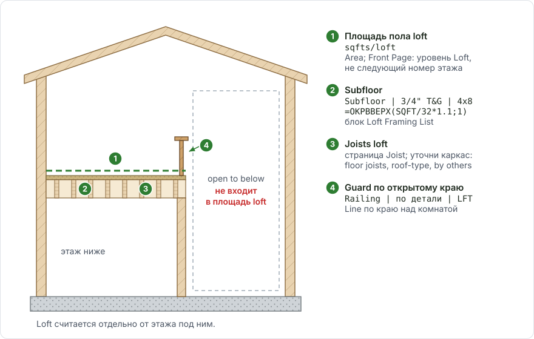

# Loft SQFT (площадь антресоли)

<figure markdown>
  
  <figcaption markdown="span">Loft: пол антресоли внутри объёма этажа плюс guard по открытому краю. Площадь - отдельная Area, не часть этажа ниже.</figcaption>
</figure>

## Что это

Loft - антресоль или mezzanine внутри объёма этажа, часто над частью
плана. Её площадь считается отдельно от этажа под ней: она тянет свой
subfloor, свои joists и ограждение по открытому краю. На Front Page уровень
называется `Loft`, не следующим номером этажа. Общие правила замера -
[Floor SQFT, раздел правил](1st2nd.md#rules).

## Где искать на чертежах

| Лист | Что взять |
| --- | --- |
| Loft / mezzanine plan (A) | Контур пола, открытый край, лестница |
| Sections (`sec`) | Высота, тип каркаса: floor framing, roof framing или by others |
| Framing plan (S) | Joists loft, балки, опоры; глубина и hangers |
| Door / guard notes | Guard по открытому краю |

## Как мерить в OurPlanCore

1. Area по контуру пола loft на листе плана loft (точка W). Имя `loft`.
2. Открытый край (над комнатой ниже) не входит в площадь loft, но нужен
   как длина guard: Line в `trims` или `framing` по принятому дереву.
3. Уточни тип каркаса: floor joists, roof-type или by others; от этого зависит,
   куда идут joists ([Joist](../horizontal/floor-framing/joist.md)).

!!! note "Имя `loft` и папка `sqfts`"
    Слова `loft` нет среди имён, которые программа сама отправляет в `sqfts`
    (туда уходят этажи `1st`...`8th`, `base`, `porch`, `deck`, `blcny`, `cant`,
    `flat`, `rf`). После создания проверь, что позиция лежит в `sqfts`; если
    нет, перенеси её туда или добавь правило в Settings > Takeoff Name
    Routing. Экспорт SF имя `loft` понимает и кладёт площадь в ячейку пятого
    этажа: строка `Subfloor` loft должна ссылаться на неё.

## Как назвать в дереве и строка DFL

| Имя в дереве | Строка DFL | Материал | Unit | Формула |
| --- | --- | --- | --- | --- |
| `sqfts/loft` | Front Page, `Loft` | | `SQ FT` | как измерено |
| `sqfts/loft` | `Subfloor` в `Loft Framing List` | `3/4" T&G` | `4x8` | `=ОКРВВЕРХ(SQFT/32*1.1;1)` |
| J Area зоны joists loft | `Joists 16" o.c.` в `Loft Framing List` | по S-плану | длина доски в футах | C = число joists: [Joist](../horizontal/floor-framing/joist.md) |
| Line по открытому краю | `Railing` / guard | по детали | `LFT` | [Railing](../deck/railing.md) |

## Частые ошибки

- Loft не найден: он на архитектурных листах, каркас на structural.
- Guard по открытому периметру забыт.
- Loft записан как `5th` вместо `Loft` на Front Page.
- Joists записаны в `LFT`: в C число досок, в D длина доски.

Все ошибки по площадям: [common-mistakes](../../start/common-mistakes.md#sqft).

## Пример

```text
Takeoffs/Main/sqfts/
  loft      Area   340 SF   (20' x 17')
Loft Framing List
Joists 16" o.c.    2x10       16   18    S203   20 x 12/16 = 15, плюс 1; пролёт 17' = доска 18'
Subfloor           3/4" T&G   12   4x8          340 / 32 x 1.1 = 11.7
```

## См. также

- [Floor SQFT](1st2nd.md), [Joist](../horizontal/floor-framing/joist.md), [Stair](../horizontal/floor-framing/stair.md)
- [Railing](../deck/railing.md)
