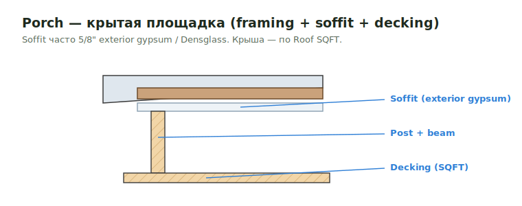

# Porch SQFT

**Porch** — крытая входная площадка, прикреплённая к зданию. В SQFT-такеоффе
это площадь пола (и/или потолка/soffit) порча, которая тянет за собой framing,
decking и наружную отделку.

<figure markdown>
  
  <figcaption>Porch: post + beam + soffit + decking. Крыша — по Roof SQFT.</figcaption>
</figure>

## Что считать

- Floor framing порча: joists/beams, posts, ledger к зданию.
- Decking по площади (см. формулу ниже).
- Soffit / ceiling sheathing — часто **5/8" exterior-grade gypsum** или Densglass.
- Posts, beams, railings, exterior trims.
- Roof над порчем (если есть) — отдельно по [Roof SQFT](roof.md).

## Формула площади

`Decking / soffit pcs = area SQFT / 32` (лист 4×8) либо `area × 1.1` по
материалу. Waste — `1.1` (см. [Формулы](../../reference/formulas.md)).

## Проверить

- На многих COM jobs porch/deck scope **не входит** — проверь, а не предполагай.
- Exterior soffit sheathing может быть `5/8"` exterior gypsum или Densglass —
  не путать с обычным interior gypsum.
- Attachment к зданию (ledger) может требовать LVL rim, bolts или Simpson screws.

## See also

- [Deck / Porch / Balcony framing](../deck/deck-porch-balcony-frame.md)
- [Porch / Deck / Balcony trims](../exterior-trims/porch-deck-balcony.md)
- [Anchor Bolts](../deck/anchor-bolts.md) · [Soffit & Fascia](../exterior-trims/soffit-fascia.md)
