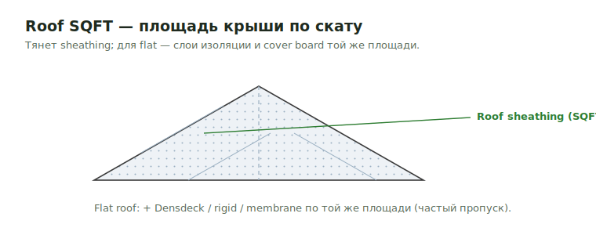

# Roof SQFT

**Roof SQFT** — площадь крыши (по скату/проекции). Тянет sheathing, а для
плоских крыш — слои изоляции и cover board.

<figure markdown>
  
  <figcaption>Площадь по скату → sheathing; flat roof — Densdeck/rigid той же площади.</figcaption>
</figure>

## Что считать

- Roof sheathing area.
- Flat roof insulation, cover board, and protection board where shown.
- Roof truss accessories by perimeter/detail.

## Частые пропуски

- `1/4" Densedeck` or `1/2" Glass Mat` protection board.
- Additional rigid XPS layer.
- Piggy truss sleepers.
- Roof TJI rim.
- 1x3 strapping under roof trusses, когда specified.

## See also

- [Roof Sheathing](../horizontal/roof-framing/roof-sheathing.md) · [Roof Types](../sheathing-and-misc/rooftype.md)
- [Truss Heel](../vertical/sheathing/truss-heel.md)

