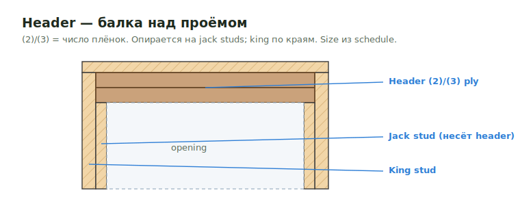

# Headers

**Header** — балка над проёмом (окно/дверь), передающая нагрузку на jack/king
studs. `(2)`/`(3)` = число плёнок (двух-/трёхслойный). Размер часто меняется
по этажу — бери из structural schedule.

<figure markdown>
  
  <figcaption>Header опирается на jack studs; king по краям. `(2)`/`(3)` — число плёнок.</figcaption>
</figure>

## Что считать

- Exterior и interior headers, когда они part of takeoff scope.
- Flush headers даже в panelized jobs, если они not included in panels.

## Правила

- В panelized wall jobs exterior и interior wall headers часто относятся к
  Walls, а не Floor Framing.
- Не считай panelized wall headers, если wall panels уже include them.
- Header sizes могут меняться by floor; schedules проверяй внимательно.

## Проверить

- Higher floors могут иметь larger exterior headers, чем lower floors.
- Structural schedules override architectural wall assumptions.
- `(3)` означает three-ply header; не вводи only one board для triple header.

## See also

- [Windows & Doors](windows-doors.md) · [Roof Framing → Header](../../horizontal/roof-framing/header.md) · [Exterior Walls](../walls/exterior.md)
