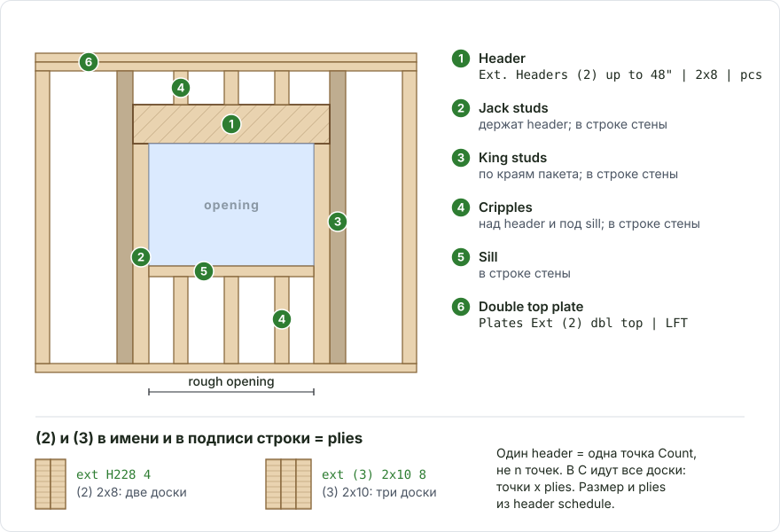
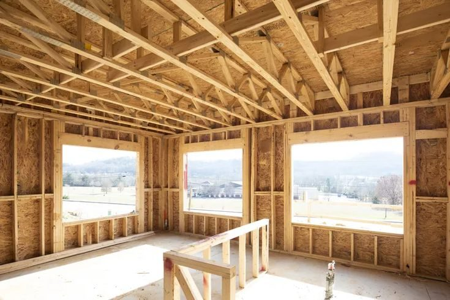

# Headers (перемычки над проёмами)

<figure markdown>
  
  <figcaption markdown="span">Header лежит на jack studs, king studs держат пакет по краям. `(2)` и `(3)` в имени - число слоёв (plies).</figcaption>
</figure>

<figure markdown>
  
  <figcaption markdown="span">Наружная стена изнутри: над каждым окном сдвоенный header лежит на jack studs, по краям king studs, под окном sill с cripples. Каждый проём даёт один header в строку `ext` по размеру из header schedule; cripples и jacks в header не входят. Фото: thespruce.com, [источник](https://www.thespruce.com/what-size-header-is-needed-for-a-window-5092377), найдено через Pinterest.</figcaption>
</figure>

## Что это

Header - балка над проёмом в стене, передаёт нагрузку на jack studs.
Наружные (`ext`) и внутренние (`int`) считаются раздельно, размер и число
plies - из header schedule, не из ширины окна. На panel-job headers внутри
панелей не считаем, только flush и loose. Header крыши (roof header) - другая
тема: [Roof Framing: Header](../../horizontal/roof-framing/header.md).

## Где искать на чертежах

| Лист | Что взять |
| --- | --- |
| Header schedule (S), типовые детали стены | Марка и сечение по пролёту и этажу: `H228`, `HPA`, `(3) 2x10` |
| Планы с тегами (`s102`) | Марки над проёмами, где инженер их показал |
| Window и door schedule, фасады | Ширина проёма, составные проёмы |
| Панельные чертежи, scope | Что внутри панели, что flush или loose |
| Code summary | FRT у headers в плоскости наружной стены при Type III |

## Размер, если header schedule нет { #default-sizes }

Размер из header schedule и с планов всегда главнее. Когда schedule нет (обычно residential), бери дефолты E-Wood по пролёту, то есть по ширине проёма:

| Где стоит header | до 4' | до 6' | 6'-9' | 9'-12' | 12'-14' | 14'-16' | 16'-18' |
| --- | --- | --- | --- | --- | --- | --- | --- |
| Наружная несущая стена 2x6 (Exterior brg wall) | `(2) 2x10` | `(3) 2x10` | `(2) 9-1/2" LVL` | `(2) 11-7/8" LVL` | `(2) 14" LVL` | `(2) 16" LVL` | `(3) 16" LVL` |
| Внутренняя несущая стена 2x4 (Interior brg wall) | `(2) 2x10` | `(2) 2x12` | `(2) 9-1/2" LVL` | `(2) 11-7/8" LVL` | `(2) 14" LVL` | `(2) 14" LVL` | `(2) 16" LVL` |
| Flush header или beam под перекрытием | `(2) 2x` высотой joists при 2x joists, `(2) LVL` при I-joists | так же, как до 4' | `(2) LVL` высотой joists | `(2) LVL` высотой joists | `(3) LVL` высотой joists | `(3) LVL` высотой joists | `(3) 14" LVL` |
| Flush header или beam под перекрытием и крышей (под наружной стеной) | | | `(3) 9-1/2" LVL` | `(3) 11-7/8" LVL` | `(3) 14" LVL` | `(3) 16" LVL` | `(3) 18" LVL` |

Центральная балка гаража (garage center beam), по пролёту:

| Нагрузка | 22' | 24' | 26' |
| --- | --- | --- | --- |
| Сверху перекрытие (Floor above) | `(3) 16" LVL` | `(3) 18" LVL` | `(3) 24" LVL` |
| Только потолок (ceiling load only) | `(3) 14" LVL` | `(3) 16" LVL` | `(3) 18" LVL` |

Принятый по таблице размер запиши нотой у строки header или beam (см. [Ноты в DFL](../../../reference/standard-notes.md)), чтобы было видно, что он не из schedule.

## Как мерить в OurPlanCore

Инструмент **Count** (point), один на физический header, или **Beam** по
пролёту между опорами: Beam сам меряет длину и округляет её в имени (до 8'
вверх до целого фута, длиннее - до чётного).

1. Ветка `framing/<этаж> framing/headers/ext/` и `.../headers/int/`. Точка F
   на S-листе кладёт Count в `framing/<этаж> framing`; дальше в `headers/ext`
   переносом или выбором папки перед New Item.
2. Имя: `ext H228 4`, `int H228 4`, `HPA 4`, `ext (3) 2x10 8` - сторона,
   марка или сечение с plies, заказная длина в футах.
3. Этаж папки - реальный bearing scope, не номер архитектурного фасада.
4. Один built-up header = одна точка с `(n)`; не ставь n точек.
5. Storefront из нескольких окон не обязательно даёт столько же headers;
   составной проём может иметь общий header.
6. Деревянный header отдельно от стального элемента и его nailer.

## Как назвать в дереве и строка DFL

Кнопка `HD` полосы XL кладёт headers в блок стен этажа **ниже**; сторона
`ext` / `int` берётся из имени. В легенде `LG` строка `HP2 - (2) 2x10`
даёт размер по коду, иначе в B попадёт код. Число plies стоит в конце подписи
в скобках: `(2)`, `(3)`; C считает каждую доску.

| Имя в дереве | Строка DFL | Unit (колонка D) | Формула / фактор |
| --- | --- | --- | --- |
| `ext H228 4` | `Ext. Headers up to 48" (2)` `2x8` | штуки, D = `8` | `точки x plies / 2`: два header режутся из одной доски |
| `ext H228 7` | `Ext. Headers up to 72" (2)` | штуки, D = `14` (до 60" D = `12`) | `точки x plies / 2` |
| `ext (3) 2x10 8` | `Ext. Headers over 72" (3)` `2x10` | штуки, D = ширина проёма + 1', до чётного | `точки x plies`: один header из одной доски |
| `int H228 4` | `Int. Headers (2)` | штуки, D = `8` | `точки x plies / 2`; пролёт больше 4' - `точки x plies`, D по длине |
| `9.0x6.8 gd` ворота | `Ext. Grge Headers (3)` | штуки, D = ширина ворот + 1', до чётного | `ворота x plies`, размер по schedule |
| нет на плане | нота `The headers indicated on the plan...` | | чёрный жирный текст без заливки |

Если наружная стена FRT, headers в её плоскости тоже FRT; LVL/PSL в
плоскости наружной стены при Type III не ставятся. Образцы нот:
[Ноты в DFL](../../../reference/standard-notes.md).

## Частые ошибки

- Header выведен из ширины окна: разные несущие условия дают разные марки.
- `(3)` введено одной доской.
- Headers внутри панелей посчитаны на panel-job.
- Этаж взят по фасаду, а не по bearing scope; верхние этажи имеют другие размеры.
- Наружные headers без FRT при Type III (в проверке: 4-й этаж целиком).
- Один составной проём записан как два headers.

Разбор с примерами: [все ошибки по проёмам](../../../start/common-mistakes.md#openings).

## Пример

```text
framing/2nd floor framing/headers/
  ext/
    ext H228 4        Count, 14 ea
    ext (3) 2x10 8    Count, 2 ea     Notes: 4/S501, FRT per A001
  int/
    int H228 4        Count, 9 ea
```

Строки DFL в блоке стен 1-го этажа (`H228` = `(2) 2x8`):

```text
Ext. Headers up to 48" (2)    2x8     14   8    14 x 2 / 2
Ext. Headers over 72" (3)     2x10     6   8    2 x 3
Int. Headers (2)              2x8      9   8    9 x 2 / 2
```

## См. также

- [Windows and Doors](windows-doors.md), [Exterior Walls](../walls/exterior.md), [Wall Panels](../walls/wall-panels.md)
- [Beam](../../horizontal/floor-framing/beam.md): инструмент Beam и округление
- [Подписи строк DFL](../../../reference/takeoff-items.md)
