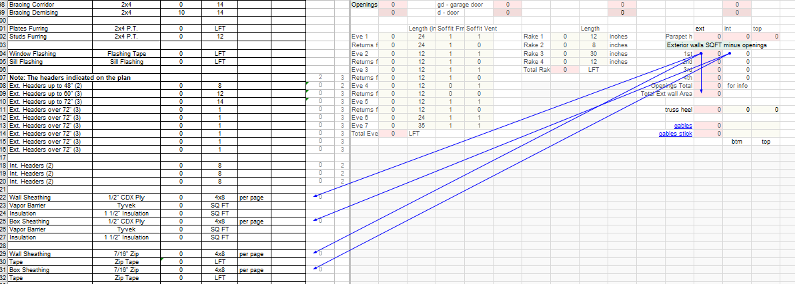

# Windows and Doors

Source: `https://ewood.atlassian.net/wiki/spaces/work/pages/65339393/Windows+Doors`

## Count

- Window and door openings by type/size.
- Jamb blocking for all windows and interior doors.
- Fire-rated unit entry doors from corridors.

## Door Labels

- Use material and fire rating where relevant: `2670 FCW`, `3070 HM C-lbl`.
- Unit entries can be labeled `3070 Entry`.
- Hardware numbers usually are not needed in the takeoff list.

## Check

- Exterior jambs can use flashing-style formulas.
- Interior door jambs can use casing divided by 2 where that is the local method.
- Room schedule tile base should be excluded if only wood base is needed.

## Flashing Table

Source: `https://ewood.atlassian.net/wiki/spaces/work/pages/65044582/Openings`

| Opening item | Output |
| --- | --- |
| Window Flashing | Sill Flashing |

## PlanSwift Marking & Macro

- Подсчёт всех openings — макрос **`F_Openings`** (даёт Window Flashing + Sill Flashing).
- У всех **дверей** обязательно ставь пометку **`d`**.
- У **гаражных** дверей — пометка **`gd`**.
- Если **окно и дверь объединены одним хэдером** (например, sliding patio в blocks с фиксом сбоку) — считай их **вместе** одним openings, ставь **`d`**.
- Все openings **вырезаются из sheathing** — не забывай subtract при подсчёте Wall Sheathing SQFT.

<!-- confluence-gallery:start -->
## Confluence Images

Изображения из Confluence размещены на этой странице по исходной теме.
Подпись сохраняет группу-источник, чтобы можно было быстро проверить контекст.

| Source group | Images | Confluence |
| --- | ---: | --- |
| Openings | 1 | [source](https://ewood.atlassian.net/wiki/spaces/work/pages/65044582/Openings) |

  <a class="kb-gallery__item" href="../../../../assets/images/confluence/confluence-092.png" title="image-20251030-161759.png">
    
    
opening schedule/reference 01 (image, 82 KB raw)

  </a>

<!-- confluence-gallery:end -->
