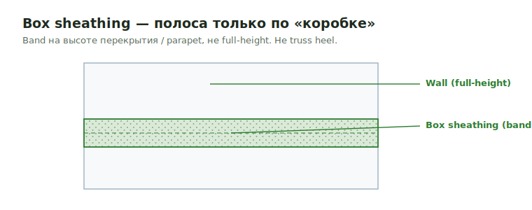

# Box Sheathing

**Box sheathing** — узкая полоса обшивки только по «коробке» перехода
(floor/roof band, parapet, loose wall), а не full-height. Не путать с truss
heel и full-height sheathing.

<figure markdown>
  
  <figcaption>Box sheathing — узкая полоса по «коробке» перехода, а не вся стена.</figcaption>
</figure>

## Что считать

- Box-only sheathing areas around floor/roof transitions, parapets и loose wall
  conditions.

## Правила

- Не называй box sheathing как truss heel.
- Для panelized wall jobs box sheathing может оставаться in scope, даже когда
  wall panels are by others.
- Optional walls могут требовать full-height sheathing вместо box-only.
- Tilda wall checklist говорит проверять hidden box sheathing в sections/details,
  а не только на plan view.
- At attic conditions добавляй floor height к box sheathing только для first
  height, когда local rule требует это.
- Attic subfloor может быть из `extra plate + box = subfloor`; не пропусти
  subfloor line, когда box/plate detail — это clue.

## Проверить

- Сопоставляй labels с details; copied detail labels — recurring error.

## See also

- [Wall Sheathing](wall-sheathing.md) · [Truss Heel](truss-heel.md) · [Floor Sheathing](floor.md)
