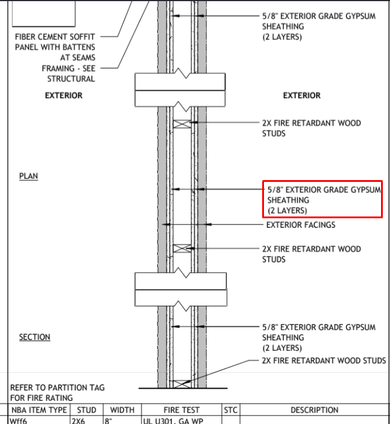
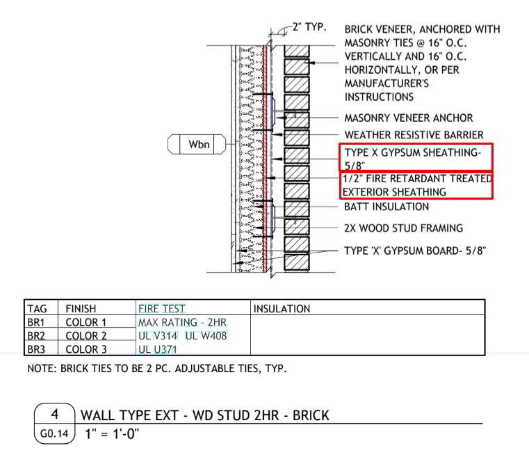
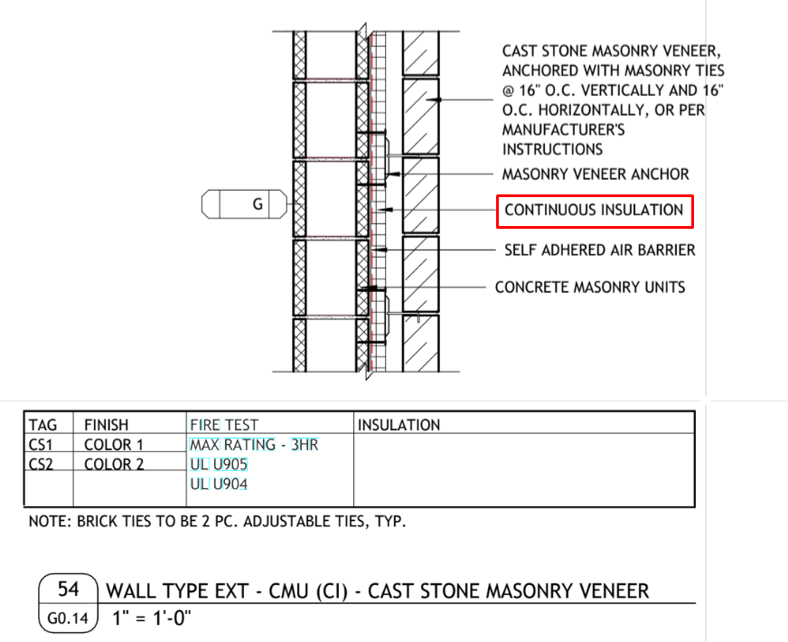

# Exterior Wall Materials

Блок наружных материалов стены — то, что лежит **поверх и внутри каркаса**:
обшивка (gypsum / ply / Zip), continuous insulation, flashing, bracing, window
jambs и furring. Эти позиции легко потерять, потому что они спрятаны в wall
sections / wall type schedule, а не на elevation.

!!! danger "Считаем материал, даже если каркас — чужой"
    Metal stud walls и CMU walls сам каркас часто **by others**. Но обшивка
    (sheathing/gypsum), **insulation**, **flashing** вокруг проёмов, **bracing
    2x4** и **window jambs** обычно остаются нашими. Не выкидывай весь блок
    стены только потому, что studs/CMU не считаем — пройди по wall section и
    собери material lines.

## Exterior gypsum sheathing { .kb-section-title .kb-st--green }

Наружная **gypsum sheathing** (`Type X`, `Exterior Grade`, `Densglass`) идёт по
fire-rating и wall type schedule. Бывает в **один или два слоя**, и отдельно —
слой **поверх FRT** структурной обшивки.

<div class="kb-split" markdown>

- `5/8" Type X` (= `19/32"`) — стандартная exterior gypsum sheathing.
- **(2) layers** — когда wall type / UL-assembly требует два слоя (см. схему).
- **over FRT** — gypsum поверх структурной `1/2" Ply FRT` обшивки; это
  **отдельная строка**, не сливай с базовой.
- `Densglass` разноси по level/elevation, если schedule так делит.
- Считается в `SQ FT` площади стены (gypsum) и в `4x8` листах (structural ply).

<figure markdown>
  
  <figcaption>WD stud (FRT) wall, UL U301 — (2) layers 5/8" exterior grade gypsum sheathing на наружной грани.</figcaption>
</figure>

</div>

Иногда на стене **несколько слоёв обшивки сразу** — структурный ply + gypsum:

<figure markdown>
  
  <figcaption>WD stud 2HR / brick: <strong>5/8" Type X gypsum</strong> + <strong>1/2" FRT exterior sheathing</strong> + batt insulation + 5/8" gypsum board внутри. Все слои — отдельные lines.</figcaption>
</figure>

| Строка в takeoff | Материал | Unit |
| --- | --- | --- |
| `Wall Sheathing` | `5/8" Type X` | `SQ FT` |
| `Wall Sheathing (2) layers` | `5/8" Type X` | `SQ FT` |
| `Wall Sheathing over FRT` | `5/8" Type X` | `SQ FT` |
| `Wall Sheathing` | `1/2" Ply FRT` (structural) | `4x8` |
| `Box Sheathing` | `1/2" Ply FRT` | `4x8` |

!!! tip "Densglass over Zip"
    Часто в заметках: `5/8" Densglass Gypsum over Zip Sheathing`. Это **два
    продукта** — Zip (structural) + Densglass (gypsum) — обе строки в takeoff.

## Insulation (continuous) { .kb-section-title .kb-st--cyan }

Continuous insulation (`Cont. Insulation`, `R6 Zip`, rigid) идёт по energy /
envelope sheets. Два разных места — **на каркасных стенах** и **на CMU** —
считаются **отдельными строками**, потому что площади и детали разные.

<div class="kb-split" markdown>

- `Insulation` — continuous insulation на наружной грани каркасных стен.
- `Insulation at CMU` — continuous insulation на CMU (бетонный блок) стенах. Это
  **отдельная позиция**, её площадь обычно больше (вся CMU-оболочка).
- Считается в `SQ FT`.
- Под insulation на CMU часто крепят **Z metal furring** (см. ниже Furring).

<figure markdown>
  
  <figcaption>Wall type EXT — CMU (CI): concrete masonry units + <strong>continuous insulation</strong> + air barrier + masonry veneer. Insulation at CMU — наша строка.</figcaption>
</figure>

</div>

| Строка в takeoff | Материал | Unit |
| --- | --- | --- |
| `Insulation` | `1.5" Cont. Insulation` | `SQ FT` |
| `Insulation at CMU` | `1.5" Cont. Insulation` | `SQ FT` |
| `Insulation at 6" Ext. Walls` | batt / rigid по детали | `SQ FT` |
| `Rigid Insulation` | rigid board | `SQ FT` |

## Metal stud walls — что остаётся нашим { .kb-section-title .kb-st--magenta }

Даже если **metal studs by others**, по wall section обычно наши:

- **Exterior gypsum sheathing** — material для metal стен нужен, считаем
  (`5/8" Type X`, слои по wall type).
- **Bracing 2x4** — temporary/permanent bracing остаётся: `Bracing Ext Walls`,
  `Bracing Corridor`, `Bracing Demising` — все `2x4`.
- **Flashing** вокруг openings — `Window Flashing at Mtl Walls`, `Sill Flashing
  at Mtl Walls`.
- **Window jambs** — иногда в metal стенах проёмы добирают **доской** (`2x` jamb),
  смотри внимательно (см. ниже).

| Строка в takeoff | Материал | Unit |
| --- | --- | --- |
| `Bracing Ext Walls` | `2x4` | `LFT` |
| `Bracing Corridor` | `2x4` | `LFT` |
| `Bracing Demising` | `2x4` | `LFT` |

## Flashing вокруг проёмов { .kb-section-title .kb-st--green }

Flashing разделяют **по типу стены**, потому что у metal / CMU / каркасных стен
разные detail и разные quantities:

| Строка в takeoff | Материал | Unit |
| --- | --- | --- |
| `Window Flashing` | `Flashing Tape` | `LFT` |
| `Sill Flashing` | `Sill Flashing` | `LFT` |
| `Window Flashing at Mtl Walls` | `Flashing Tape` | `LFT` |
| `Sill Flashing at Mtl Walls` | `Sill Flashing` | `LFT` |
| `Window Flashing at CMU Walls` | `Flashing Tape` | `LFT` |

- `Flashing Tape` — по периметру окна (head + jambs, иногда + sill).
- `Sill Flashing` — отдельно по нижней грани проёма.
- Не объединяй Mtl / CMU / wood walls в одну строку — это разные scope-зоны.

## Window jambs — доска в проёмах { .kb-section-title .kb-st--cyan }

В **metal стенах** проёмы окон/дверей иногда добирают **деревянной доской**
(`2x4` / `2x8` jamb) — это наш material, легко пропустить.

- Глубина стены задаёт size: `2x4` тонкая, `2x8`/`2x10` толстая (CMU + insulation
  + furring). Бери из section.
- Если на плане jambs **не используются**, фиксируй note: `Assumed window jambs
  2x4 are not used page A8.53; verify` — это видно на drawing, не угадывай.

Полная логика jambs — [Furring & Window Jambs](../../exterior-trims/furring-and-jambs.md).

## Furring { .kb-section-title .kb-st--magenta }

Две разные вещи, обе называются "furring", но это **разный product**:

| Тип | Где | Типовой size | Назначение |
| --- | --- | --- | --- |
| **Z metal furring** | на CMU / под insulation | `Z furring` (metal) | держит continuous / rigid insulation на CMU |
| **Furring под siding** | за siding на каркасе | `1x4` или `2x4` **P.T.** | rainscreen / ровная nailing-плоскость / зазор |

- **Z metal furring** идёт вместе с `Insulation at CMU` — металлический Z-профиль
  крепит rigid insulation к блоку. Если client не хочет metal — verify scope.
- **Furring под siding** бывает `1x4` (лёгкая рейка) или `2x4` **P.T.**
  (толще, по structural / у влажных зон). P.T. и не-P.T. — разные строки.
- Если в заметке `Furring strips under the siding system are not utilized` —
  значит на этом проекте siding furring чужой/нет, но проверь по section.

Подробно про furring и P.T. — [Furring (walls)](../walls/furring.md) и
[Furring & Window Jambs](../../exterior-trims/furring-and-jambs.md).

## Пример из реального takeoff (EBS) { .kb-section-title .kb-st--green }

Блок наружных материалов на одном этаже (Hempstead Main St, FRT wood + CMU +
metal openings):

```text
Wall Sheathing               5/8" Type X            6670   SQ FT
Wall Sheathing (2) layers    5/8" Type X            2530   SQ FT
Wall Sheathing over FRT      5/8" Type X            4190   SQ FT
Wall Sheathing               1/2" Ply FRT            298   4x8
Box Sheathing                1/2" Ply FRT             75   4x8
Insulation                   1.5" Cont. Insulation  6670   SQ FT
Insulation at CMU            1.5" Cont. Insulation 13350   SQ FT
Bracing Ext Walls            2x4                     ...   LFT
Bracing Corridor             2x4                     ...   LFT
Bracing Demising             2x4                     ...   LFT
Window Flashing at Mtl Walls Flashing Tape          1650   LFT
Sill Flashing at Mtl Walls   Sill Flashing           670   LFT
Window Flashing at CMU Walls Flashing Tape           190   LFT
```

Заметки с того же job (так фиксируют решения и пропуски):

- `Assumed window jambs 2x4 are not used page A8.53; verify`
- `Furring strips under the siding system are not utilized as indicated on page a8.53; verify`

## Чек перед выводом { .kb-section-title .kb-st--magenta }

- [ ] Прошёл по wall section, а не только elevation?
- [ ] Exterior gypsum (`Type X`) посчитан, даже если studs/CMU чужие?
- [ ] Слои gypsum разделены: 1 слой / (2) layers / over FRT?
- [ ] `Insulation` (на каркасе) и `Insulation at CMU` — две отдельные строки?
- [ ] `Bracing` Ext / Corridor / Demising `2x4` есть для metal стен?
- [ ] Flashing разделён по Mtl / CMU / wood walls?
- [ ] Проверил window jambs в metal стенах (доска в проёме)?
- [ ] Z metal furring под insulation на CMU?
- [ ] Furring под siding `1x4` / `2x4` P.T. — нужный size и P.T.?

## See also

- [Wall Sheathing](wall-sheathing.md)
- [Box Sheathing](box-sheathing.md)
- [Exterior Walls](../walls/exterior.md)
- [Furring (walls)](../walls/furring.md)
- [Furring & Window Jambs](../../exterior-trims/furring-and-jambs.md)
- [Flashing](../../sheathing-and-misc/flashing.md)
