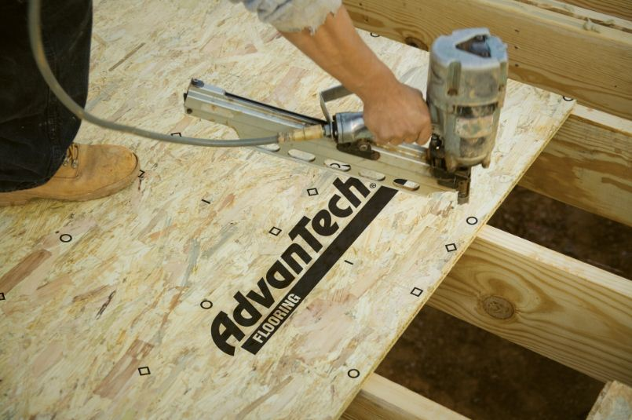
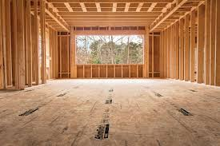
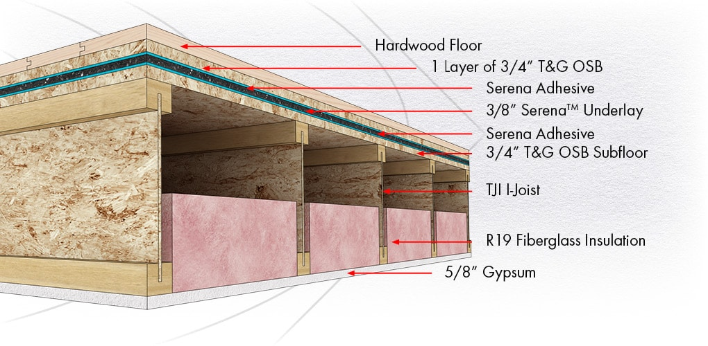

# Floor-height Sheathing

**Floor-height sheathing** — полоса наружной обшивки на высоте перекрытия (band
между этажами), плюс floor underlayment по сборке. Считается по площади/полосе.

## Что считать

- Floor sheathing and underlayment per assembly.
- FRT perimeter strips where specified.
- Sound membrane or multi-layer floor assemblies.

## Common Miss

`1/2" plywood underlayment` per floor assembly can be a very large quantity. Do
not rely only on structural floor framing plans; check assemblies and details.

## Проверить

- FRT 2' or 4' perimeter notes.
- Underlayment over slab, когда assembly calls for it.
- Deck underlayment assemblies.

<!-- confluence-gallery:start -->
## Визуальная проверка

Эти картинки уже привязаны к правилам страницы. Используй их как быстрые
checkpoint-ы перед output: сначала прочитай правило выше, потом открой нужную
карточку и проверь похожий condition на плане/schedule.

??? info "Источник картинок"
    - Floor (обшивка перекрытия снаружи): [3 карт. Confluence](https://redacted.atlassian.net/wiki/spaces/work/pages/89948162/Floor)

  
Показать 3 иллюстраций

  

    
    
    
  

<!-- confluence-gallery:end -->
