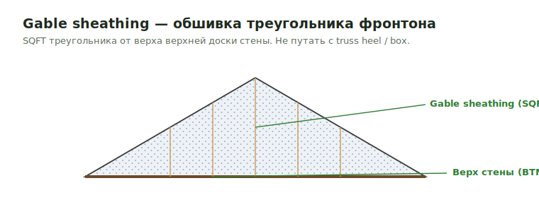

# Gable Sheathing

**Gable** — треугольный участок стены под двускатной крышей. Здесь считается
обшивка этого треугольника (OSB/plywood) в SQFT — отдельно от truss heel и box
sheathing.

<figure markdown>
  
  <figcaption>SQFT треугольника фронтона — от верха верхней доски стены. Не truss heel / box.</figcaption>
</figure>

## Что считать

- Gable OSB/Plywood SQFT where shown.
- WRB, siding substrate, and trim if in scope.
- Sheathing area for exterior, interior, porch, and dormer gables.

## Проверить

- Не смешивай это с truss heel или box sheathing.
- Exterior sheathing thickness идёт по Arch/energy notes, если Structural не даёт
  stronger non-Zip requirement.
- FRT follows exterior wall rules.
- For truss gables, verify whether sheathing is loose material while studs/plates
  are included in trusses.

## See also

- [Gable Wall](../walls/gable.md) · [Truss Heel](truss-heel.md) · [Box Sheathing](box-sheathing.md) · [Wall Sheathing](wall-sheathing.md)
