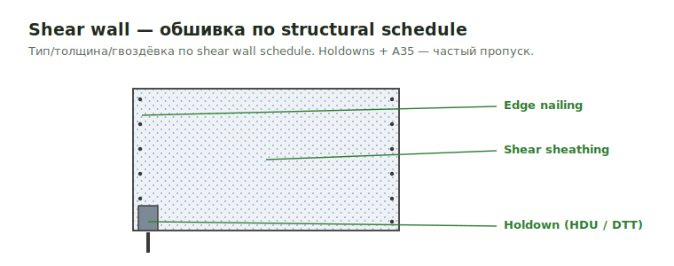

# Shear Wall

**Shear wall** — стена, воспринимающая боковые (ветер/сейсмика) нагрузки через
структурную обшивку + holdowns/anchors. Обшивка считается строго по structural
shear wall schedule (тип, толщина, гвоздёвка), не по Arch.

<figure markdown>
  
  <figcaption>Обшивка + edge nailing по schedule; holdowns и A35 — частый пропуск.</figcaption>
</figure>

## Что считать

- Shear wall sheathing per structural schedule.
- Holdowns, A35 clips, and related details where required.

## Правила

- Demising shear wall sheathing может быть only one side или half the wall; следуй
  schedule.
- FRT is not automatic for demising shear wall sheathing.
- Interior sheathing follows Structural.

## Проверить

- A35 clips at shear wall connection to another shear wall below.
- Holdowns per S-details.
- Interior vs exterior sheathing thickness.

## See also

- [Wall Sheathing](wall-sheathing.md) · [Hardware catalog](../../../reference/hardware-catalog.md) (holdowns/A35) · [Demising Walls](../walls/demising.md)
