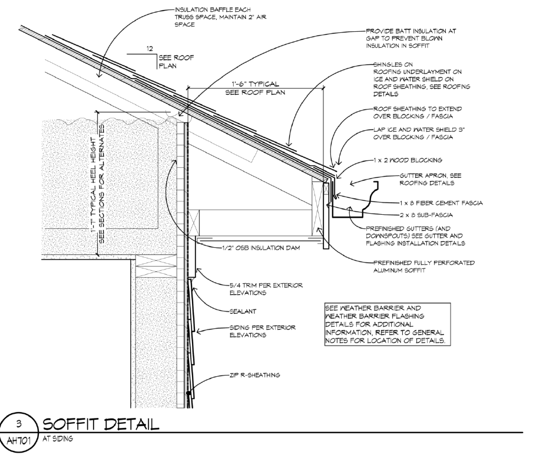

# Truss Heel

## Что считать

- Vertical sheathing at the heel of roof trusses.
- Related blocking or exterior wall treatment where shown.

## Правила

- Truss Heel держи отдельно от Box Sheathing.
- In panelized COM jobs, truss heel sheathing can still be loose material.
- Проверь, убирает ли top chord bearing truss condition ribbon board и требует ли
  blocking between trusses.

## Typical Heel Height

- Стандартная высота `truss heel` ≈ **1'-7"** (берётся от верха стены до верха верхнего пояса фермы по краю).
- Используй это как sanity-check, если на чертеже высота heel не подписана; конкретное число — всегда из truss-package, если он есть.

## Companion-строки { .kb-section-title .kb-st--green }

Heel-секция почти всегда несёт за собой:

- **Vapor Barrier** (`Tyvek`) за обшивкой heel — типовая пара.
- Иногда Subfloor, Panel Adhesive (`29OZ`), Tape (`Zip Tape`).
- Blocking for Drywall — на COM / flat condition.

→ Если поставил Truss Heel sheathing, проверь Vapor Barrier рядом.

## Где не пропустить heel sheathing

- На **gable**-сторонах heel-обшивка обычно уже **учтена** в Gable Sheathing (треугольник + полоска heel под ним идут одной плоскостью).
- На **Eave**-сторонах (длинная сторона свеса) heel-обшивка **часто забывается** — это отдельная вертикальная полоска по периметру здания между Top Plate стены и нижом overhang. Проверяй её отдельной строкой.

<!-- confluence-gallery:start -->
## Визуальная проверка

Эти картинки уже привязаны к правилам страницы. Используй их как быстрые
checkpoint-ы перед output: сначала прочитай правило выше, потом открой нужную
карточку и проверь похожий condition на плане/schedule.

??? info "Источник картинок"
    - Truss Heel (обшивка ферм крыши, вертикальной части): [1 карт. Confluence](https://redacted.atlassian.net/wiki/spaces/work/pages/89948190/Truss+Heel)

  
Показать 1 иллюстраций

  

    
  

<!-- confluence-gallery:end -->
