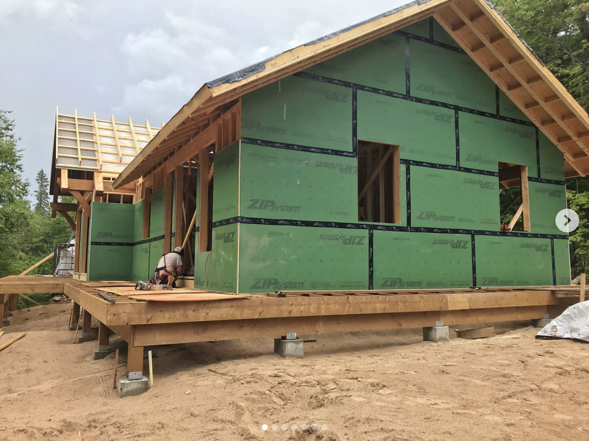
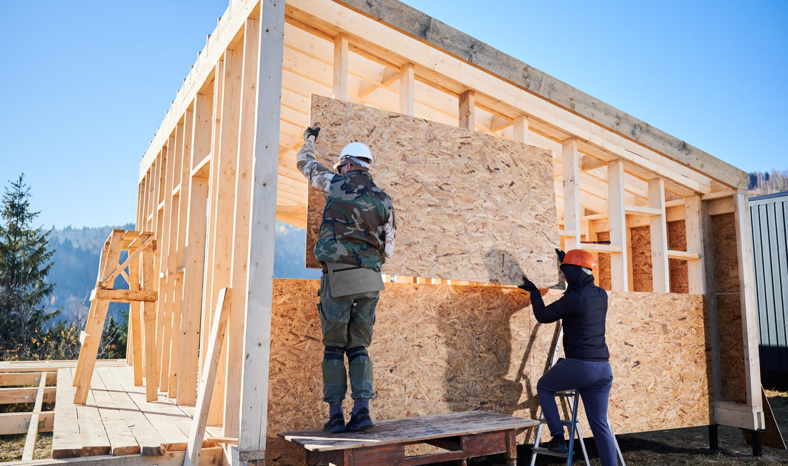

# Wall Sheathing

Source: `https://redacted.atlassian.net/wiki/spaces/work/pages/90144770/Wall+Sheathing`

!!! abstract "Коротко"
    - **Exterior** обшивку ведут **Arch / Energy / Zip** notes.
    - **Shear / interior** обшивку ведёт **Structural** (по shear wall schedule).
    - Zip перекрывает structural notes на exterior, но оставляй note о конфликте.
    - Каждый product / thickness / side — отдельной строкой, не прячь в wall SQFT.
    - Полный блок наружных материалов → [Exterior Wall Materials](exterior-materials.md).

## Что считать

- Exterior sheathing по Arch / energy / Zip notes.
- Interior shear wall sheathing по Structural.
- Loose/box/full-height sheathing отдельно, когда project scope различает их.
- Densglass, FRT, Zip, plywood/OSB и gypsum-based sheathing отдельными lines,
  когда drawings показывают разные products.

## Правила

- `19/32"` = `5/8"`, не `1/2"`.
- Zip на exterior walls перекрывает structural sheathing notes, но оставляй note.
- Non-Zip exception: если Arch говорит 1/2", а Structural говорит 5/8", бери
  5/8" для strength.
- Optional walls могут требовать full-height sheathing; loose sheathing может
  быть box only.
- Interior shear wall sheathing идёт по shear wall schedule, включая one-side vs
  both-sides requirements.
- Не прячь sheathing в generic wall SQFT, когда reviewer нужны product,
  thickness, side или location.

## Приоритет источников

| Situation | Default takeoff decision |
| --- | --- |
| Exterior wall has Zip note | Используй Zip; Structural conflict оставь как note |
| Exterior wall has no Zip, Arch 1/2" vs Structural 5/8" | Используй 5/8" |
| Shear wall schedule says both sides | Считай both sides, не wall area один раз |
| Wall type/elevation calls Densglass | Разделяй Densglass by level/elevation |
| FRT exterior wall material | Проверь, меняются ли sheathing/blocking/parapet |

## Проверить

- FRT sheathing notes на exterior walls.
- Densglass / Type X gypsum на metal walls или specific elevations.
- `Insulation at CMU` — continuous insulation на CMU стенах отдельной строкой.
- Shear wall schedule: one-side vs both-sides requirements.
- Full-height vs box-only sheathing на optional walls.
- Floor-height sheathing вокруг panelized COM jobs, где loose material всё ещё
  in scope.
- Draft stop sheathing at party/demising walls — это не shear wall sheathing.
  Draft stop и shear wall quantities держи отдельно.
- Draft stop может быть на walls и between floors; считай каждый supplied scope
  в своей section, а не объединяй в одну wall line.

## Sheathing Material Variants

Стандартные продукты, которые встречаются на чертежах:

| Запись на чертеже | Что брать |
| --- | --- |
| `1/2" CDX Ply` | Plywood CDX, 1/2" |
| `1/2" OSB` | OSB, 1/2" |
| `1/2" Ply` (или просто **APA RATED**) | Plywood APA-rated, 1/2" |
| `7/16" Zip` | Huber Zip System, 7/16" |
| `Zip Tape` | Лента Zip — отдельной строкой к Zip-обшивке |
| `5/8" Type X` | Exterior grade gypsum sheathing (= `19/32"`) |
| `5/8" Densglass` | Densglass gypsum sheathing (часто over Zip) |

- Если на плане только `APA RATED` без указания материала — это **Plywood**, не OSB.
- `Zip Tape` идёт **только** в паре с Zip-обшивкой; не забывай добавить отдельную строку.
- **Gypsum sheathing** (`Type X` / `Densglass`) бывает в **(2) layers** и отдельным
  слоем **over FRT** — каждый слой считается своей строкой. Material для metal/CMU
  стен нужен, даже если каркас чужой.

!!! note "Полный блок наружных материалов"
    Exterior gypsum, continuous insulation, **Insulation at CMU**, flashing,
    bracing и window jambs собраны на странице
    [Exterior Wall Materials](exterior-materials.md). Открывай её, когда
    считаешь наружную оболочку целиком.

<!-- confluence-gallery:start -->
## Визуальная проверка

Эти картинки уже привязаны к правилам страницы. Используй их как быстрые
checkpoint-ы перед output: сначала прочитай правило выше, потом открой нужную
карточку и проверь похожий condition на плане/schedule.

??? info "Источник картинок"
    - Sheathing: [2 карт. Confluence](https://redacted.atlassian.net/wiki/spaces/work/pages/65044604/Sheathing)

  
Показать 2 иллюстраций

  

    
    
  

<!-- confluence-gallery:end -->
