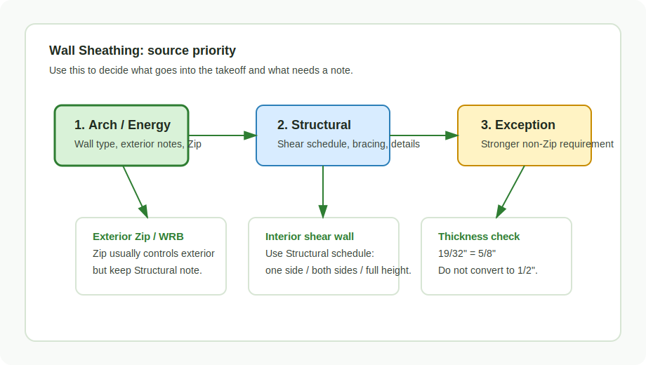

# Wall Sheathing

Source: `https://ewood.atlassian.net/wiki/spaces/work/pages/90144770/Wall+Sheathing`

<figure markdown>
  
  <figcaption>Wall sheathing priority: Arch/Energy can control exterior, Structural controls shear.</figcaption>
</figure>

## Count

- Exterior sheathing by Arch / energy / Zip notes.
- Interior shear wall sheathing by Structural.
- Loose/box/full-height sheathing separately when project scope distinguishes it.
- Densglass, FRT, Zip, plywood/OSB, and gypsum-based sheathing as separate lines
  when the drawings call out different products.

## Rules

- `19/32"` is `5/8"`, not `1/2"`.
- Zip on exterior walls supersedes structural sheathing notes, but keep a note.
- Non-Zip exception: if Arch says 1/2" and Structural says 5/8", use 5/8" for
  strength.
- Optional walls may need full-height sheathing; loose sheathing may be box only.
- Interior shear wall sheathing follows the shear wall schedule, including
  one-side vs both-sides requirements.
- Do not hide sheathing inside generic wall SQFT when the reviewer needs product,
  thickness, side, or location.

## Source Priority

| Situation | Default takeoff decision |
| --- | --- |
| Exterior wall has Zip note | Use Zip; keep Structural conflict as note |
| Exterior wall has no Zip, Arch 1/2" vs Structural 5/8" | Use 5/8" |
| Shear wall schedule says both sides | Count both sides, not wall area once |
| Wall type/elevation calls Densglass | Separate Densglass by level/elevation |
| FRT exterior wall material | Check if sheathing/blocking/parapet also changes |

## Check

- FRT sheathing notes at exterior walls.
- Densglass at metal walls or specific elevations.
- Shear wall schedule one-side vs both-sides requirements.
- Full-height vs box-only sheathing at optional walls.
- Floor-height sheathing around panelized COM jobs where loose material is still
  in scope.

<!-- confluence-context:start -->
## Confluence Context

Эта секция показывает, какие Confluence-страницы питают эту wiki-страницу и какие соседние темы связаны с ней через исходники.

| Source | Role here | Images | Raw MD |
| --- | --- | ---: | --- |
| [Sheathing](https://ewood.atlassian.net/wiki/spaces/work/pages/65044604/Sheathing) | content + images | 2 | `imports/live-sources/confluence-work/pages/01-65044604-sheathing.md` `imports/live-sources/confluence-work-images/pages/01-65044604-sheathing.md` |
| [Wall Sheathing (обшивка стен)](https://ewood.atlassian.net/wiki/spaces/work/pages/90144770/Wall+Sheathing) | content | 0 | `imports/live-sources/confluence-work/pages/01-90144770-wall-sheathing-обшивка-стен.md` |

### Related Wiki Pages

| Wiki page | Why it is connected |
| --- | --- |
| [reference/source-map.md](../../../reference/source-map.md) | linked from `Wall Sheathing (обшивка стен)` |
| [start/takeoff-structure.md](../../../start/takeoff-structure.md) | linked from `Sheathing, Wall Sheathing (обшивка стен)` |
| [work-types/ewp-capital.md](../../../work-types/ewp-capital.md) | linked from `Sheathing` |
| [work/horizontal/roof-framing/dbl-trpl-rafters.md](../../horizontal/roof-framing/dbl-trpl-rafters.md) | linked from `Sheathing` |
| [work/vertical/walls/exterior.md](../walls/exterior.md) | linked from `Sheathing, Wall Sheathing (обшивка стен)` |
| [work/vertical/walls/gable.md](../walls/gable.md) | linked from `Sheathing` |
| [work/vertical/walls/parapet.md](../walls/parapet.md) | linked from `Sheathing, Wall Sheathing (обшивка стен)` |
| [work/vertical/walls/unit.md](../walls/unit.md) | linked from `Wall Sheathing (обшивка стен)` |

### Source Notes

??? note "Sheathing"
    Source: `https://ewood.atlassian.net/wiki/spaces/work/pages/65044604/Sheathing`
    Updated in Confluence: `апр. 18`

    - Варианты:
    - 1/2" CDX Ply
    - 1/2” OSB
    - 1/2” Ply (если написано, просто APA RATED)
    - 7/16" Zip
    - Zip Tape

??? note "Wall Sheathing (обшивка стен)"
    Source: `https://ewood.atlassian.net/wiki/spaces/work/pages/90144770/Wall+Sheathing`

    - Опубликовано июл. 28, 2025

<!-- confluence-context:end -->

<!-- confluence-gallery:start -->
## Confluence Images

Изображения из Confluence размещены на этой странице по исходной теме.
Подпись сохраняет группу-источник, чтобы можно было быстро проверить контекст.

| Source group | Images | Confluence |
| --- | ---: | --- |
| Sheathing | 2 | [source](https://ewood.atlassian.net/wiki/spaces/work/pages/65044604/Sheathing) |

  <a class="kb-gallery__item" href="../../../../assets/images/confluence/confluence-093.jpg" title="image-20251030-155040.png">
    
    
wall sheathing reference 01 (preview, 1299 KB raw)

  </a>
  <a class="kb-gallery__item" href="../../../../assets/images/confluence/confluence-094.jpg" title="image-20251030-155003.png">
    
    
wall sheathing reference 02 (preview, 5480 KB raw)

  </a>

<!-- confluence-gallery:end -->
