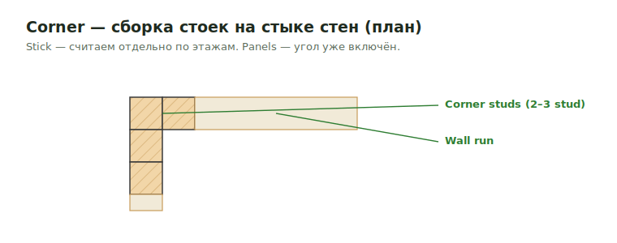

# Corners

**Corner** — сборка стоек на стыке двух стен (L-corner, 2- или 3-stud corner,
California corner). На stick-каркасе считается отдельно; в panels — уже включён.

<figure markdown>
  
  <figcaption>Сборка стоек на стыке стен (план). Stick — отдельная строка по этажам.</figcaption>
</figure>

## Что считать

- Corner studs, extra studs, holdowns и structural corner details, когда called out.
- Sheathing/trim conditions, которые отличаются на corners.

## Критические правила

- **Wall stick** — внешние углы **необходимо подсчитать** отдельной позицией.
- **Wall panels** — углы **НЕ считаем** (они уже входят в panel).
- Считай углы по этажам — corners by floor должны выдаваться отдельной строкой.

## Проверить

- Structural details override generic wall assumptions.
- Если corners относятся к panelized walls, проверь, что входит в loose material
  scope.
- Notes держи видимыми, когда corner material assumed, а не specified.

## See also

- [Exterior Walls](exterior.md) · [Sill Plates](sill-plates.md) · [Hardware catalog](../../../reference/hardware-catalog.md)
