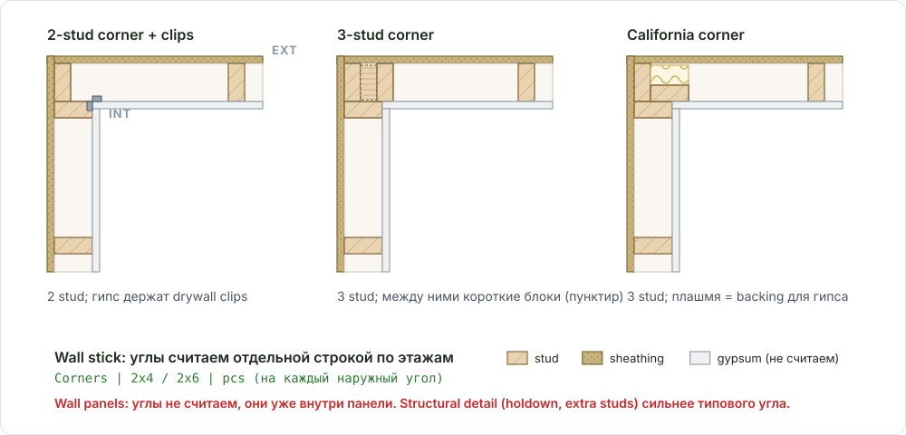

# Corners (углы стен)

<figure markdown>
  
  <figcaption markdown="span">Угол стены в плане: 2-stud L, 3-stud, California corner с backing под gypsum. Stick: точки `corners` по этажам, шаблон добавляет стойки углов в `Studs Ext`. Panels: не считаем.</figcaption>
</figure>

<!-- TODO-PHOTO: three stud corner wood framing photo, EN query "three stud corner framing" -->

## Что это

Corner - пакет стоек на стыке двух стен: 2, 3 стойки или California corner.
Фактор студов `1.1` (одна стойка на фут плюс waste) закрывает обрезь и стойки
у проёмов, а углы и T-пересечения на stick-каркасе считаются точками
`corners`: шаблон DFL сам добавляет по 2 LFT стоек на каждую точку в первую
строку `Studs Ext` этажа. Отдельной строки `Corners` в DFL нет. На panel-job
углы уже внутри панели.

## Где искать на чертежах

| Лист | Что взять |
| --- | --- |
| Планы этажей | Число наружных углов и T-пересечений по этажу |
| Typical wall details, corner detail | Сколько стоек в углу, backing под gypsum |
| Structural details | Corner holdowns, extra studs, где called out |
| Scope | Stick или panels: на panel-job углы не считаем |

## Как мерить в OurPlanCore

Инструмент **Count** (точки), по одной в каждый наружный угол и каждое
T-пересечение на плане этажа. Позиция `corners` в
`walls/<этаж> floor walls` (точка W кладёт Count в walls; слово `corners`
само считается wall-токеном). Свой CountSymbol, чтобы точки отличались от holdowns.

## Как назвать в дереве и строка DFL

| Имя в дереве | Строка DFL | Unit | Формула / фактор |
| --- | --- | --- | --- |
| `corners` (Count, 1-й этаж) | своей строки нет: точки идут в G первой строки `Studs Ext` 1-го этажа | G в LFT | G = LFT наружных стен + 2 x число точек (формула шаблона `=P40+Q38*2`, руками не менять) |
| `corners` (Count, 2-й этаж) | так же, в `Studs Ext` 2-го этажа | G в LFT | по этажам, каждый этаж в своей папке |

Своя строка `Corners` посчитает углы второй раз: они уже сидят в G строки
`Studs Ext`, а C этой строки (`G x 1.1`) превращает их в стойки.

## Частые ошибки

- Углы посчитаны на panel-job: они уже в панели.
- Точки `corners` разных этажей в одной позиции: углы уходят не в тот этаж.
- T-пересечения и backing забыты, хотя деталь их показывает.
- Добавлена своя строка `Corners`: углы посчитаны дважды.

Разбор с примерами: [все ошибки по стенам](../../../start/common-mistakes.md#walls).

## Пример

```text
walls/1st floor walls/
  corners      Count, 14 ea     Notes: 3-stud per 5/A701
walls/2nd floor walls/
  corners      Count, 14 ea
```

## См. также

- [Exterior Walls](exterior.md), [Sill Plates](sill-plates.md)
- [COM Commercial: studs, extra, dbl](../../../work-types/com.md)
- [Hardware catalog](../../../reference/hardware-catalog.md)
