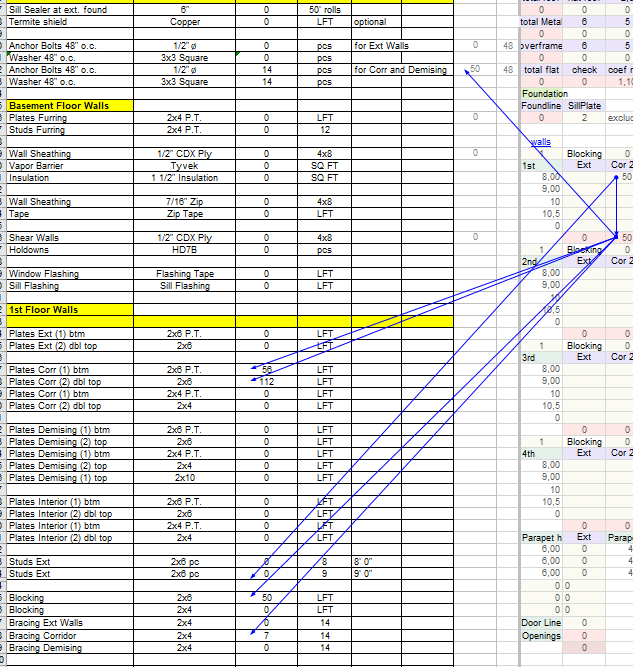

# Corridor Walls

## Что считать

- Corridor studs, plates, blocking, bracing, fire-rated openings, and relevant
  sheathing.
- Corridor ledgers or drywall ledger where floor framing runs parallel.

## Правила { #rules }

- Corridor studs can be staggered: 2x4 staggered usually means two rows at
  16" o.c. with 2x6 plates.
- Unit entry doors from corridors are fire rated; label them clearly.
- Corridor spans are often framed with 2x10 on ledger; verify structural plans.

## Проверить

- Не используй `DHU` / `DGU` hangers только потому, что стена — demising/corridor.
  `DHU` / `DGU` нужны **только там, где joists заходят над настоящей fire wall**
  по детали (stairs / elevator / shaft).

## Что считается corridor wall

Corridor walls — это **не только стены вдоль коридоров**. Сюда же относятся стены, разделяющие жилые помещения от нежилых:

- между лестницей (stair) и жилым помещением;
- между гаражом и жилым помещением;
- любые fire-rated перегородки common-area от unit-зоны.

Запись в PlanSwift — `cor 2x6 x` / `corr 2x6 x` (см. [Exterior → PlanSwift Wall Names](exterior.md#planswift-wall-names)). Двойной коридор — `cor (2) 2x6 x`.

<figure markdown>
  
  <figcaption>Corridor-строки в takeoff-таблице: <code>Plates Corr (1) btm / (2) dbl top</code> (2x6 P.T. / 2x6), <code>Bracing Corridor</code> 2x4. Так заполняется коридорная стена.</figcaption>
</figure>

## See also

- [Demising Walls](demising.md) · [Unit Walls](unit.md) · [Sill Plates](sill-plates.md) · [Hangers](../../../reference/hangers.md)
