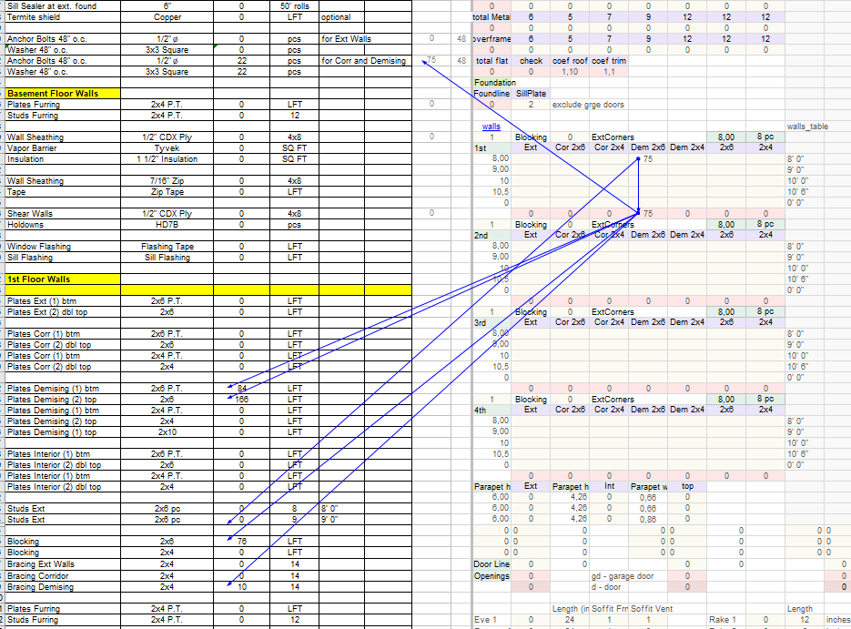

# Demising Walls

## Что считать

- Demising wall studs, plates, blocking, bracing, sheathing и drywall ledgers,
  когда in scope.
- Double demising walls отдельно.

## Правила

- Some demising walls are double; не усредняй их в regular walls.
- Shear wall sheathing at demising walls может быть one side only или half the
  wall length; следуй schedule.
- На обычных demising hanger conditions используют `ITS`, а не `DHU` / `DGU` —
  когда gypsum заканчивается ниже уровня floor framing (т.е. это не настоящая
  fire wall, см. [Corridor → DHU/DGU](corridor.md#правила)).

## Проверить

- Drywall ledger: 2x4 at both sides of demising walls, где parallel with framing.
- Double studs на lower bearing levels, если structural notes требуют их.
- Draft stop sheathing at party/demising walls — отдельно от shear wall
  sheathing. Если structural details требуют draft stop, считай его на wall и
  на floor-framing levels отдельными measurements.
- Не assume draft stop material = P.T.; используй regular material, если
  detail/spec явно не calls for P.T.

## PlanSwift Записи (двойные demising)

Для demising стен с двумя рядами стоек указывай **обе толщины и обе высоты**, если они отличаются:

| Запись | Что значит |
| --- | --- |
| `dem (2) 2x6 10.5` | Двойной demising 2x6, обе стены высотой 10.5' |
| `dem 2x4 2x6 9 10.5` | Двойной demising: одна стена 2x4 высотой 9', вторая 2x6 высотой 10.5' |
| `dem 2x4 2x4 10.5 9` | Двойной demising 2x4/2x4 разной высоты |
| `dem 2x6 2x6 11 12` | Двойной demising 2x6/2x6 разной высоты |

Если обе стены идентичны — короткая запись `dem (2) 2x6 10.5`. Если стены разные — пиши **толщины подряд, потом высоты подряд**.

<figure markdown>
  
  <figcaption>Demising-строки в takeoff: <code>Plates Demising (1) btm / (2) top</code> по каждой из двух стен (2x6 P.T. / 2x6 / 2x4) — двойная стена заводится отдельными строками.</figcaption>
</figure>

## See also

- [Corridor Walls](corridor.md) · [Shear Wall](../sheathing/shear-wall.md) · [Bracing for Drywall](../../horizontal/floor-framing/details/bracingdrywall.md)
