# Exterior Walls

<figure markdown>
  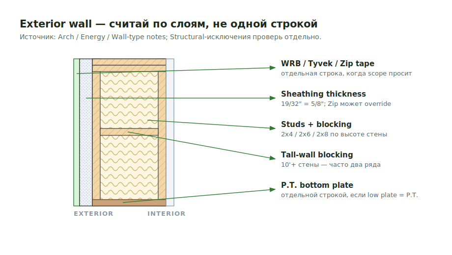
  <figcaption>Exterior wall takeoff: split the wall into layers before counting materials.</figcaption>
</figure>

## Count

- Studs, plates, blocking, sheathing, bracing, Tyvek/WRB, insulation, and exterior
  buildouts when in scope.
- For panelized COM jobs, count only loose/exterior scope such as Tyvek, bracing,
  floor-height sheathing, box sheathing, truss heel, and parapet items.
- Residential/Tilda checklist buckets: basement exterior walls, first floor
  exterior walls, second floor exterior walls, attic/loft exterior walls, chimney
  walls, knee walls, dormer walls, garage walls, and balloon walls.

## Critical Rules

- Exterior sheathing follows Arch / energy / Zip notes unless Structural gives a
  stronger non-Zip requirement.
- If exterior wall material is FRT, exterior blocking and parapets are FRT too.
- Exterior buildouts are stick framed, not panels.
- For one-hour exterior walls, provide exterior wall SQFT when requested.
- Check wall size by floor: 2x4, 2x6, or 2x8.
- Bottom plates may need to be separated when the lower plate is P.T.

## Where To Look

| Drawing area | What to pull from it |
| --- | --- |
| Wall type schedule | Stud size, spacing, fire rating, sheathing notes |
| Exterior elevations | Special sheathing/Densglass zones, material changes, gables |
| Energy / envelope sheets | Zip, WRB, rigid insulation, continuous insulation |
| Structural plans/details | Bracing, shear wall notes, holdowns, tall-wall blocking |
| RCP / soffit details | Dropped exterior soffit frames and buildouts |

## Takeoff Output

- Keep exterior wall framing, sheathing, WRB, insulation, and buildouts as
  separate rows when the scope or pricing needs review.
- Note assumptions directly in the output: `2x6 ext wall assumed from wall type`
  is better than silently mixing sizes.
- If a floor repeats, still list that floor separately and add an `same as`
  note instead of combining floors.

## PlanSwift Wall Names

Source: `https://ewood.atlassian.net/wiki/spaces/work/pages/65175555/Walls`

| Wall output name | Use for |
| --- | --- |
| `ext x` | Exterior wall run |
| `cor 2x6 x` / `corr 2x6 x` | Corridor wall, 2x6 |
| `cor 2x4 x` / `corr 2x4 x` | Corridor wall, 2x4 |
| `dem 2x6 x` | Demising wall, 2x6 |
| `dem 2x4 x` | Demising wall, 2x4 |
| `cor (2) 2x6 x` / `corr (2) 2x6 x` | Double corridor wall, 2x6 |
| `cor (2) 2x4 x` / `corr (2) 2x4 x` | Double corridor wall, 2x4 |
| `dem (2) 2x6 x` | Double demising wall, 2x6 |
| `dem (2) 2x4 x` | Double demising wall, 2x4 |
| `2x4 x` / `2x6 x` | Generic wall run by stud size |
| `2x4 half` / `2x6 half` | Half-height wall by stud size |

## Common Misses

- Rigid insulation.
- R6 Zip wall system.
- 5/8" Densglass on levels or elevations called out by wall type schedule.
- Dropped soffit frames from RCP pages.
- Garage doors quantity on first-floor/garage wall takeoff.
- Corner studs and corners by floor.
- Exterior blocking changing to FRT because the exterior wall material is FRT.
- Parapet framing that follows the exterior wall material rule.

<!-- confluence-context:start -->
## Confluence Context

Эта секция показывает, какие Confluence-страницы питают эту wiki-страницу и какие соседние темы связаны с ней через исходники.

| Source | Role here | Images | Raw MD |
| --- | --- | ---: | --- |
| [Exterior (наружные стены)](https://ewood.atlassian.net/wiki/spaces/work/pages/65273857/Exterior) | content + images | 16 | `imports/live-sources/confluence-work/pages/01-65273857-exterior-наружные-стены.md` `imports/live-sources/confluence-work-images/pages/01-65273857-exterior-наружные-стены.md` |
| [Walls](https://ewood.atlassian.net/wiki/spaces/work/pages/65175555/Walls) | content | 3 | `imports/live-sources/confluence-work/pages/01-65175555-walls.md` `imports/live-sources/confluence-work-images/pages/01-65175555-walls.md` |

### Related Wiki Pages

| Wiki page | Why it is connected |
| --- | --- |
| [reference/source-map.md](../../../reference/source-map.md) | linked from `Exterior (наружные стены)` |
| [start/takeoff-structure.md](../../../start/takeoff-structure.md) | linked from `Exterior (наружные стены), Walls` |
| [work/horizontal/roof-framing/dbl-trpl-rafters.md](../../horizontal/roof-framing/dbl-trpl-rafters.md) | linked from `Walls` |
| [work/vertical/walls/unit.md](unit.md) | linked from `Exterior (наружные стены), Walls` |

### Source Notes

??? note "Walls"
    Source: `https://ewood.atlassian.net/wiki/spaces/work/pages/65175555/Walls`
    Updated in Confluence: `апр. 09`

    - Основные компоненты каркасной стены:
    - Bottom Plate / Нижняя доска – лежит на перекрытии или бетоне, служит основанием стены.
    - Top Plate / Верхняя доска – завершает стену сверху, обычно двойная.
    - Studs / Стойки – вертикальные элементы, обычно 2x4 или 2x6, шаг 16" или 24".
    - Headers / Перемычки – устанавливаются над проёмами (окна, двери), перераспределяют нагрузку.
    - Bracing / Раскосы – временные или постоянные укосины для жёсткости.
    - Blocking / Перемычки между стойками – для крепления отделки, противопожарные преграды.
    - Sheathing / Обшивка – OSB или аналог для жёсткости и крепления внешней отделки.
    - Tyvek/ Бумага – служит для защиты от ветра и влаги
    - Insulation/ Утеплитель –  наружный утеплитель фасада
    - Exterior – наружные стены.
    - Отделяют здание от внешней среды. Требуют утепления, ветро- и влагозащиты (Tyvek), внешней обшивки (OSB, сайдинг), часто содержат оконные и дверные проёмы.
    - Corridor – коридорные стены.
    - Разделяют юниты и общие коридоры. часто строятся с двумя слоями гипса или слоем Plywood
    - Demising – разделяющие стены между юнитами.
    - Обеспечивают шумоизоляцию и пожарную защиту между жильцами. Часто двойной каркас, по 2 слоя гипса с каждой стороны или слой Plywood
    - Furring – облицовочные (вдоль бетонных стен).
    - Не несущие. Используются для выравнивания и прокладки инженерии. Как правило: металлический или деревянный тонкий каркас + гипс.
    - Shaft – шахтные стены.
    - Ограждают коммуникационные шахты (лифты, вентиляция, сантехника). Требуют огнестойкости (до 2 часов), спец. гипс, усиленные крепления.
    - Units / Interior – внутренние стены в юнитах.
    - Разделяют комнаты внутри квартиры. Обычно простые, без огнестойких требований, каркас 2x4 или металлокаркас, один слой гипса с каждой стороны
    - Shear Walls – сейсмостойкие/сопротивляющиеся сдвигу стены.
    - Обеспечивают жёсткость здания при ветровых и сейсмических нагрузках. Обычно: 2x6 каркас + структурный OSB/plywood, спец. крепежи и анкеры.
    - Walls - запись в Planswift
    - ext x
    - cor 2x6 x
    - corr 2x6 x
    - cor 2x4 x
    - corr 2x6 x
    - dem 2x6 x
    - dem 2x4 x
    - cor (2) 2x6 x
    - corr (2) 2x6 x
    - cor (2) 2x4 x
    - corr (2) 2x4 x
    - dem (2) 2x6 x
    - dem (2) 2x4 x
    - 2x4 x
    - 2x6 x
    - 2x4 half
    - 2x6 half

    Source tables:

    ### Table 1
    
    | Walls - запись в Planswift |
    | --- |

    ### Table 2
    
    | Walls - запись в Planswift |
    | --- |
    | ext x cor 2x6 x corr 2x6 x cor 2x4 x corr 2x6 x dem 2x6 x dem 2x4 x cor (2) 2x6 x corr (2) 2x6 x cor (2) 2x4 x corr (2) 2x4 x dem (2) 2x6 x dem (2) 2x4 x 2x4 x 2x6 x 2x4 half 2x6 half |

??? note "Exterior (наружные стены)"
    Source: `https://ewood.atlassian.net/wiki/spaces/work/pages/65273857/Exterior`
    Updated in Confluence: `апр. 09`

    - Exterior Walls - экстерьерные стены, обычно используют 2x6 или 2x4 сечения
    - на плане толщину стен указывают 5 1/2” для 2x6 и 3 1/2” для 2x4
    - Ext Walls
    - ширина стен 2х6 и 2х4
    - нужно определить высоту стен, по фасаду или разрезу (elevation or section).
    - высота стены начинается с нижней доски Btm Plate до верхних досок Top Plates (включая эти доски)
    - в Planswift на плане Exterior Walls записывается как ext толщина стены высота стены
    - например ext 2x6 9.0
    - Sill Sealer
    - Termite Shield
    - Washers
    - ---

<!-- confluence-context:end -->

<!-- confluence-gallery:start -->
## Confluence Images

Изображения из Confluence размещены на этой странице по исходной теме.
Подпись сохраняет группу-источник, чтобы можно было быстро проверить контекст.

| Source group | Images | Confluence |
| --- | ---: | --- |
| Exterior (наружные стены) | 16 | [source](https://ewood.atlassian.net/wiki/spaces/work/pages/65273857/Exterior) |

  <a class="kb-gallery__item" href="../../../../assets/images/confluence/confluence-109.png" title="image-20260408-222831.png">
    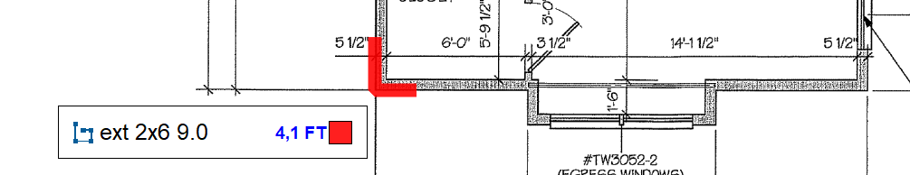
    
exterior wall detail/reference 01 (image, 39 KB raw)

  </a>
  <a class="kb-gallery__item" href="../../../../assets/images/confluence/confluence-110.png" title="image-20260408-220422.png">
    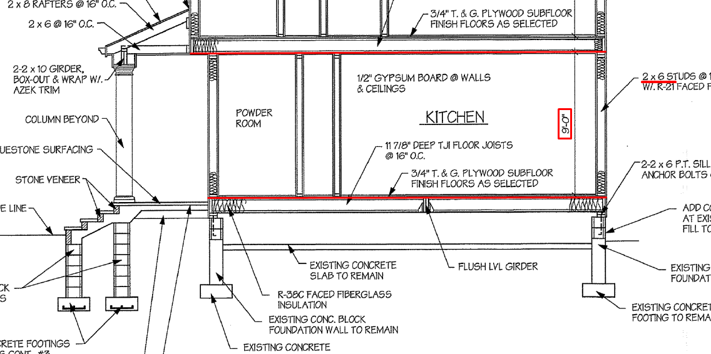
    
exterior wall detail/reference 02 (image, 181 KB raw)

  </a>
  <a class="kb-gallery__item" href="../../../../assets/images/confluence/confluence-111.png" title="image-20260408-215636.png">
    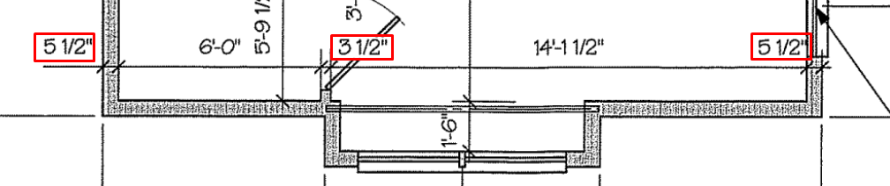
    
exterior wall detail/reference 03 (image, 77 KB raw)

  </a>
  <a class="kb-gallery__item" href="../../../../assets/images/confluence/confluence-112.png" title="image-20260408-215533.png">
    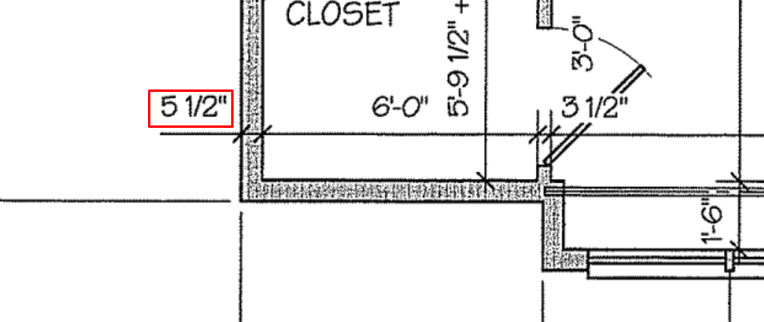
    
exterior wall detail/reference 04 (image, 109 KB raw)

  </a>
  <a class="kb-gallery__item" href="../../../../assets/images/confluence/confluence-113.png" title="image-20260408-215334.png">
    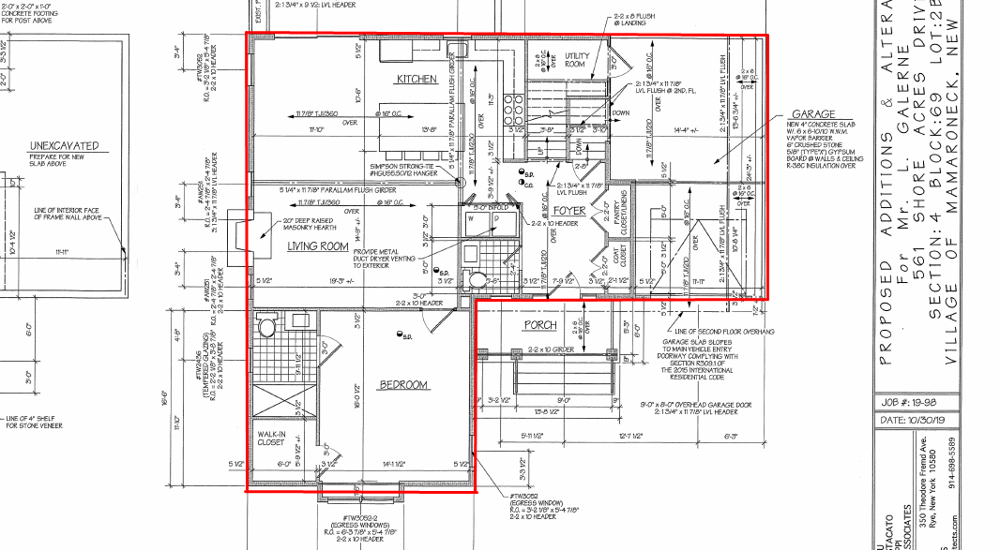
    
exterior wall detail/reference 05 (image, 313 KB raw)

  </a>
  <a class="kb-gallery__item" href="../../../../assets/images/confluence/confluence-114.png" title="image-20260408-212441.png">
    
    
exterior wall detail/reference 06 (image, 261 KB raw)

  </a>
  <a class="kb-gallery__item" href="../../../../assets/images/confluence/confluence-115.png" title="image-20260408-212418.png">
    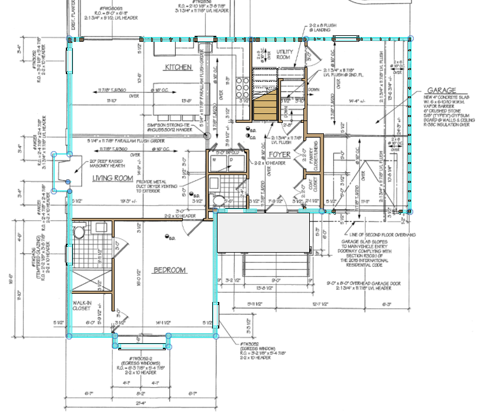
    
exterior wall detail/reference 07 (image, 261 KB raw)

  </a>
  <a class="kb-gallery__item" href="../../../../assets/images/confluence/confluence-116.png" title="image-20251120-163603.png">
    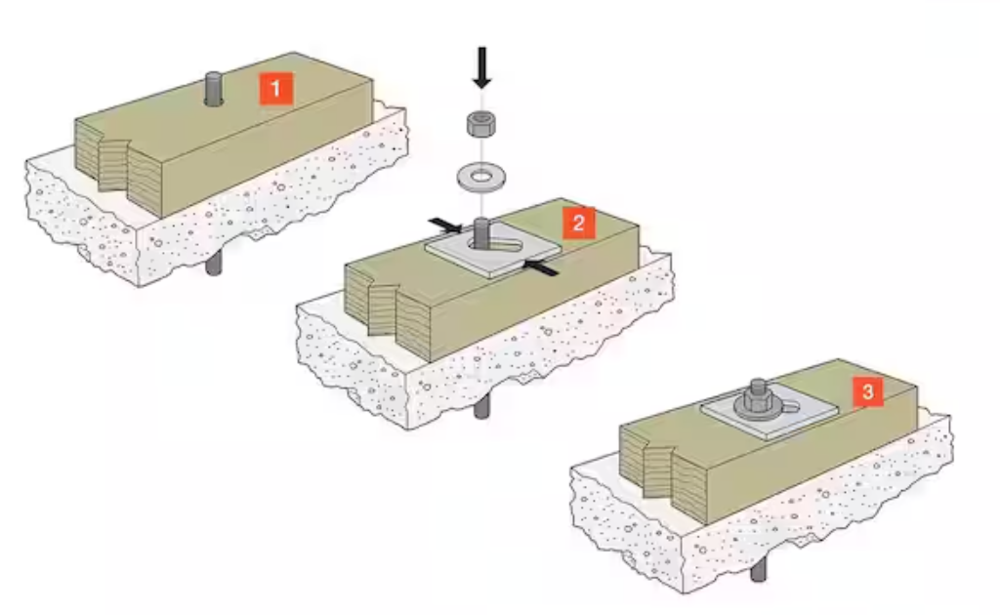
    
exterior wall detail/reference 08 (image, 321 KB raw)

  </a>
  <a class="kb-gallery__item" href="../../../../assets/images/confluence/confluence-117.png" title="image-20251120-163803.png">
    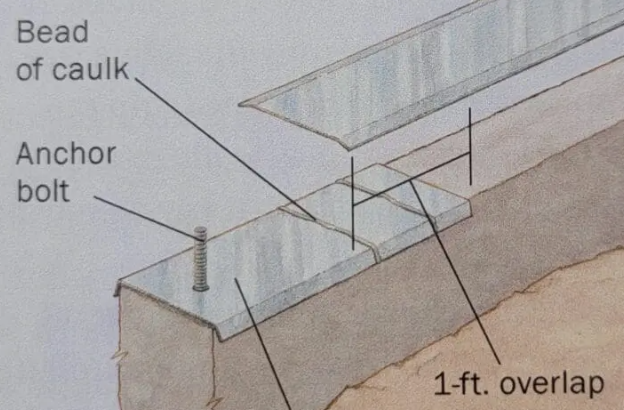
    
exterior wall detail/reference 09 (image, 432 KB raw)

  </a>
  <a class="kb-gallery__item" href="../../../../assets/images/confluence/confluence-118.png" title="654dd981-d86a-4882-94a5-679a31b64b84.png">
    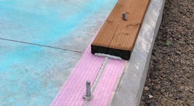
    
exterior wall detail/reference 10 (image, 234 KB raw)

  </a>
  <a class="kb-gallery__item" href="../../../../assets/images/confluence/confluence-119.png" title="image-20260408-211626.png">
    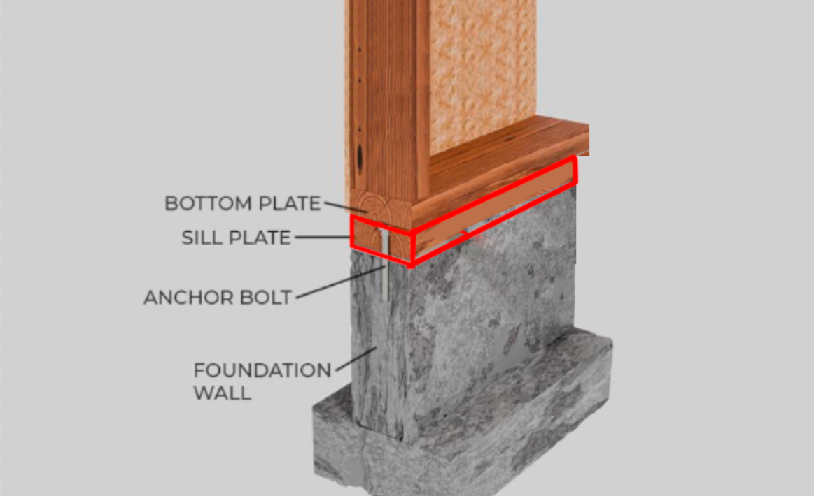
    
exterior wall detail/reference 11 (image, 382 KB raw)

  </a>
  <a class="kb-gallery__item" href="../../../../assets/images/confluence/confluence-120.png" title="image-20251120-162245.png">
    
    
exterior wall detail/reference 12 (image, 180 KB raw)

  </a>
  <a class="kb-gallery__item" href="../../../../assets/images/confluence/confluence-121.png" title="image-20251030-161255.png">
    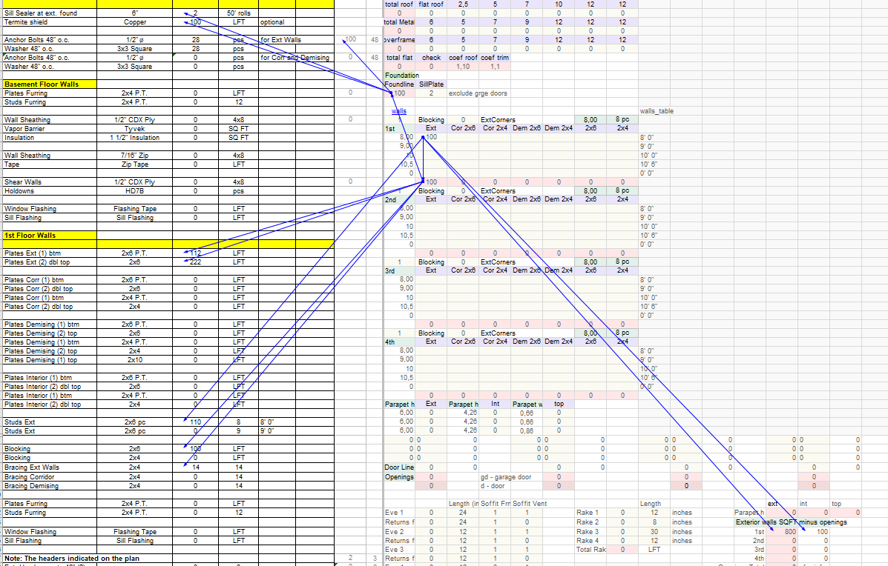
    
exterior wall detail/reference 13 (image, 137 KB raw)

  </a>
  <a class="kb-gallery__item" href="../../../../assets/images/confluence/confluence-122.png" title="image-20251030-161158.png">
    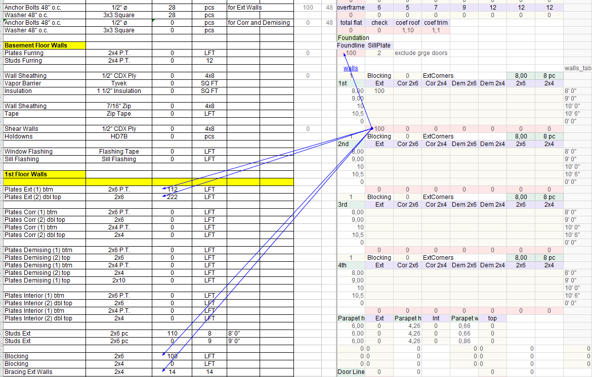
    
exterior wall detail/reference 14 (image, 117 KB raw)

  </a>
  <a class="kb-gallery__item" href="../../../../assets/images/confluence/confluence-123.png" title="image-20251030-161154.png">
    
    
exterior wall detail/reference 15 (image, 117 KB raw)

  </a>
  <a class="kb-gallery__item" href="../../../../assets/images/confluence/confluence-124.png" title="image-20251030-161128.png">
    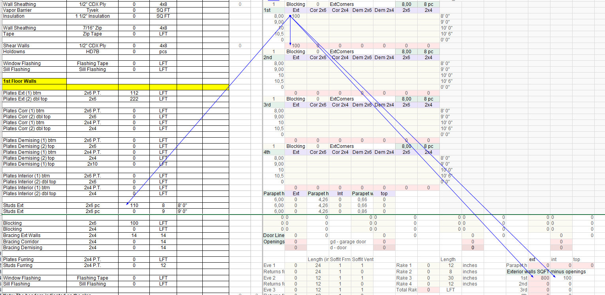
    
exterior wall detail/reference 16 (image, 130 KB raw)

  </a>

<!-- confluence-gallery:end -->
