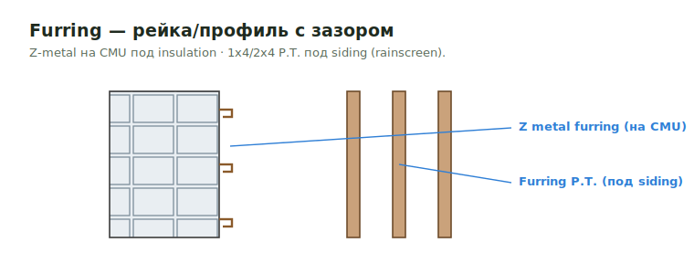

# Furring

**Furring** — рейки/профили, создающие зазор и плоскость крепления: под siding
(`1x4`/`2x4` P.T.) или Z-metal на CMU под continuous insulation. Считается
только когда в scope.

<figure markdown>
  
  <figcaption>Z-metal furring на CMU под insulation · 1x4/2x4 P.T. furring под siding.</figcaption>
</figure>

## Что считать

- Furring strips/studs at CMU или concrete walls — только когда scope просит их.
- Rigid insulation отдельно, когда показан.

## Правила

- Не добавляй 2x4 furring at exterior CMU walls, когда detail требует только
  1-1/2" insulation.
- Metal resilient channels under floor frames обычно by others, если client не
  хочет видеть metal.
- `1x3 strapping` under roof trusses или siding panels включается, когда
  specified.

## Проверить

- MA / RI jobs часто требуют strapping review.
- RCP pages могут показать soffit/furring scope, которого нет на structural plans.

## Где Искать Furring

- Furring к бетонным стенам **типично возле elevator-шахт** и других бетонных core-конструкций.
- Смотри детали — указано ли в спецификации **P.T.** (Pressure Treated) для досок, прилегающих к бетону. Если P.T. в детали есть, считай его отдельно от обычного SPF furring.

## Z metal furring и furring под siding

Два разных продукта, оба "furring":

| Тип | Где | Size | Назначение |
| --- | --- | --- | --- |
| **Z metal furring** | на CMU, под insulation | `Z furring` (metal) | держит rigid / continuous insulation на блоке |
| **Furring под siding** | за siding на каркасе | `1x4` или `2x4` **P.T.** | rainscreen / nailing-плоскость / зазор |

- **Z metal furring** идёт в паре с `Insulation at CMU` (continuous insulation на
  CMU). Если client не хочет видеть metal — verify scope.
- **Furring под siding** бывает лёгкая рейка `1x4` или толще `2x4` **P.T.** (низ /
  влажные зоны). P.T. и не-P.T. — разные строки.

См. [Exterior Wall Materials](../sheathing/exterior-materials.md) и
[Furring & Window Jambs](../../exterior-trims/furring-and-jambs.md).
