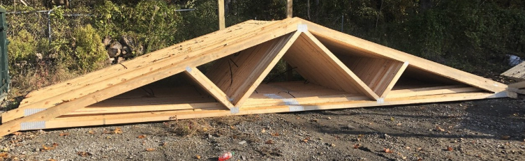
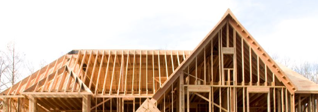
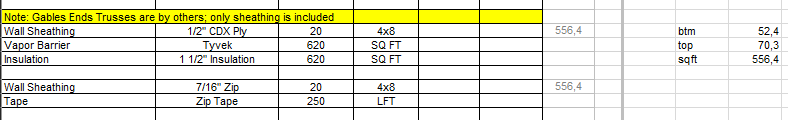
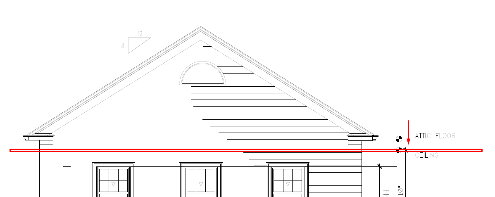
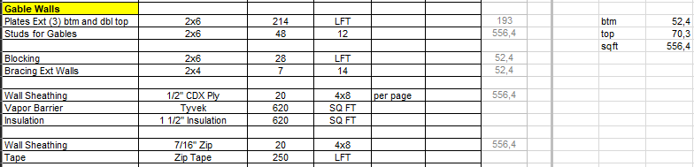
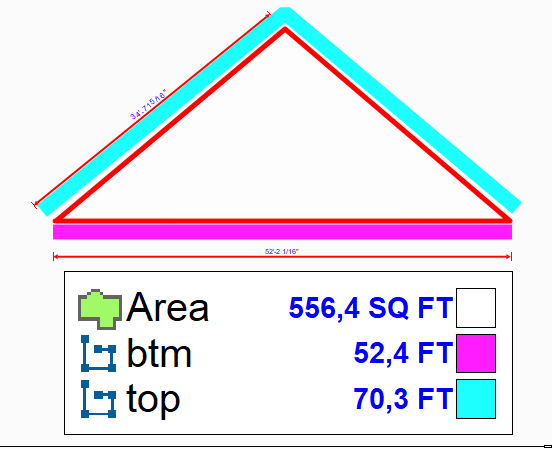

# Gable Walls

Gables делятся на **два типа**, и от этого зависит весь takeoff:

- **gable stick** — продолжение каркасной стены вверх. Считаем plates, studs, blocking, bracing, sheathing.
- **gable trusses** — собран из ферм. Считаем **только sheathing** (фермы — by others).

### Как определить тип

1. На плане крыши найди заметки про **Rafters**.
2. Если написано **Trusses** — крыша из ферм → **gable trusses**.
3. Если написано `2x8`, `2x10`, `2x12`, `TJI 360` или `stick` — крыша stick → **gable stick**.

## Workflow в PlanSwift

Для каждого треугольника gable замерь:

- **SQFT** — площадь треугольника gable. Брать **от верхней грани TOP верхней доски стены** (не от низа стены).
- **BTM** — длина нижней грани (по верху стены).
- **TOP** — длина двух верхних наклонных граней.

Все gables на здании заводи **одной площадью SQFT, одним BTM и одним TOP**, даже если треугольников несколько. Где заканчивается стена и начинается gable — смотри на разрезах/фасадах (sections / elevations).

## Что считать

- Gable wall framing, sheathing и SQFT там, где показано.
- Exterior treatment, WRB и trim, если included in scope.
- Exterior gables.
- Interior gables.
- Porch gables.
- Truss gables.
- Dormer gables.

## Проверить

- Не путай gable sheathing с truss heel или box sheathing.
- Если gable wall panelized, проверь, входит ли loose sheathing или только WRB.
- FRT и exterior sheathing rules идут по exterior wall notes.
- Exterior/interior/dormer gables могут быть 2x4 или 2x6; проверяй drawings.
- Truss gables: убери plates и studs с left/output side, если trusses уже
  include them.
- Dormers записывай вместе с wall scope.
- Gable stud height добавляй на left/output side.

## Таблица вывода

Source: `https://ewood.atlassian.net/wiki/spaces/work/pages/63799300/Gable`

| Line | Material | Formula / count | Unit | Note |
| --- | --- | --- | --- | --- |
| Plates Ext `(3)` btm and dbl top | `2x6` | `=ЧЁТН(((BTM + DBL TOP)*1)*1.1)` | LFT | `= BTM + TOP * 2` |
| Studs for Gables | `2x6` | `=ЧЁТН(SQFT / height)` | height | `= SQFT` |
| Blocking | `2x6` | `=ЧЁТН((BTM)/2*1)` | LFT | `= BTM` |
| Bracing Ext Walls | `2x4` | `=(BTM)/8*1.1` | `14` | `= BTM` |
| Wall Sheathing | `1/2" CDX Ply` | `=ОКРВВЕРХ(SQFT*1.1/32;1)` | 4x8 | per page |
| Vapor Barrier | `Tyvek` | `=ОКРВВЕРХ(SQFT*1.1;10)` | SQ FT | |
| Insulation | `1 1/2" Insulation` | `=ОКРВВЕРХ(SQFT*1.1;10)` | SQ FT | |
| Wall Sheathing | `7/16" Zip` | `=ОКРВВЕРХ(SQFT/32*1.1;1)` | 4x8 | per page |
| Tape | `Zip Tape` | `=ОКРВВЕРХ((SQFT*0.4)*1.1;10)` | LFT | |

## Truss Gable note

Source: `https://ewood.atlassian.net/wiki/spaces/work/pages/63799300/Gable`

Когда gable end trusses **by others**, включается только sheathing package:

| Line | Material | Formula / count | Unit |
| --- | --- | --- | --- |
| Wall Sheathing | `1/2" CDX Ply` | `=ОКРВВЕРХ(SQFT*1.1/32;1)` | 4x8 |
| Vapor Barrier | `Tyvek` | `=ОКРВВЕРХ(SQFT*1.1;10)` | SQ FT |
| Insulation | `1 1/2" Insulation` | `=ОКРВВЕРХ(SQFT*1.1;10)` | SQ FT |
| Wall Sheathing | `7/16" Zip` | `=ОКРВВЕРХ(SQFT/32*1.1;1)` | 4x8 |
| Tape | `Zip Tape` | `=ОКРВВЕРХ((SQFT*0.4)*1.1;10)` | LFT |

<!-- confluence-gallery:start -->
## Визуальная проверка

Эти картинки уже привязаны к правилам страницы. Используй их как быстрые
checkpoint-ы перед output: сначала прочитай правило выше, потом открой нужную
карточку и проверь похожий condition на плане/schedule.

??? info "Источник картинок"
    - Gable (треугольные фронтоны): [9 карт. Confluence](https://ewood.atlassian.net/wiki/spaces/work/pages/63799300/Gable)

  <a class="kb-rule-card" href="../../../../assets/images/confluence/confluence-083.png" title="image-20250603-181446.png">
    
    

      
Gable Wall - визуальная проверка 01

      
Проверь triangular wall area, height breakpoints, studs/blocking и sheathing.

      
Gable легко задвоить между wall framing и sheathing; держи scope отдельно.

    

  </a>
  <a class="kb-rule-card" href="../../../../assets/images/confluence/confluence-084.png" title="image-20250603-181146.png">
    
    

      
Gable Wall - визуальная проверка 02

      
Проверь triangular wall area, height breakpoints, studs/blocking и sheathing.

      
Gable легко задвоить между wall framing и sheathing; держи scope отдельно.

    

  </a>
  <a class="kb-rule-card" href="../../../../assets/images/confluence/confluence-085.png" title="image-20250603-180924.png">
    
    

      
Gable Wall - визуальная проверка 03

      
Проверь triangular wall area, height breakpoints, studs/blocking и sheathing.

      
Gable легко задвоить между wall framing и sheathing; держи scope отдельно.

    

  </a>
  <a class="kb-rule-card" href="../../../../assets/images/confluence/confluence-086.png" title="image-20250603-180752.png">
    
    

      
Gable Wall - визуальная проверка 04

      
Проверь triangular wall area, height breakpoints, studs/blocking и sheathing.

      
Gable легко задвоить между wall framing и sheathing; держи scope отдельно.

    

  </a>
  <a class="kb-rule-card" href="../../../../assets/images/confluence/confluence-087.png" title="image-20250603-180136.png">
    
    

      
Gable Wall - визуальная проверка 05

      
Проверь triangular wall area, height breakpoints, studs/blocking и sheathing.

      
Gable легко задвоить между wall framing и sheathing; держи scope отдельно.

    

  </a>
  <a class="kb-rule-card" href="../../../../assets/images/confluence/confluence-088.png" title="image-20250603-174813.png">
    
    

      
Gable Wall - визуальная проверка 06

      
Проверь triangular wall area, height breakpoints, studs/blocking и sheathing.

      
Gable легко задвоить между wall framing и sheathing; держи scope отдельно.

    

  </a>
  <a class="kb-rule-card" href="../../../../assets/images/confluence/confluence-089.png" title="image-20250603-172238.png">
    
    

      
Gable Wall - визуальная проверка 07

      
Проверь triangular wall area, height breakpoints, studs/blocking и sheathing.

      
Gable легко задвоить между wall framing и sheathing; держи scope отдельно.

    

  </a>
  <a class="kb-rule-card" href="../../../../assets/images/confluence/confluence-090.png" title="image-20250603-172109.png">
    
    

      
Gable Wall - визуальная проверка 08

      
Проверь triangular wall area, height breakpoints, studs/blocking и sheathing.

      
Gable легко задвоить между wall framing и sheathing; держи scope отдельно.

    

  </a>
  <a class="kb-rule-card" href="../../../../assets/images/confluence/confluence-091.png" title="image-20250603-172051.png">
    
    

      
Gable Wall - визуальная проверка 09

      
Проверь triangular wall area, height breakpoints, studs/blocking и sheathing.

      
Gable легко задвоить между wall framing и sheathing; держи scope отдельно.

    

  </a>

<!-- confluence-gallery:end -->
