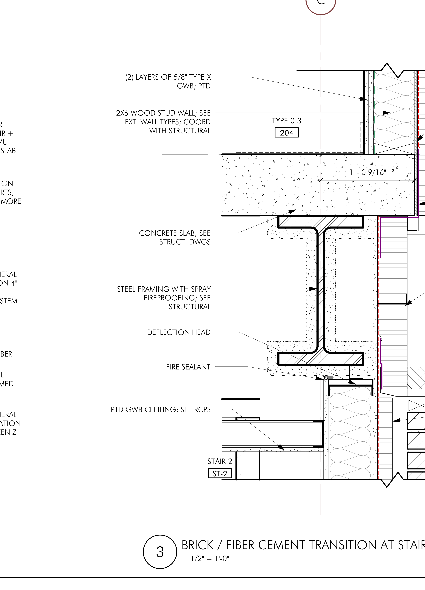
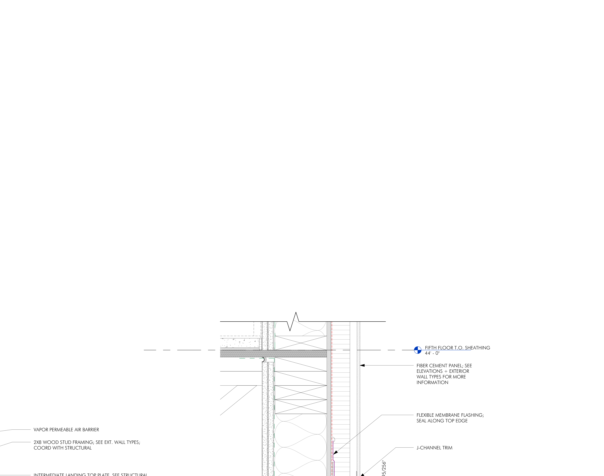

# Metal Tracks / CFMF Walls

**Cold-Formed Metal Framing (CFMF)** — это стальной каркас стены вместо
деревянного. Меняются только два элемента каркаса, всё остальное в стене остаётся
тем же:

- деревянные **plates** (доски сверху/снизу) → **tracks** — горизонтальный
  U-профиль снизу и сверху стены;
- деревянные **studs** → **metal studs** — вертикальный C-профиль, который
  вставляется в треки.

Чаще всего metal framing встречается на коммерческих (COM) объектах: interior
partitions, shaft / rated (огнестойкие) стены, parapet, целые металлические
здания, basement, а также soffit / ceiling framing.

!!! tip "Главная мысль страницы"
    Metal-стена считается **как деревянная стена той же функции** — только
    `plates → tracks` и `studs → mtl studs`. Весь остальной пакет (sheathing,
    vapor barrier, insulation, gypsum, bracing, blocking) остаётся и считается
    точно так же. Смотри раздел [Обшивка и материалы](#material-package) ниже.

## Три типа треков { .kb-section-title .kb-st--green }

В отличие от дерева, где сверху и снизу одинаковые plates, у металлической стены
треки бывают разными по роли:

- **Bottom track** — нижний трек. Крепится к плите/перекрытию; в него снизу
  заходят studs. Считается по длине стены (LFT).
- **Top track** — обычный верхний трек (когда сверху нет подвижной конструкции).
- **Deflection track** — особый верхний трек на стыке с конструкцией сверху
  (см. раздел [Deflection track](#deflection) — это важный и часто пропускаемый
  элемент).
- **Head track** — трек над проёмом (head), идёт отдельной позицией. На каждый
  проём это, как правило, две полки.

## Deflection track — что это и зачем { #deflection .kb-section-title .kb-st--cyan }

**Deflection track** (он же slip / slotted / deep-leg track) — это верхний трек на
стыке стены с конструкцией **сверху** (балка, перекрытие, ферма). У него
**глубокие ноги** (длинные полки) и/или **прорези (slots)**, и нужен он для того,
чтобы конструкция сверху могла **двигаться вертикально** — прогибаться под
нагрузкой, реагировать на сейсмику и усадку — **не опираясь на студы** и не ломая
стену.

Как это работает: студ заходит внутрь deflection-трека, но **не крепится к нему
жёстко** (или крепится через прорезь). Сверху остаётся зазор, и при движении
перекрытия студ просто скользит в треке. В итоге стена несёт только саму себя, а
не нагрузку сверху.

<figure markdown>
  
  <figcaption>Реальная деталь «DEFLECTION HEAD» на стыке стены со стальной балкой:
  steel framing with spray fireproofing, fire sealant, (2) слоя 5/8" Type-X GWB.
  Источник: 112 Queensberry, A402 Section Details (Brick / Fiber Cement Transition
  at Stair).</figcaption>
</figure>

!!! warning "Когда deflection track обязателен"
    На **non-load-bearing** партициях под структурой, на rated / shaft стенах и
    везде, где сверху проходит балка / дек / ферма — deflection track требуется.
    Тип (slotted vs deep-leg) и глубину ног сверяй в structural notes и на
    деталях. Если в стене сверху просто обычный top track под подвижной
    конструкцией — это, скорее всего, пропуск.

## GA (gauge) — калибр стали { .kb-section-title .kb-st--amber }

**GA = gauge** — это толщина стального профиля. Правило обратное привычному:
**чем меньше число, тем толще и прочнее сталь.**

- **25ga** — тонкая сталь, лёгкие non-structural партиции.
- **20ga / 18ga** — средние.
- **16ga** — нагруженные / structural стены.
- **14ga / 12ga** — тяжёлые structural.

Калибр берётся из **wall-type schedule** и/или structural notes — там он обычно
обозначается аббревиатурой `GA` / `GAGE`. Студ и трек одного типа стены, как
правило, одного калибра; у structural / load-bearing CFMF профиль толще.

!!! note "Если gauge указан — пиши его в spec"
    Когда калибр задан на чертеже, его нужно перенести в спецификацию позиции
    (например `6" 18ga mtl`). Если не указан — не выдумывай, оставь видимую note
    и сверь со структурой.

## Jambs у проёмов { .kb-section-title .kb-st--magenta }

У проёмов в металлической стене есть две неочевидные вещи:

- **Jamb может быть деревянным** даже в металлической стене. Косяк проёма часто
  делают из дерева (`2x4`) — чтобы было к чему крепить и навешивать дверь /
  фурнитуру. Так что в металлической стене вполне нормально встретить деревянный
  jamb по периметру проёма.
- **Double jamb (двойной).** На широких или нагруженных проёмах ставят **два**
  профиля (или две доски) на сторону — `(2)2x4` или сдвоенный metal stud.
  Box-header проёма тоже обычно опирается на сдвоенные jamb-студы.

Плюс к этому по краям проёма добавляют **дополнительные металлические студы**
(extra studs at openings), а сверху — **head track** (см. выше).

## Обшивка и материалы — всё как у деревянной стены { #material-package .kb-section-title .kb-st--blue }

Это ключевой раздел. Металлический каркас меняет **только** сам каркас
(`tracks + mtl studs`). Всё остальное металлическая стена получает **так же, как
деревянная стена той же функции**, и считается теми же позициями:

- **Wall / Box Sheathing** — обшивка стены / коробки.
- **Vapor Barrier / WRB** — пароизоляция / влаго-ветрозащита.
- **Insulation** — утепление (включая mineral wool на rated/exterior стенах).
- **Gypsum** — `5/8" Type X`, Densglass и т.п., теми же слоями.
- **Bracing** — в т.ч. диагональный X-brace / cross-brace на structural CFMF.
- **Blocking** — между студами (под стыки gypsum, навеску, backing).
- **Holdowns / ties / clips** — где этого требует структура.

<figure markdown>
  
  <figcaption>Слои стены на уровне перекрытия: air barrier → sheathing → insulation
  → fiber cement panel → flashing → J-channel, с deflection на уровне floor line.
  У металлической стены тот же пакет обшивки — меняется только каркас. Источник:
  112 Queensberry, A402 Section Details.</figcaption>
</figure>

!!! warning "Не считать metal-стену «только каркасом»"
    Частая ошибка — посчитать у металлической стены только треки и студы и
    забыть sheathing / vapor barrier / insulation / gypsum / bracing / blocking.
    Правило простое: **metal-стена = (tracks + mtl studs) + весь пакет обшивки и
    изоляции, как у обычной wood-стены.** Подробно по слоям —
    [Exterior Walls](exterior.md) и [Box Sheathing](../sheathing/box-sheathing.md).

## Как берём takeoff { .kb-section-title .kb-st--green }

Считаем концептуально так же, как деревянную стену, разбивая на позиции:

- **Tracks** — по длине стены (LFT). Обычно это две позиции одинаковой длины:
  **bottom track** + **deflection (top) track**.
- **Mtl Studs** — по длине стены и шагу (spacing), как деревянные стойки. Те же
  spacing-факторы, что и у дерева (16" / 24" o.c.) — см.
  [Формулы → spacing factors](../../../reference/formulas.md). Единица студа —
  высота стены.
- **Extra studs + jambs + head track** — отдельными позициями у проёмов.

Группируй так же, как деревянные стены:

- **по сечению профиля** (6" / 3 5/8" / 2 1/2") — отдельная группа на каждый
  размер;
- **по этажу**;
- **по типу стены** — Exterior / Interior / Demising / Corridor.

## By others — проверяй scope { .kb-section-title .kb-st--amber }

Металлический каркас **очень часто исключён из нашего scope** — его делает GC или
отдельный металлист (metal sub). Это нужно проверять всегда.

- **By others.** Каркас не наш → ставим `0` и видимую note, например
  `Metal Studs by others; verify` / `Steel Tracks by others` /
  `Ceiling Metal Tracks by others`.
- **Material-only.** Иногда заливаем только материал (без работы).
- **В scope.** Если металл наш — считаем полностью: tracks + studs + deflection +
  проёмы.

!!! warning "Сначала scope, потом счёт"
    Прежде чем считать металлический каркас — открой scope / notes и убедись, что
    металл вообще наш. Очень частый случай — он исключён, и тогда наша задача лишь
    отметить это note (а пакет обшивки при этом может остаться нашим).

## Где искать детали — WT-листы { .kb-section-title .kb-st--cyan }

Все параметры металлокаркаса — **size, GA, тип deflection-трека, X-bracing,
wood/double jamb, слои gypsum** — живут на **WT (Wall Type detail)** листах в
архитектурном / структурном комплекте.

| Где на чертежах | Что взять |
| --- | --- |
| Wall type schedule / WT-листы | Size профиля, GA (gauge), слои стены, fire rating |
| Section details (напр. A402) | Deflection head, узлы стыка стены со структурой |
| Structural notes / cover sheet | Аббревиатуры (CFMF / GA / GALV), X-brace legend, требования к deflection |
| Plans | Длины стен (LFT) и привязка по типу стены / этажу |

!!! tip "Правило поиска"
    Не нашёл размер или калибр на плане — иди на **WT-листы и section details**.
    Там же подтверждается, нужен ли deflection track и есть ли X-bracing.

## See also

- [Exterior Walls](exterior.md) · [Basement Walls](basement.md) · [Sill Plates](sill-plates.md)
- [Shaft Walls](shaft.md) · [Parapet](parapet.md) · [Furring](furring.md)
- [Box Sheathing](../sheathing/box-sheathing.md) · [Exterior Wall Materials](../sheathing/exterior-materials.md)
- [Формулы → spacing factors](../../../reference/formulas.md)
