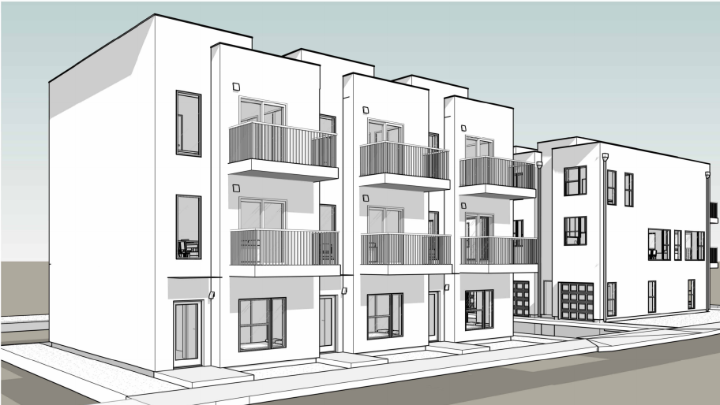

# Parapet Walls

## Count

- Parapet framing, cap plates, inside/outside sheathing, insulation adjustments,
  and EPDM where required.
- FRT blocking/plates when exterior wall FRT rules apply.

## Rules

- Parapets are FRT when exterior walls are FRT.
- Parapet sheathing can be both sides; outside may subtract insulation board.
- Top chord bearing truss conditions may need blocking between trusses rather
  than ribbon board.

## Common Misses

- Detail callouts such as `(2) 2x8 FRT blocking at parapets`.
- Cap plate treatment, often 2x6 PT.

<!-- confluence-context:start -->
## Confluence Context

Эта секция показывает, какие Confluence-страницы питают эту wiki-страницу и какие соседние темы связаны с ней через исходники.

| Source | Role here | Images | Raw MD |
| --- | --- | ---: | --- |
| [Parapet (парапет, стены крыши)](https://ewood.atlassian.net/wiki/spaces/work/pages/65306653/Parapet) | content + images | 2 | `imports/live-sources/confluence-work/pages/01-65306653-parapet-парапет-стены-крыши.md` `imports/live-sources/confluence-work-images/pages/01-65306653-parapet-парапет-стены-крыши.md` |

### Related Wiki Pages

| Wiki page | Why it is connected |
| --- | --- |
| [start/takeoff-structure.md](../../../start/takeoff-structure.md) | linked from `Parapet (парапет, стены крыши)` |
| [work/horizontal/roof-framing/dbl-trpl-rafters.md](../../horizontal/roof-framing/dbl-trpl-rafters.md) | linked from `Parapet (парапет, стены крыши)` |
| [work/vertical/walls/exterior.md](exterior.md) | linked from `Parapet (парапет, стены крыши)` |
| [work/vertical/walls/gable.md](gable.md) | linked from `Parapet (парапет, стены крыши)` |
| [work/vertical/walls/sill-plates.md](sill-plates.md) | linked from `Parapet (парапет, стены крыши)` |

### Source Notes

??? note "Parapet (парапет, стены крыши)"
    Source: `https://ewood.atlassian.net/wiki/spaces/work/pages/65306653/Parapet`
    Updated in Confluence: `апр. 07`

    - Parapet integral  with roof  truss. Система парапетов включена в truss. Но не обшивка.
    - Но в случае, если parapet не включен в систему truss, при перпендикулярном опирании парапет выполнить отдельно stud, при паралельном опирании стены последнего этажа продлить до высоты parapet

<!-- confluence-context:end -->

<!-- confluence-gallery:start -->
## Confluence Images

Изображения из Confluence размещены на этой странице по исходной теме.
Подпись сохраняет группу-источник, чтобы можно было быстро проверить контекст.

| Source group | Images | Confluence |
| --- | ---: | --- |
| Parapet (парапет, стены крыши) | 2 | [source](https://ewood.atlassian.net/wiki/spaces/work/pages/65306653/Parapet) |

  <a class="kb-gallery__item" href="../../../../assets/images/confluence/confluence-127.png" title="image-20251030-151131.png">
    
    
parapet wall reference 01 (image, 83 KB raw)

  </a>
  <a class="kb-gallery__item" href="../../../../assets/images/confluence/confluence-128.png" title="image-20251030-150702.png">
    
    
parapet wall reference 02 (image, 199 KB raw)

  </a>

<!-- confluence-gallery:end -->
