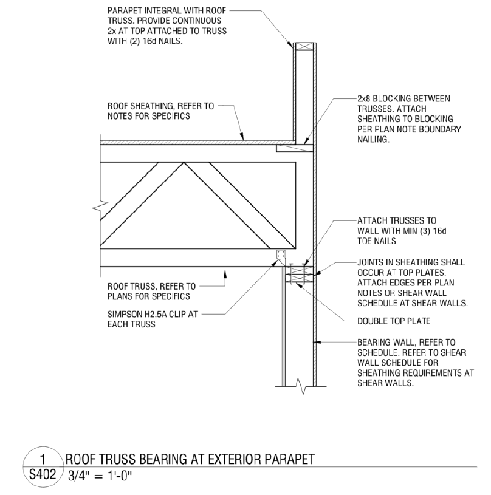

# Parapet Walls

## Что считать

- Parapet framing, cap plates, inside/outside sheathing, insulation adjustments
  и EPDM, где required.
- FRT blocking/plates, когда exterior wall FRT rules применяются.

## Правила

- Parapets = FRT, когда exterior walls = FRT.
- Parapet sheathing может быть both sides; outside может subtract insulation board.
- Top chord bearing truss conditions могут требовать blocking between trusses,
  а не ribbon board.

## Частые пропуски

- Detail callouts вроде `(2) 2x8 FRT blocking at parapets`.
- Cap plate treatment, часто 2x6 PT.

## Типовой состав { .kb-section-title .kb-st--green }

Парапет как framed-стена — полноценный набор строк:

| Строка | Типично |
| --- | --- |
| Flashing | `Drip Edge` по верху |
| Inside Sheathing | OSB / `5/8" Gypsum` (внутренняя сторона) |
| Wall Sheathing | OSB / Zip (наружная сторона) |
| **Top Sheathing** | по верхней грани парапета (часто забывают) |
| Studs | размер по высоте (nested-IF) |
| Vapor Barrier | Tyvek |
| Plates btm + top | P.T. снизу |
| Subfloor / Hangers | `LUS210` / `A35` / `LSSR1.81Z` где есть |

→ Ключевое: парапет обшивается **с двух сторон** (inside + wall) **плюс top** + flashing —
это три плоскости обшивки, не одна.

## Parapet vs. Truss System

Главная развилка — входит ли парапет в truss-систему крыши:

- **Parapet integral with roof truss** — система парапетов уже включена в truss. **Обшивка (sheathing) при этом НЕ включена в truss** — её всё равно надо считать отдельно.
- **Parapet НЕ включён в truss** — смотри на ориентацию опирания truss/rafters относительно стены:
    - **Перпендикулярное опирание** — парапет выполняй отдельным каркасом (stud wall).
    - **Параллельное опирание** — стену последнего этажа **продли вверх** до высоты парапета (продолжение exterior wall).

<figure markdown>
  
  <figcaption>Parapet integral with truss: continuous <code>2x</code> по верху + (2) 16d, <strong>2x8 blocking между фермами</strong>, double top plate, Simpson <code>H2.5A</code> clip. Sheathing считаем отдельно — она <em>не</em> в truss-пакете.</figcaption>
</figure>

<figure markdown>
  
  <figcaption>Ещё один parapet condition — сверь height, FRT и roof-edge перед output.</figcaption>
</figure>

## See also

- [Exterior Walls](exterior.md) · [Truss Heel](../sheathing/truss-heel.md) · [Flashing](../../sheathing-and-misc/flashing.md) · [Box Sheathing](../sheathing/box-sheathing.md)
