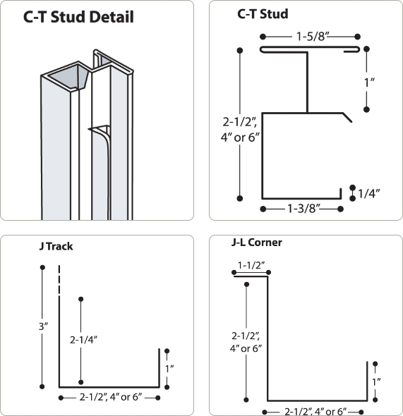
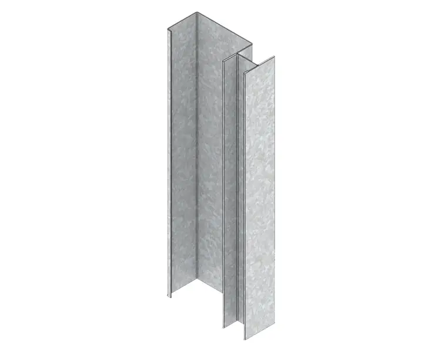
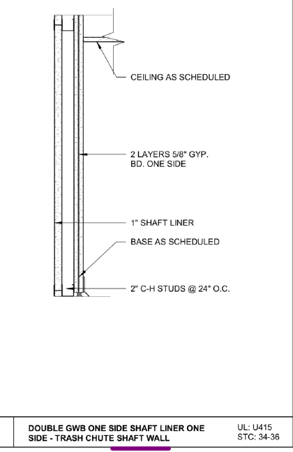
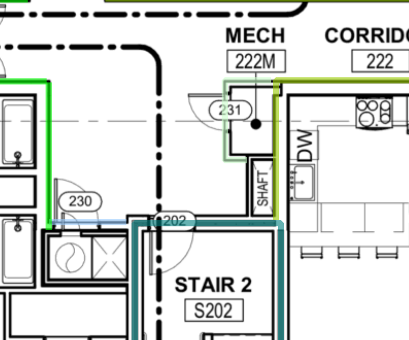

# Shaft Walls

**Shaft wall** — это стена шахты, ограждение **вертикальных шахт** в здании. На чертежах под `shaft wall` обычно понимают:

- **elevator shaft** — шахты лифтов;
- **vent shaft** — вентиляционные каналы;
- **trash chute** — мусоропроводы;
- **mechanical/communications shafts** — pipes, cables, ducts.

Shaft wall почти всегда fire-rated и собирается из CH-stud + shaft liner.

## Count

- CH studs.
- J-channels.
- 1" liner panels.
- Fire-wall hanger conditions when joists hang over shaft walls.

## Default Assumption

When not otherwise specified, notes often use:

| Item | Typical |
| --- | --- |
| Studs | 2-1/2" CH studs |
| Tracks | 2-1/2" J-channel |
| Liner | 1" liner panel |

## Check

- Chute Shaft wall A201/A806, wall type 7A, is a recurring miss.
- DHU/DGU hanger conditions belong here when joists hang over the firewall.
- Mark shaft hangers separately by floor for review.

<!-- confluence-gallery:start -->
## Confluence Images

Изображения из Confluence размещены на этой странице по исходной теме.
Подпись сохраняет группу-источник, чтобы можно было быстро проверить контекст.

| Source group | Images | Confluence |
| --- | ---: | --- |
| Shaft (противопожарные стены) | 5 | [source](https://ewood.atlassian.net/wiki/spaces/work/pages/65306667/Shaft) |

  <a class="kb-gallery__item" href="../../../../assets/images/confluence/confluence-129.png" title="image-20251030-153706.png">
    
    
shaft/fire wall reference 01 (image, 62 KB raw)

  </a>
  <a class="kb-gallery__item" href="../../../../assets/images/confluence/confluence-130.png" title="image-20251030-153647.png">
    
    
shaft/fire wall reference 02 (image, 125 KB raw)

  </a>
  <a class="kb-gallery__item" href="../../../../assets/images/confluence/confluence-131.png" title="image-20251030-153459.png">
    
    
shaft/fire wall reference 03 (image, 340 KB raw)

  </a>
  <a class="kb-gallery__item" href="../../../../assets/images/confluence/confluence-132.png" title="image-20251030-153049.png">
    
    
shaft/fire wall reference 04 (image, 38 KB raw)

  </a>
  <a class="kb-gallery__item" href="../../../../assets/images/confluence/confluence-133.png" title="image-20251030-152801.png">
    
    
shaft/fire wall reference 05 (image, 153 KB raw)

  </a>

<!-- confluence-gallery:end -->
