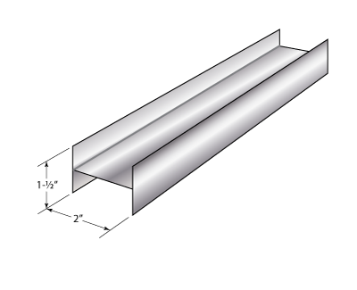
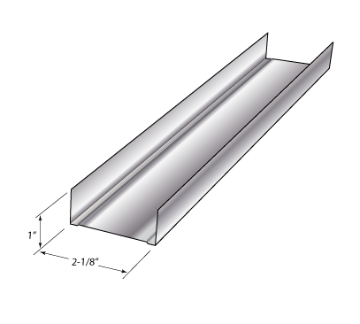
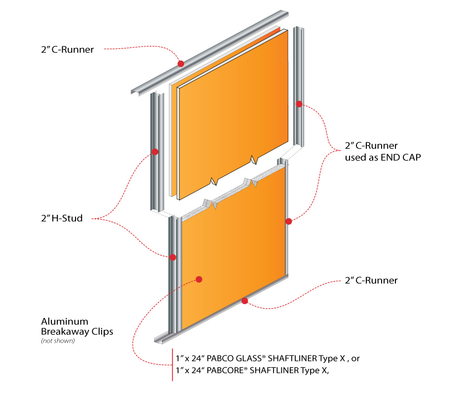

# Shaft Walls

**Shaft wall** — это стена шахты, ограждение **вертикальных шахт** в здании. На чертежах под `shaft wall` обычно понимают:

- **elevator shaft** — шахты лифтов;
- **vent shaft** — вентиляционные каналы;
- **trash chute** — мусоропроводы;
- **mechanical/communications shafts** — pipes, cables, ducts.

Shaft wall почти всегда fire-rated. На takeoff/DFL обычно встречаются два рабочих типа:
`2-1/2" CH + J-channel` или `2" H + C-channel`. Размер и тип всегда бери из wall type/detail.

## Что считать

- CH studs.
- J-channels.
- 1" liner panels.
- Fire-wall hanger conditions, когда joists hang over shaft walls.
- Для `2"` H/C assemblies: H-channels vertical/horizontal и C-channels perimeter.
- Shaft walls не пропускай как "панели by others" автоматически: если wall type/detail дает shaft assembly,
  отрази его отдельными строками в takeoff/DFL.

## Two common shaft-wall types

Если detail/wall type прямо не уточняет другое, сначала проверь эти два типовых варианта.
Не смешивай их в один блок: у них разные channels и разные формулы для panels/horizontal rows.

### Type 1: 2-1/2" CH + J-channel

Обычно для CH-stud shaft wall assembly с одним слоем 1" shaftliner:

| Item | Typical |
| --- | --- |
| Studs | 2-1/2" CH studs |
| Horizontal tracks/channels | 2-1/2" J-channel |
| Liner | 1" liner panel |

<figure markdown>
  
  <figcaption>Профили Type 1: <strong>C-T (CH) stud</strong> (`2-1/2"/4"/6"`, полка `1-5/8"`), <strong>J-track</strong> и <strong>J-L corner</strong>. Размер studs/tracks бери из wall type.</figcaption>
</figure>

DFL rows:

| Row | Material | Formula | Stock |
| --- | --- | --- | --- |
| Linear Panels | 1" Shaft Panels | `ОКРВВЕРХ(LFT * 1.1 / 24; 2)` | 12 (2x12 Panels) |
| CH Channels Vertical | 2-1/2" CH-channels | `ОКРВВЕРХ(LFT * 0.5 * 1.1 / Stock LF; 2)` | 12 |
| J Channels Horizontal | 2-1/2" J-channels | `ОКРВВЕРХ(Horizontal LFT * 1.1 / Stock LF; 2)` | 12 |

### Type 2: 2" H + C-channel

Обычно для H-channel assembly (area separation / party fire wall), где detail требует
H-channels и perimeter C-channel. Панели здесь идут **в два слоя** 1" liner —
поэтому в формуле panels стоит множитель `* 2`:

| Item | Typical |
| --- | --- |
| Vertical channels | 2" H-channels (H-studs) |
| Horizontal channels | 2" H-channels |
| Perimeter channels | 2" C-channels (C-runner) |
| Liner | 1" shaft panel, 2 слоя |

  <a class="kb-gallery__item" href="../../../../assets/images/walls/shaft-h-stud.png">
    
    
2" H-stud (2" × 1-1/2") — вертикальный: 1" панели входят в пазы с двух сторон

  </a>
  <a class="kb-gallery__item" href="../../../../assets/images/walls/shaft-c-runner.png">
    
    
2" C-runner / C-channel (2-1/8" × 1") — perimeter: top, bottom, end cap

  </a>

<figure markdown>
  
  <figcaption>Сборка Type 2: панели <strong>1" × 24" shaftliner</strong> вставляются между <strong>2" H-studs</strong>, по периметру (top, bottom, end cap) — <strong>2" C-runner</strong>. Источник: PABCO Gypsum, H-Stud ASW.</figcaption>
</figure>

DFL rows:

| Row | Material | Formula | Stock |
| --- | --- | --- | --- |
| Linear Panels | 1" Shaft Panels | `ОКРВВЕРХ(LFT * 2 * 1.1 / 24; 2)` | 12 (2x12 Panels) |
| Channels Vertical | 2" H-channels | `ОКРВВЕРХ(LFT * 0.5 * 1.1 / Stock LF; 2)` | 12 |
| Channels Horizontal | 2" H-channels | `ОКРВВЕРХ(Horizontal LFT * 2 * 1.1 / Stock LF; 2)` | 12 |
| Channels Perimeter | 2" C-channels | `ОКРВВЕРХ(Perimeter LFT * 1.1 / Stock LF; 2)` | 12 |

`Stock LF` is the stock length cell, usually `12`. Use the measured LFT source that matches the row:
overall shaft-wall LFT, horizontal run LFT, or perimeter LFT.

<figure markdown>
  
  <figcaption><strong>1" shaftliner</strong> — одна и та же гипсовая панель-вкладыш для обоих типов: в Type 1 — один слой между CH-studs, в Type 2 — два слоя между H-studs. Отдельная строка.</figcaption>
</figure>

!!! note "Формулы shaft wall"
    CH-channels, J-channels и liner-панели считаются по формулам в
    [Формулы → Shaft Walls](../../../reference/formulas.md#shaft-walls).

## Проверить

- Chute Shaft wall A201/A806, wall type 7A — recurring miss.
- DHU/DGU hanger conditions относятся сюда, когда joists hang over the firewall.
- Shaft hangers помечай отдельно by floor для review.
- Typical shaft details сами по себе недостаточны; найди реальный shaft location
  на plans. Начни с trash/vent/mechanical shafts, потом проверь referenced detail.
- Если wall type показывает shaft assembly, но plan calls out только resilient
  channel, считай resilient channel condition отдельно вместо full shaft-wall quantity.
- `7/8"` resilient channel может быть ceiling/strapping item и применяться на
  всех levels, минус dropped metal-frame areas; проверь RCP/ceiling notes.

## See also

- [Формулы → Shaft Walls](../../../reference/formulas.md#shaft-walls) · [Demising Walls](demising.md) · [Hangers](../../../reference/hangers.md)

<!-- confluence-gallery:start -->
## Ещё примеры (shaft / fire wall)

??? info "Источник картинок"
    - Shaft (противопожарные стены): 5 карт. Confluence (архивный источник; ссылка не публикуется)

  
Показать ещё 3 иллюстрации

  

    
    
    
  

<!-- confluence-gallery:end -->
