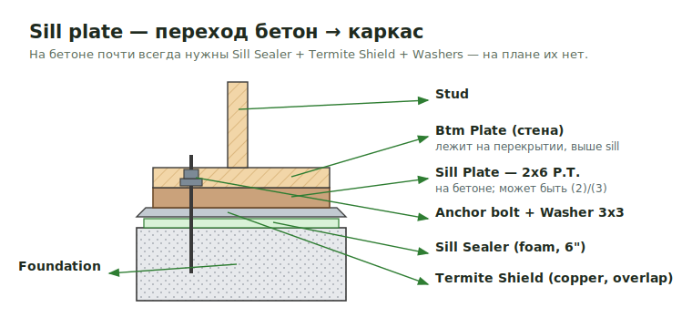
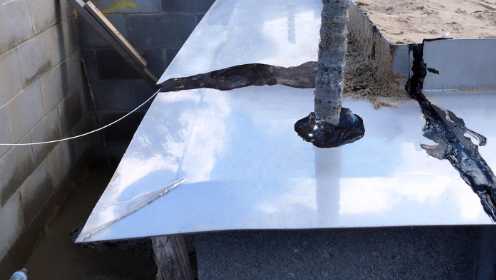
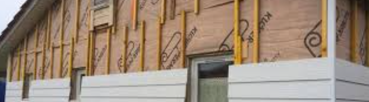
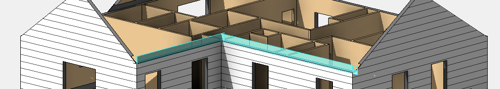
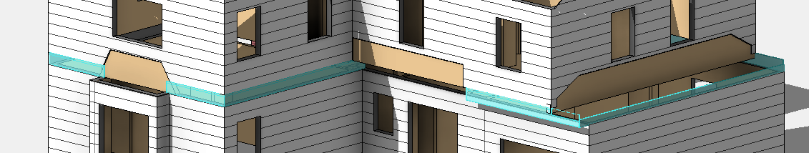
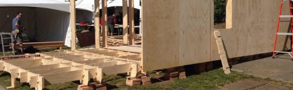
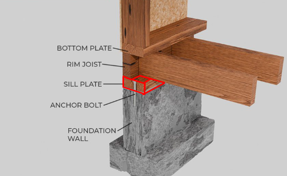
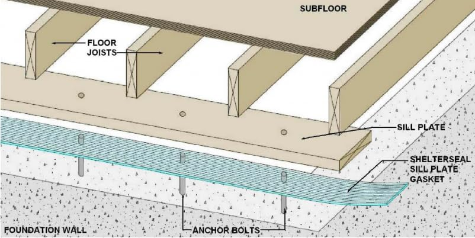
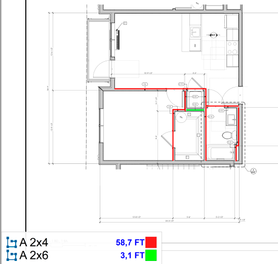

# Sill Plates

**Sill Plate** — нижняя горизонтальная доска, которая укладывается на бетонный фундамент или цоколь, и к которой крепится каркас стены. По сути это переходный элемент между бетоном и деревянной конструкцией.

<figure markdown>
  
  <figcaption>Стек на бетоне: foundation → sill sealer → termite shield → P.T. sill plate (+ anchor/washer) → btm plate → stud.</figcaption>
</figure>

- Sill Plate бывает **одинарной, двойной и даже тройной** — смотри детали.
- Типичный материал — **`2x6 P.T.`**, но возможен любой размер (по детали).
- **Sill Plate ≠ Btm Plate.** Sill Plate лежит **под перекрытием** (на бетоне), а **Btm Plate стены находится на перекрытии** (выше Sill Plate). Обе доски являются частью стены и проходят отдельными строками.
- Над Sill Plate может идти **Dbl Btm Plate (2) — `2x6 P.T.`** (двойная нижняя доска стены).

На реальном узле порядок снизу вверх читается так: **Foundation Wall → Sill Plate
(на бетоне) → Anchor Bolt сквозь plate → Bottom Plate стены → стойка**. Sill
Plate — самая нижняя деревянная доска, она же контактирует с бетоном, поэтому
**P.T.**

<figure markdown>
  
  <figcaption>Узел: Bottom Plate / Sill Plate / Anchor Bolt / Foundation Wall.</figcaption>
</figure>

## Что считать вместе с Sill Plate

При посадке стены на бетон (foundation / slab) обязательно проверь и добавь в takeoff три позиции — **на плане их не показывают**:

- **Sill Sealer** — поролоновая прокладка между бетоном и Sill Plate. Ширина почти
  всегда **`6"`** (реже `8"` / `4"`).
- **Termite Shield** — металлическая защита от термитов, обычно **`Copper`**.
  Укладывается с **нахлёстом ~1 ft** на стыках, вдоль края — bead of caulk.
- **Washers** — шайбы под анкерные болты, типично **`3x3 Square`**.

<figure markdown>
  
  <figcaption>Termite shield: bead of caulk, anchor bolt, нахлёст `1 ft` на стыке.</figcaption>
</figure>

Termite Shield по факту — это сплошной металлический лист поверх стены/sill,
из-под которого выходят анкеры:

<figure markdown>
  
  <figcaption>Termite shield в натуре: металл по верху фундамента, анкер сквозь него.</figcaption>
</figure>

Подробнее по болтам — [Anchor Bolts](../../deck/anchor-bolts.md).

!!! note "Не забыть"
    Sill Sealer и Termite Shield на бетонной посадке нужны почти всегда — если их
    нет в takeoff, это почти наверняка пропуск. Типовые размеры/количества —
    [Quantity benchmarks](../../../reference/quantity-benchmarks.md).

## Что считать

- Bottom plates at walls, особенно на concrete/slab conditions.
- PT plates там, где plates касаются concrete или exterior/exposed conditions требуют это.
- Double bottom plates там, где gypcrete или details требуют их.
- Sill Plates и Shelf Plates отдельными notes, когда drawing calls them out.
- Sill Plates under KD Plates: two lower boards, lower board обычно P.T.

## Проверить

- COM jobs часто прячут plate rules в specs и wall sections.
- Panelized wall jobs могут исключать most plates, потому что panels are by others.
- Corridor staggered walls могут требовать 2x6 plates, даже когда studs are 2x4.
- Plates разделяй максимально просто. Если plate scope неясен, спроси или добавь
  видимую note, не прячь assumption.

## Заметки

Когда plate species/treatment неясен, оставляй видимую assumption note вместо
тихого выбора SPF/PT/FRT.

## See also

- [Anchor Bolts](../../deck/anchor-bolts.md) · [Exterior Walls](exterior.md) · [Basement SQFT](../../sqfts/basement.md) · [Corners](corners.md)

<!-- confluence-gallery:start -->
## Ещё примеры (Sill Plates)

Дополнительные реальные узлы Sill Plate / anchor / termite — открой нужную
карточку и сверь похожий condition на плане/детали.

??? info "Источник картинок"
    - Sill Plates (доска для бетона): [17 карт. Confluence](https://redacted.atlassian.net/wiki/spaces/work/pages/75333633/Sill+Plates)

  
Показать ещё 14 иллюстраций

  

    
    
    
    
    
    
    
    
    
    
    
    
    
    
  

<!-- confluence-gallery:end -->
